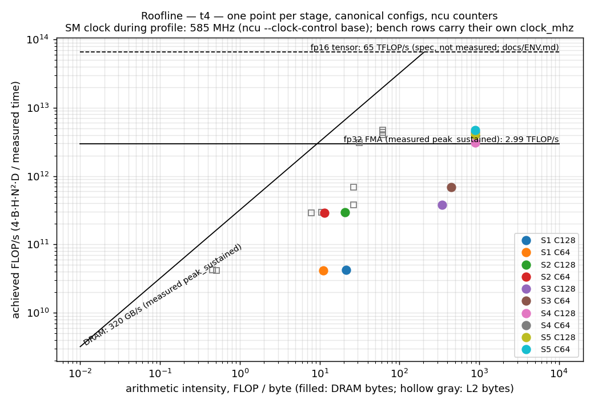

# fused-attention-cuda

[](https://github.com/yashpatil582/fused-attention-cuda/actions/workflows/build.yml)
[](https://github.com/yashpatil582/fused-attention-cuda/actions/workflows/lint.yml)
[](LICENSE)

A FlashAttention-style fused scaled-dot-product attention (SDPA) forward kernel written from
scratch in CUDA C++ and optimized in stages: three naive kernels, shared-memory tiling, one fused
kernel with online softmax, fp16 tensor cores (WMMA), then Nsight-guided tuning. Every stage is
benchmarked against PyTorch SDPA under a fixed protocol, and every optimization is justified by a
committed Nsight Compute profile (`.ncu-rep` + raw CSV) whose named metric moved. The kernel is
exposed as a PyTorch custom op (`torch.ops.fused_attn.forward`) registered with `TORCH_LIBRARY`
and a `register_fake` kernel; `torch.library.opcheck` and a `torch.compile(fullgraph=True)`
no-graph-break test are in `tests/test_op_gpu.py` and pass on the T4.

**Status (2026-09-04): S0–S7 done on the Colab T4; every number in this repository is from a
committed CSV or Nsight capture.** Canonical config B2 H8 N2048, SM clock locked at 585 MHz,
medians at the kernel HEAD ships (371f406): D=64 naive 410.6 → tiled 59.2 → fused 25.1 → WMMA fp16
3.94 → tuned **3.64 ms** (113× from naive, **68 %** of SDPA `EFFICIENT_ATTENTION` fp16 at 2.49 ms;
the d835758 run of the same D=64 path read 3.63 ms / 69 % — a 0.2 % run-to-run spread that flips
the rounded percent); D=128 817.1 → 115.8 → 94.3 → 11.17 → **8.45 ms** (97×, 59 % of SDPA at
5.00 ms) — the size-aware tile, measured three ways that agree: the `bench.py` canonical row
(8.4527 ms), the tuning A/B (8.4526 ms) and the Nsight capture (8.449 ms). Twenty Nsight Compute captures, compute-sanitizer clean at every
stage, 48-config sweeps for S1–S5 (causal tile skipping measured at 1.73–1.87×), the op passes
`opcheck` and `torch.compile(fullgraph=True)`, and a nanoGPT block runs at 703 K tokens/s on our
kernel vs 816–856 K on SDPA. No sm_80+ row exists: Track B was never started, $0 spent.

> **Scope and honesty**
> - **Forward pass only.** No backward, no dropout, no KV cache, no paged attention in-window.
> - **Primary GPU: NVIDIA T4 (Turing, sm_75).** Every number is measured there unless a row says
>   otherwise. Free Colab T4 is the only zero-cost platform with independent 2026 evidence that
>   Nsight Compute hardware counters work (see `docs/RESEARCH.md` §8).
> - **Speed baseline: `F.scaled_dot_product_attention` pinned to `SDPBackend.EFFICIENT_ATTENTION`.**
>   On sm_75 the FLASH backend refuses to run — PyTorch's `sdp_utils.cpp` says
>   *"Flash attention only supports gpu architectures in the range [sm80, sm121]"* — and the cuDNN
>   backend has the same sm80 floor, so the memory-efficient kernel is the fastest vendor attention
>   that exists on this GPU and the only honest denominator. `SDPBackend.MATH` in fp32/fp64 is the
>   correctness oracle, never a speed baseline (it upcasts half inputs to float).
> - **fp16 tensor cores only on T4.** bf16 WMMA and `cp.async` are Ampere (sm_80+) features. Those
>   paths compile under `#if __CUDA_ARCH__ >= 800` in CI and are labelled *compile-only* until an
>   sm_80+ run lands.
> - **`N % 32 == 0` and `Nq == Nkv` are enforced** by every stage in-window; ragged sequence
>   lengths are a stated limitation, not a silent bug. Head dims 64 and 128; fp32 and fp16 inputs;
>   scores, running max/sum and the output accumulator are fp32 in every kernel.
> - **Causal mask is top-left aligned** (PyTorch `is_causal` semantics for `L == S`).

## The optimization ladder

One stage per optimization, one named Nsight Compute metric per stage. The metric is chosen
*before* the stage is written; `docs/STAGES.md` records hypothesis, before/after metric, bench
delta and the keep/revert decision. Kernel names are frozen in `CONTRACT.md` §2.

| Stage | Kernel(s) | What changes | ncu metric that should move |
|---|---|---|---|
| S1 | `fa_s1_qk`, `fa_s1_softmax`, `fa_s1_pv` | three fp32 kernels, global memory only, S and P materialized in HBM | baseline: `dram__bytes.sum` grows with N² (S and P round-trip HBM); `smsp__sass_average_data_bytes_per_sector_mem_global_op_ld.pct` low on the strided K^T read |
| S2 | `fa_s2_qk_tiled`, `fa_s2_softmax`, `fa_s2_pv_tiled` | shared-memory tiled GEMMs, `float4` coalesced loads, `__shfl_down_sync` softmax; S/P still materialized | coalescing % toward ~100; `dram__bytes.sum` down by the tile-reuse factor; `l1tex__t_sector_hit_rate.pct` / `lts__t_sector_hit_rate.pct` up; bank conflicts recorded as S5a's "before" |
| S3 | `fa_s3_fused` | one kernel: a block owns a Q tile (FA2 loop order), K/V tiles stream through smem, online softmax with deferred normalization, LSE written | `dram__bytes.sum` collapses from O(N²) to O(B·H·N·D); `dram__throughput...pct` falls; stalls shift to `mio_throttle` / `barrier` |
| S4 | `fa_s4_wmma` | fp16 in / fp32 accumulate on tensor cores via `nvcuda::wmma`; S round-trips padded smem because the fragment layout is opaque | `sm__pipe_tensor_op_hmma_cycles_active.avg.pct_of_peak_sustained_active` from 0 to non-zero; `sm__inst_executed_pipe_tensor.sum > 0`; ffma count down; zero spills in `-Xptxas -v` |
| S5 | `fa_s5_tuned<T,D,WARPS,BC,PREFETCH>` | the S4 kernel with two Nsight-chosen knobs as template parameters: a register-staged K/V prefetch (the T4 has no `cp.async`) and the block height; 22-variant A/B on the T4 picks the defaults (`bench/results/t4/stage5_tuning.csv`) and the 48-config sweep makes the D=128 tile size-aware (tall tile from N=2048 up) | `smsp__warp_issue_stalled_long_scoreboard_per_warp_active.pct` toward 0 (measured 11.4 → 0.85 % at C64, 17.4 → 0.41 % at C128); `sm__warps_active` up where the block grows; registers are the price, 0 spills stays the rule. The planned bank-conflict/shuffle sub-stages were dropped: S4's padding already took the conflicts off the top of the stall list (values in `docs/INTERVIEW.md` §4) |
| S6 | op + `bench/gpt_block.py` | `torch.ops.fused_attn.forward` dispatches to the highest stage that supports (dtype, D, sm); `opcheck`; `torch.compile(fullgraph=True)` with no graph break; GPT-block tokens/s; causal tile skipping measured | causal: time at fixed N is 1.73–1.87× lower than dense (FA2's "~1.7–1.8×" reproduced, never assumed); op: attention share of a nanoGPT block measured with the binding-boundary copies inside the window |

## Benchmarks (generated by `scripts/bench_to_md.py`)

<!-- BENCH:START -->
Median ms per forward call (lower is better); one CUDA-event pair per iteration, 256 MB
L2 flush before every timed iteration, >=100 iterations after >=10 warmup. Every column
is the stage's DEFAULT tile configuration (the S5 A/B sweep is `stage5_tuning.csv`).
TFLOP/s in the CSVs use 4·B·H·N²·D; causal rows are credited half of that
(`flops=causal_half`, CONTRACT §5) only in rows benchmarked after that convention landed
(S5 onward) — earlier sweep rows carry `flops=full`. Speed baseline is SDPA pinned to
`EFFICIENT_ATTENTION`; `SDPA MATH fp32` is the correctness oracle, not a speed baseline.

**`t4`** — GPU `Tesla T4`, driver 580.82.07, nvcc 12.8.93, torch 2.11.0+cu128, ncu 2025.1.1.0, commit(s) `371f406, 3add37c`, clocks unlocked (SM clock sampled during each timed loop; `clock_mhz` = median).

**fp16, causal=0**

| config | S4 wmma | S5 tuned | SDPA EFFICIENT | SDPA FLASH | SDPA cuDNN | SDPA MATH fp32 (oracle) | torch unfused | flash_attn | best ours vs S1 naive | best ours, % of SDPA EFFICIENT |
|---|---|---|---|---|---|---|---|---|---|---|
| `B1_H8_N128_D64` | 0.028 | 0.025 | 0.036 | refused | refused | 0.120 | 0.056 | refused | — | 140% (tuned) |
| `B8_H32_N128_D64` | 0.324 | 0.307 | 0.216 | refused | refused | 1.186 | 0.413 | refused | — | 70% (tuned) |
| `B1_H8_N128_D128` | 0.049 | 0.045 | 0.031 | refused | refused | 0.139 | 0.060 | refused | — | 69% (tuned) |
| `B8_H32_N128_D128` | 1.034 | 0.938 | 0.410 | refused | refused | 1.700 | 0.470 | refused | — | 44% (tuned) |
| `B1_H8_N256_D64` | 0.056 | 0.052 | 0.058 | refused | refused | 0.214 | 0.077 | refused | — | 112% (tuned) |
| `B8_H32_N256_D64` | 1.227 | 1.120 | 0.675 | refused | refused | 3.974 | 1.291 | refused | — | 60% (tuned) |
| `B1_H8_N256_D128` | 0.154 | 0.141 | 0.065 | refused | refused | 0.309 | 0.084 | refused | — | 46% (tuned) |
| `B8_H32_N256_D128` | 3.678 | 3.326 | 1.444 | refused | refused | 5.728 | 1.444 | refused | — | 43% (tuned) |
| `B1_H8_N512_D64` | 0.187 | 0.173 | 0.128 | refused | refused | 0.652 | 0.192 | refused | — | 74% (tuned) |
| `B8_H32_N512_D64` | 4.587 | 4.197 | 2.483 | refused | refused | 14.547 | 4.663 | refused | — | 59% (tuned) |
| `B1_H8_N512_D128` | 0.518 | 0.471 | 0.219 | refused | refused | 0.792 | 0.214 | refused | — | 47% (tuned) |
| `B8_H32_N512_D128` | 13.144 | 11.985 | 5.179 | refused | refused | 20.974 | 5.170 | refused | — | 43% (tuned) |
| `B1_H8_N1024_D64` | 0.660 | 0.609 | 0.451 | refused | refused | 1.921 | 0.646 | refused | — | 74% (tuned) |
| `B8_H32_N1024_D64` | 16.788 | 15.544 | 9.523 | refused | refused | 55.850 | 18.143 | refused | — | 61% (tuned) |
| `B1_H8_N1024_D128` | 1.653 | 1.485 | 0.776 | refused | refused | 2.787 | 0.709 | refused | — | 52% (tuned) |
| `B8_H32_N1024_D128` | 48.007 | 43.195 | 19.807 | refused | refused | 80.379 | 20.077 | refused | — | 46% (tuned) |
| `B1_H8_N2048_D64` | 2.118 | 1.956 | 1.411 | refused | refused | 7.293 | 2.518 | refused | — | 72% (tuned) |
| `B2_H8_N2048_D64` | 3.944 | 3.637 | 2.485 | refused | refused | 14.060 | 4.815 | refused | — | 68% (tuned) |
| `B8_H32_N2048_D64` | 61.661 | 56.956 | 37.201 | refused | refused | OOM by design | OOM by design | refused | — | 65% (tuned) |
| `B1_H8_N2048_D128` | 5.640 | 4.530 | 2.668 | refused | refused | 10.226 | 2.742 | refused | — | 59% (tuned) |
| `B2_H8_N2048_D128` | 11.170 | 8.453 | 4.997 | refused | refused | 19.861 | 5.264 | refused | — | 59% (tuned) |
| `B8_H32_N2048_D128` | 176.284 | 132.185 | 77.550 | refused | refused | OOM by design | OOM by design | refused | — | 59% (tuned) |
| `B1_H8_N4096_D64` | 7.305 | 6.673 | 4.907 | refused | refused | 29.982 | 13.717 | refused | — | 74% (tuned) |
| `B8_H32_N4096_D64` | 228.974 | 209.276 | 147.182 | refused | refused | OOM by design | OOM by design | refused | — | 70% (tuned) |
| `B1_H8_N4096_D128` | 20.694 | 14.224 | 9.864 | refused | refused | 41.477 | 14.608 | refused | — | 69% (tuned) |
| `B8_H32_N4096_D128` | 647.333 | 445.536 | 308.099 | refused | refused | OOM by design | OOM by design | refused | — | 69% (tuned) |

**fp16, causal=1**

| config | S4 wmma | S5 tuned | SDPA EFFICIENT | SDPA FLASH | SDPA cuDNN | SDPA MATH fp32 (oracle) | torch unfused | flash_attn | best ours vs S1 naive | best ours, % of SDPA EFFICIENT |
|---|---|---|---|---|---|---|---|---|---|---|
| `B1_H8_N128_D64` | 0.028 | 0.026 | 0.036 | refused | refused | 0.154 | 0.071 | refused | — | 137% (tuned) |
| `B8_H32_N128_D64` | 0.264 | 0.253 | 0.176 | refused | refused | 1.356 | 0.656 | refused | — | 70% (tuned) |
| `B1_H8_N128_D128` | 0.049 | 0.044 | 0.031 | refused | refused | 0.172 | 0.076 | refused | — | 69% (tuned) |
| `B8_H32_N128_D128` | 0.674 | 0.620 | 0.339 | refused | refused | 1.872 | 0.713 | refused | — | 55% (tuned) |
| `B1_H8_N256_D64` | 0.055 | 0.051 | 0.059 | refused | refused | 0.259 | 0.107 | refused | — | 115% (tuned) |
| `B8_H32_N256_D64` | 0.773 | 0.734 | 0.469 | refused | refused | 4.575 | 2.191 | refused | — | 64% (tuned) |
| `B1_H8_N256_D128` | 0.111 | 0.101 | 0.059 | refused | refused | 0.354 | 0.114 | refused | — | 59% (tuned) |
| `B8_H32_N256_D128` | 2.155 | 1.965 | 0.956 | refused | refused | 6.330 | 2.344 | refused | — | 49% (tuned) |
| `B1_H8_N512_D64` | 0.127 | 0.117 | 0.121 | refused | refused | 0.768 | 0.307 | refused | — | 104% (tuned) |
| `B8_H32_N512_D64` | 2.571 | 2.421 | 1.488 | refused | refused | 16.879 | 8.190 | refused | — | 61% (tuned) |
| `B1_H8_N512_D128` | 0.305 | 0.278 | 0.149 | refused | refused | 0.908 | 0.334 | refused | — | 54% (tuned) |
| `B8_H32_N512_D128` | 7.359 | 6.728 | 3.101 | refused | refused | 23.305 | 8.698 | refused | — | 46% (tuned) |
| `B1_H8_N1024_D64` | 0.373 | 0.344 | 0.264 | refused | refused | 2.400 | 1.106 | refused | — | 77% (tuned) |
| `B8_H32_N1024_D64` | 9.134 | 8.547 | 5.237 | refused | refused | 68.679 | 32.330 | refused | — | 61% (tuned) |
| `B1_H8_N1024_D128` | 0.954 | 0.860 | 0.440 | refused | refused | 3.264 | 1.167 | refused | — | 51% (tuned) |
| `B8_H32_N1024_D128` | 26.245 | 23.816 | 10.959 | refused | refused | 93.190 | 34.269 | refused | — | 46% (tuned) |
| `B1_H8_N2048_D64` | 1.199 | 1.110 | 0.828 | refused | refused | 9.182 | 4.405 | refused | — | 75% (tuned) |
| `B8_H32_N2048_D64` | 33.273 | 30.894 | 19.577 | refused | refused | OOM by design | OOM by design | refused | — | 63% (tuned) |
| `B1_H8_N2048_D128` | 3.203 | 2.765 | 1.460 | refused | refused | 12.114 | 4.632 | refused | — | 53% (tuned) |
| `B8_H32_N2048_D128` | 95.300 | 77.778 | 41.052 | refused | refused | OOM by design | OOM by design | refused | — | 53% (tuned) |
| `B1_H8_N4096_D64` | 4.102 | 3.763 | 2.776 | refused | refused | 38.290 | 21.032 | refused | — | 74% (tuned) |
| `B8_H32_N4096_D64` | 122.220 | 112.439 | 75.594 | refused | refused | OOM by design | OOM by design | refused | — | 67% (tuned) |
| `B1_H8_N4096_D128` | 11.109 | 8.525 | 5.281 | refused | refused | 49.795 | 21.932 | refused | — | 62% (tuned) |
| `B8_H32_N4096_D128` | 346.779 | 256.810 | 158.571 | refused | refused | OOM by design | OOM by design | refused | — | 62% (tuned) |

**fp32, causal=0**

| config | S1 naive | S2 tiled | S3 fused | SDPA EFFICIENT | SDPA FLASH | SDPA cuDNN | SDPA MATH fp32 (oracle) | torch unfused | flash_attn | best ours vs S1 naive | best ours, % of SDPA EFFICIENT |
|---|---|---|---|---|---|---|---|---|---|---|---|
| `B1_H8_N128_D64` | 0.856 | 0.199 | 0.151 | 0.074 | refused | refused | 0.121 | 0.088 | refused | 5.67x (fused) | 49% (fused) |
| `B8_H32_N128_D64` | 26.294 | 4.379 | 1.805 | 0.836 | refused | refused | 1.187 | 0.823 | refused | 14.57x (fused) | 46% (fused) |
| `B1_H8_N128_D128` | 1.656 | 0.330 | 0.486 | 0.070 | refused | refused | 0.139 | 0.104 | refused | 5.02x (tiled) | 21% (tiled) |
| `B8_H32_N128_D128` | 51.664 | 7.972 | 6.208 | 1.394 | refused | refused | 1.702 | 1.198 | refused | 8.32x (fused) | 22% (fused) |
| `B1_H8_N256_D64` | 3.284 | 0.581 | 0.270 | 0.152 | refused | refused | 0.215 | 0.158 | refused | 12.14x (fused) | 56% (fused) |
| `B8_H32_N256_D64` | 103.765 | 15.981 | 6.755 | 2.958 | refused | refused | 3.976 | 3.075 | refused | 15.36x (fused) | 44% (fused) |
| `B1_H8_N256_D128` | 6.482 | 1.075 | 0.928 | 0.216 | refused | refused | 0.309 | 0.242 | refused | 6.99x (fused) | 23% (fused) |
| `B8_H32_N256_D128` | 205.510 | 30.143 | 24.088 | 5.327 | refused | refused | 5.730 | 4.550 | refused | 8.53x (fused) | 22% (fused) |
| `B1_H8_N512_D64` | 12.961 | 2.042 | 1.002 | 0.461 | refused | refused | 0.653 | 0.549 | refused | 12.93x (fused) | 46% (fused) |
| `B8_H32_N512_D64` | 412.678 | 61.380 | 26.075 | 11.578 | refused | refused | 15.011 | 12.374 | refused | 15.83x (fused) | 44% (fused) |
| `B1_H8_N512_D128` | 25.694 | 3.836 | 3.615 | 0.825 | refused | refused | 0.793 | 0.670 | refused | 7.11x (fused) | 23% (fused) |
| `B8_H32_N512_D128` | 819.269 | 117.995 | 93.785 | 20.848 | refused | refused | 20.984 | 18.076 | refused | 8.74x (fused) | 22% (fused) |
| `B1_H8_N1024_D64` | 51.470 | 7.621 | 3.807 | 1.780 | refused | refused | 1.923 | 1.628 | refused | 13.52x (fused) | 47% (fused) |
| `B8_H32_N1024_D64` | 1643.266 | 236.875 | 99.907 | 45.426 | refused | refused | 62.502 | 59.767 | refused | 16.45x (fused) | 45% (fused) |
| `B1_H8_N1024_D128` | 102.301 | 14.752 | 14.166 | 2.857 | refused | refused | 2.788 | 2.456 | refused | 7.22x (fused) | 20% (fused) |
| `B8_H32_N1024_D128` | 3269.114 | 462.964 | 365.800 | 82.266 | refused | refused | 83.903 | 78.826 | refused | 8.94x (fused) | 22% (fused) |
| `B1_H8_N2048_D64` | 205.397 | 29.897 | 13.064 | 6.338 | refused | refused | 7.298 | 6.334 | refused | 15.72x (fused) | 49% (fused) |
| `B2_H8_N2048_D64` | 410.604 | 59.159 | 25.104 | 11.607 | refused | refused | 14.065 | 12.175 | refused | 16.36x (fused) | 46% (fused) |
| `B8_H32_N2048_D64` | OOM by design | OOM by design | 389.473 | 179.998 | refused | refused | OOM by design | OOM by design | refused | — | 46% (fused) |
| `B1_H8_N2048_D128` | 408.641 | 57.963 | 50.346 | 10.474 | refused | refused | 10.230 | 9.194 | refused | 8.12x (fused) | 21% (fused) |
| `B2_H8_N2048_D128` | 817.089 | 115.837 | 94.349 | 20.866 | refused | refused | 19.874 | 17.840 | refused | 8.66x (fused) | 22% (fused) |
| `B8_H32_N2048_D128` | OOM by design | OOM by design | 1457.092 | 327.951 | refused | refused | OOM by design | OOM by design | refused | — | 23% (fused) |
| `B1_H8_N4096_D64` | 823.365 | 120.298 | 50.062 | 23.110 | refused | refused | 30.341 | 26.818 | refused | 16.45x (fused) | 46% (fused) |
| `B8_H32_N4096_D64` | — | — | 1568.754 | 717.636 | refused | refused | OOM by design | OOM by design | refused | — | 46% (fused) |
| `B1_H8_N4096_D128` | 1636.461 | 233.571 | 186.656 | 41.633 | refused | refused | 41.493 | 37.822 | refused | 8.77x (fused) | 22% (fused) |
| `B8_H32_N4096_D128` | — | — | 5787.940 | 1308.955 | refused | refused | OOM by design | OOM by design | refused | — | 23% (fused) |

**fp32, causal=1**

| config | S1 naive | S2 tiled | S3 fused | SDPA EFFICIENT | SDPA FLASH | SDPA cuDNN | SDPA MATH fp32 (oracle) | torch unfused | flash_attn | best ours vs S1 naive | best ours, % of SDPA EFFICIENT |
|---|---|---|---|---|---|---|---|---|---|---|---|
| `B1_H8_N128_D64` | 0.530 | 0.199 | 0.157 | 0.074 | refused | refused | 0.154 | 0.106 | refused | 3.37x (fused) | 47% (fused) |
| `B8_H32_N128_D64` | 14.665 | 3.650 | 1.520 | 0.634 | refused | refused | 1.360 | 1.115 | refused | 9.65x (fused) | 42% (fused) |
| `B1_H8_N128_D128` | 1.002 | 0.332 | 0.485 | 0.070 | refused | refused | 0.173 | 0.122 | refused | 3.02x (tiled) | 21% (tiled) |
| `B8_H32_N128_D128` | 28.393 | 6.510 | 4.747 | 1.162 | refused | refused | 1.874 | 1.489 | refused | 5.98x (fused) | 24% (fused) |
| `B1_H8_N256_D64` | 1.829 | 0.520 | 0.276 | 0.153 | refused | refused | 0.261 | 0.193 | refused | 6.62x (fused) | 55% (fused) |
| `B8_H32_N256_D64` | 56.689 | 11.411 | 4.562 | 1.939 | refused | refused | 4.577 | 4.208 | refused | 12.43x (fused) | 43% (fused) |
| `B1_H8_N256_D128` | 3.568 | 0.955 | 0.917 | 0.190 | refused | refused | 0.357 | 0.277 | refused | 3.89x (fused) | 21% (fused) |
| `B8_H32_N256_D128` | 111.248 | 20.897 | 14.885 | 3.589 | refused | refused | 6.334 | 5.683 | refused | 7.47x (fused) | 24% (fused) |
| `B1_H8_N512_D64` | 7.066 | 1.436 | 0.795 | 0.414 | refused | refused | 0.770 | 0.702 | refused | 8.89x (fused) | 52% (fused) |
| `B8_H32_N512_D64` | 223.512 | 39.647 | 15.042 | 6.653 | refused | refused | 16.884 | 16.486 | refused | 14.86x (fused) | 44% (fused) |
| `B1_H8_N512_D128` | 13.889 | 2.619 | 2.643 | 0.553 | refused | refused | 0.909 | 0.824 | refused | 5.30x (tiled) | 21% (tiled) |
| `B8_H32_N512_D128` | 440.589 | 74.429 | 51.248 | 12.258 | refused | refused | 23.311 | 22.354 | refused | 8.60x (fused) | 24% (fused) |
| `B1_H8_N1024_D64` | 27.778 | 4.758 | 2.241 | 1.054 | refused | refused | 2.402 | 2.234 | refused | 12.40x (fused) | 47% (fused) |
| `B8_H32_N1024_D64` | 884.896 | 143.484 | 53.611 | 24.444 | refused | refused | 69.326 | 67.281 | refused | 16.51x (fused) | 46% (fused) |
| `B1_H8_N1024_D128` | 54.888 | 8.915 | 7.883 | 1.679 | refused | refused | 3.267 | 3.062 | refused | 6.96x (fused) | 21% (fused) |
| `B8_H32_N1024_D128` | 1751.648 | 276.120 | 187.439 | 44.919 | refused | refused | 93.536 | 93.267 | refused | 9.35x (fused) | 24% (fused) |
| `B1_H8_N2048_D64` | 110.538 | 17.862 | 7.358 | 3.536 | refused | refused | 9.181 | 8.737 | refused | 15.02x (fused) | 48% (fused) |
| `B8_H32_N2048_D64` | OOM by design | OOM by design | 199.953 | 93.562 | refused | refused | OOM by design | OOM by design | refused | — | 47% (fused) |
| `B1_H8_N2048_D128` | 218.829 | 33.875 | 26.250 | 5.901 | refused | refused | 12.117 | 11.594 | refused | 8.34x (fused) | 22% (fused) |
| `B8_H32_N2048_D128` | — | — | 714.302 | 171.403 | refused | refused | OOM by design | OOM by design | refused | — | 24% (fused) |
| `B1_H8_N4096_D64` | 443.552 | 71.243 | 26.017 | 12.679 | refused | refused | 38.305 | 36.871 | refused | 17.05x (fused) | 49% (fused) |
| `B8_H32_N4096_D64` | — | — | 768.266 | 365.704 | refused | refused | OOM by design | OOM by design | refused | — | 48% (fused) |
| `B1_H8_N4096_D128` | 876.590 | 135.402 | 94.223 | 22.051 | refused | refused | 49.808 | 48.230 | refused | 9.30x (fused) | 23% (fused) |
| `B8_H32_N4096_D128` | — | — | 2784.860 | 669.494 | refused | refused | OOM by design | OOM by design | refused | — | 24% (fused) |

<details><summary>p10/p90, TFLOP/s, GB/s, clock and notes for every row</summary>

| config | impl | stage | ms median | p10 | p90 | TFLOP/s | GB/s | clock MHz | commit | notes |
|---|---|---|---|---|---|---|---|---|---|---|
| `B1_H8_N128_D64` | naive | 1 | 0.8563 | 0.8557 | 0.8577 | 0.039 | 3.7 | 585 | `3add37c` | run=2026-09-03T06:08:39Z;clock_lock=585;iters=573;max_err=4.397e-07 torch_same_dtype_err=3.979e-07 tol=1.796e-06 cap=1e-04 |
| `B1_H8_N128_D64` | naive | 1 | 0.5305 | 0.5181 | 0.5464 | 0.063 | 5.9 | 585 | `3add37c` | flops=full;run=2026-09-03T06:08:39Z;clock_lock=585;iters=936;max_err=5.474e-07 torch_same_dtype_err=5.362e-07 tol=2.072e-06 cap=1e-04 |
| `B1_H8_N128_D64` | tiled | 2 | 0.1986 | 0.1972 | 0.1989 | 0.169 | 15.8 | 585 | `3add37c` | run=2026-09-03T06:54:17Z;clock_lock=585;iters=1000;max_err=4.397e-07 torch_same_dtype_err=3.979e-07 tol=1.796e-06 cap=1e-04 |
| `B1_H8_N128_D64` | tiled | 2 | 0.1987 | 0.1983 | 0.1999 | 0.169 | 15.8 | 585 | `3add37c` | flops=full;run=2026-09-03T06:54:17Z;clock_lock=585;iters=1000;max_err=5.474e-07 torch_same_dtype_err=5.362e-07 tol=2.072e-06 cap=1e-04 |
| `B1_H8_N128_D64` | fused | 3 | 0.1511 | 0.1491 | 0.1524 | 0.222 | 7.0 | 585 | `3add37c` | run=2026-09-03T07:15:25Z;clock_lock=585;iters=1000;max_err=5.692e-07 torch_same_dtype_err=3.979e-07 tol=1.796e-06 cap=1e-04 |
| `B1_H8_N128_D64` | fused | 3 | 0.1572 | 0.1556 | 0.1582 | 0.213 | 6.7 | 585 | `3add37c` | flops=full;run=2026-09-03T07:15:25Z;clock_lock=585;iters=1000;max_err=5.526e-07 torch_same_dtype_err=5.362e-07 tol=2.072e-06 cap=1e-04 |
| `B1_H8_N128_D64` | wmma | 4 | 0.0279 | 0.0270 | 0.0286 | 1.202 | 18.9 | 585 | `3add37c` | run=2026-09-03T07:58:48Z;clock_lock=585;iters=1000;max_err=2.848e-04 torch_same_dtype_err=6.489e-04 tol=1.299e-03 cap=1e-02 |
| `B1_H8_N128_D64` | wmma | 4 | 0.0282 | 0.0273 | 0.0287 | 1.189 | 18.7 | 585 | `3add37c` | flops=full;run=2026-09-03T07:58:48Z;clock_lock=585;iters=1000;max_err=9.831e-04 torch_same_dtype_err=1.635e-03 tol=3.271e-03 cap=1e-02 |
| `B1_H8_N128_D64` | tuned | 5 | 0.0255 | 0.0247 | 0.0263 | 1.317 | 20.7 | 585 | `371f406` | run=2026-09-04T00:43:09Z;clock_lock=585;iters=1000;max_err=2.848e-04 torch_same_dtype_err=6.489e-04 tol=1.299e-03 cap=1e-02 |
| `B1_H8_N128_D64` | tuned | 5 | 0.0261 | 0.0252 | 0.0266 | 0.642 | 20.2 | 585 | `371f406` | run=2026-09-04T00:43:09Z;flops=causal_half;clock_lock=585;iters=1000;max_err=9.831e-04 torch_same_dtype_err=1.635e-03 tol=3.271e-03 cap=1e-02 |
| `B1_H8_N128_D64` | sdpa_efficient | 0 | 0.0737 | 0.0733 | 0.0738 | 0.455 | 14.3 | 585 | `3add37c` | run=2026-09-03T07:15:25Z;clock_lock=585;iters=1000;max_err=5.096e-07 torch_same_dtype_err=3.979e-07 tol=1.796e-06 cap=1e-04 |
| `B1_H8_N128_D64` | sdpa_efficient | 0 | 0.0744 | 0.0737 | 0.0753 | 0.451 | 14.1 | 585 | `3add37c` | flops=full;run=2026-09-03T07:15:25Z;clock_lock=585;iters=1000;max_err=5.174e-07 torch_same_dtype_err=5.362e-07 tol=2.072e-06 cap=1e-04 |
| `B1_H8_N128_D64` | sdpa_efficient | 0 | 0.0356 | 0.0348 | 0.0365 | 0.944 | 14.9 | 585 | `371f406` | run=2026-09-04T00:43:09Z;clock_lock=585;iters=1000;max_err=2.848e-04 torch_same_dtype_err=6.489e-04 tol=1.299e-03 cap=1e-02 |
| `B1_H8_N128_D64` | sdpa_efficient | 0 | 0.0357 | 0.0349 | 0.0365 | 0.469 | 14.8 | 585 | `371f406` | run=2026-09-04T00:43:09Z;flops=causal_half;clock_lock=585;iters=1000;max_err=9.831e-04 torch_same_dtype_err=1.635e-03 tol=3.271e-03 cap=1e-02 |
| `B1_H8_N128_D64` | sdpa_flash | 0 | — | — | — | — | — | — | `3add37c` | run=2026-09-03T07:15:25Z;backend_refused:Memory efficient kernel not used because: (Triggered internally at /pytorch/aten/src/ATen/native/transformers/cuda/sdp_utils.cpp:986.) | Memory Efficient attention has been runtime disabled. (Triggere |
| `B1_H8_N128_D64` | sdpa_flash | 0 | — | — | — | — | — | — | `3add37c` | flops=full;run=2026-09-03T07:15:25Z;backend_refused:Memory efficient kernel not used because: (Triggered internally at /pytorch/aten/src/ATen/native/transformers/cuda/sdp_utils.cpp:986.) | Memory Efficient attention has been runtime disabled. (Triggere |
| `B1_H8_N128_D64` | sdpa_flash | 0 | — | — | — | — | — | — | `371f406` | run=2026-09-04T00:43:09Z;backend_refused:Memory efficient kernel not used because: (Triggered internally at /pytorch/aten/src/ATen/native/transformers/cuda/sdp_utils.cpp:986.) | Memory Efficient attention has been runtime disabled. (Triggere |
| `B1_H8_N128_D64` | sdpa_flash | 0 | — | — | — | — | — | — | `371f406` | run=2026-09-04T00:43:09Z;backend_refused:Memory efficient kernel not used because: (Triggered internally at /pytorch/aten/src/ATen/native/transformers/cuda/sdp_utils.cpp:986.) | Memory Efficient attention has been runtime disabled. (Triggere |
| `B1_H8_N128_D64` | sdpa_cudnn | 0 | — | — | — | — | — | — | `3add37c` | run=2026-09-03T07:15:25Z;backend_refused:Memory efficient kernel not used because: (Triggered internally at /pytorch/aten/src/ATen/native/transformers/cuda/sdp_utils.cpp:986.) | Memory Efficient attention has been runtime disabled. (Triggere |
| `B1_H8_N128_D64` | sdpa_cudnn | 0 | — | — | — | — | — | — | `3add37c` | flops=full;run=2026-09-03T07:15:25Z;backend_refused:Memory efficient kernel not used because: (Triggered internally at /pytorch/aten/src/ATen/native/transformers/cuda/sdp_utils.cpp:986.) | Memory Efficient attention has been runtime disabled. (Triggere |
| `B1_H8_N128_D64` | sdpa_cudnn | 0 | — | — | — | — | — | — | `371f406` | run=2026-09-04T00:43:09Z;backend_refused:Memory efficient kernel not used because: (Triggered internally at /pytorch/aten/src/ATen/native/transformers/cuda/sdp_utils.cpp:986.) | Memory Efficient attention has been runtime disabled. (Triggere |
| `B1_H8_N128_D64` | sdpa_cudnn | 0 | — | — | — | — | — | — | `371f406` | run=2026-09-04T00:43:09Z;backend_refused:Memory efficient kernel not used because: (Triggered internally at /pytorch/aten/src/ATen/native/transformers/cuda/sdp_utils.cpp:986.) | Memory Efficient attention has been runtime disabled. (Triggere |
| `B1_H8_N128_D64` | sdpa_math_fp32 | 0 | 0.1208 | 0.1197 | 0.1213 | 0.278 | 26.0 | 585 | `3add37c` | oracle_not_speed_baseline;run=2026-09-03T07:15:25Z;clock_lock=585;iters=1000;max_err=4.397e-07 torch_same_dtype_err=3.979e-07 tol=1.796e-06 cap=1e-04 |
| `B1_H8_N128_D64` | sdpa_math_fp32 | 0 | 0.1543 | 0.1536 | 0.1554 | 0.218 | 20.4 | 585 | `3add37c` | oracle_not_speed_baseline;flops=full;run=2026-09-03T07:15:25Z;clock_lock=585;iters=1000;max_err=5.958e-07 torch_same_dtype_err=5.362e-07 tol=2.072e-06 cap=1e-04 |
| `B1_H8_N128_D64` | sdpa_math_fp32 | 0 | 0.1200 | 0.1191 | 0.1209 | 0.280 | 26.2 | 585 | `371f406` | oracle_not_speed_baseline;run=2026-09-04T00:43:09Z;clock_lock=585;iters=1000;max_err=3.739e-07 torch_same_dtype_err=6.489e-04 tol=1.299e-03 cap=1e-02 |
| `B1_H8_N128_D64` | sdpa_math_fp32 | 0 | 0.1536 | 0.1526 | 0.1546 | 0.218 | 20.5 | 585 | `371f406` | oracle_not_speed_baseline;run=2026-09-04T00:43:09Z;flops=full;clock_lock=585;iters=946;max_err=6.744e-07 torch_same_dtype_err=1.635e-03 tol=3.271e-03 cap=1e-02 |
| `B1_H8_N128_D64` | torch_unfused | 0 | 0.0880 | 0.0870 | 0.0882 | 0.381 | 35.7 | 585 | `3add37c` | run=2026-09-03T07:15:25Z;clock_lock=585;iters=1000;max_err=4.099e-07 torch_same_dtype_err=3.979e-07 tol=1.796e-06 cap=1e-04 |
| `B1_H8_N128_D64` | torch_unfused | 0 | 0.1058 | 0.1049 | 0.1065 | 0.317 | 29.7 | 585 | `3add37c` | flops=full;run=2026-09-03T07:15:25Z;clock_lock=585;iters=1000;max_err=5.204e-07 torch_same_dtype_err=5.362e-07 tol=2.072e-06 cap=1e-04 |
| `B1_H8_N128_D64` | torch_unfused | 0 | 0.0555 | 0.0553 | 0.0566 | 0.605 | 28.3 | 585 | `371f406` | run=2026-09-04T00:43:09Z;clock_lock=585;iters=1000;max_err=6.489e-04 torch_same_dtype_err=6.489e-04 tol=1.299e-03 cap=1e-02 |
| `B1_H8_N128_D64` | torch_unfused | 0 | 0.0711 | 0.0701 | 0.0717 | 0.472 | 22.1 | 585 | `371f406` | run=2026-09-04T00:43:09Z;flops=full;clock_lock=585;iters=1000;max_err=1.635e-03 torch_same_dtype_err=1.635e-03 tol=3.271e-03 cap=1e-02 |
| `B1_H8_N128_D64` | flash_attn | 0 | — | — | — | — | — | — | `3add37c` | run=2026-09-03T07:15:25Z;backend_refused:not importable: No module named 'flash_attn' |
| `B1_H8_N128_D64` | flash_attn | 0 | — | — | — | — | — | — | `3add37c` | flops=full;run=2026-09-03T07:15:25Z;backend_refused:not importable: No module named 'flash_attn' |
| `B1_H8_N128_D64` | flash_attn | 0 | — | — | — | — | — | — | `371f406` | run=2026-09-04T00:43:09Z;backend_refused:not importable: No module named 'flash_attn' |
| `B1_H8_N128_D64` | flash_attn | 0 | — | — | — | — | — | — | `371f406` | run=2026-09-04T00:43:09Z;backend_refused:not importable: No module named 'flash_attn' |
| `B8_H32_N128_D64` | naive | 1 | 26.2937 | 26.2905 | 26.2963 | 0.041 | 3.8 | 585 | `3add37c` | run=2026-09-03T06:08:39Z;clock_lock=585;iters=100;max_err=5.865e-07 torch_same_dtype_err=4.026e-07 tol=1.805e-06 cap=1e-04 |
| `B8_H32_N128_D64` | naive | 1 | 14.6649 | 14.6534 | 14.6783 | 0.073 | 6.9 | 585 | `3add37c` | flops=full;run=2026-09-03T06:08:39Z;clock_lock=585;iters=100;max_err=6.650e-07 torch_same_dtype_err=5.311e-07 tol=2.062e-06 cap=1e-04 |
| `B8_H32_N128_D64` | tiled | 2 | 4.3791 | 4.3779 | 4.3807 | 0.245 | 23.0 | 585 | `3add37c` | run=2026-09-03T06:54:17Z;clock_lock=585;iters=114;max_err=5.865e-07 torch_same_dtype_err=4.026e-07 tol=1.805e-06 cap=1e-04 |
| `B8_H32_N128_D64` | tiled | 2 | 3.6495 | 3.5964 | 3.6524 | 0.294 | 27.6 | 585 | `3add37c` | flops=full;run=2026-09-03T06:54:17Z;clock_lock=585;iters=137;max_err=6.650e-07 torch_same_dtype_err=5.311e-07 tol=2.062e-06 cap=1e-04 |
| `B8_H32_N128_D64` | fused | 3 | 1.8047 | 1.7798 | 1.8227 | 0.595 | 18.7 | 585 | `3add37c` | run=2026-09-03T07:15:25Z;clock_lock=585;iters=273;max_err=7.057e-07 torch_same_dtype_err=4.026e-07 tol=1.805e-06 cap=1e-04 |
| `B8_H32_N128_D64` | fused | 3 | 1.5196 | 1.5109 | 1.5277 | 0.707 | 22.2 | 585 | `3add37c` | flops=full;run=2026-09-03T07:15:25Z;clock_lock=585;iters=329;max_err=6.710e-07 torch_same_dtype_err=5.311e-07 tol=2.062e-06 cap=1e-04 |
| `B8_H32_N128_D64` | wmma | 4 | 0.3241 | 0.3236 | 0.3255 | 3.313 | 52.2 | 585 | `3add37c` | run=2026-09-03T07:58:48Z;clock_lock=585;iters=1000;max_err=2.577e-04 torch_same_dtype_err=8.056e-04 tol=1.612e-03 cap=1e-02 |
| `B8_H32_N128_D64` | wmma | 4 | 0.2636 | 0.2621 | 0.2650 | 4.073 | 64.1 | 585 | `3add37c` | flops=full;run=2026-09-03T07:58:48Z;clock_lock=585;iters=1000;max_err=8.584e-04 torch_same_dtype_err=1.137e-03 tol=2.274e-03 cap=1e-02 |
| `B8_H32_N128_D64` | tuned | 5 | 0.3074 | 0.3071 | 0.3087 | 3.493 | 55.0 | 585 | `371f406` | run=2026-09-04T00:43:09Z;clock_lock=585;iters=1000;max_err=2.577e-04 torch_same_dtype_err=8.056e-04 tol=1.612e-03 cap=1e-02 |
| `B8_H32_N128_D64` | tuned | 5 | 0.2533 | 0.2518 | 0.2549 | 2.119 | 66.7 | 585 | `371f406` | run=2026-09-04T00:43:09Z;flops=causal_half;clock_lock=585;iters=1000;max_err=8.584e-04 torch_same_dtype_err=1.137e-03 tol=2.274e-03 cap=1e-02 |
| `B8_H32_N128_D64` | sdpa_efficient | 0 | 0.8359 | 0.8276 | 0.8396 | 1.284 | 40.3 | 585 | `3add37c` | run=2026-09-03T07:15:25Z;clock_lock=585;iters=597;max_err=4.077e-07 torch_same_dtype_err=4.026e-07 tol=1.805e-06 cap=1e-04 |
| `B8_H32_N128_D64` | sdpa_efficient | 0 | 0.6341 | 0.6268 | 0.6422 | 1.693 | 53.1 | 585 | `3add37c` | flops=full;run=2026-09-03T07:15:25Z;clock_lock=585;iters=769;max_err=6.041e-07 torch_same_dtype_err=5.311e-07 tol=2.062e-06 cap=1e-04 |
| `B8_H32_N128_D64` | sdpa_efficient | 0 | 0.2160 | 0.2130 | 0.2190 | 4.972 | 78.3 | 585 | `371f406` | run=2026-09-04T00:43:09Z;clock_lock=585;iters=1000;max_err=2.577e-04 torch_same_dtype_err=8.056e-04 tol=1.612e-03 cap=1e-02 |
| `B8_H32_N128_D64` | sdpa_efficient | 0 | 0.1761 | 0.1741 | 0.1785 | 3.048 | 96.0 | 585 | `371f406` | run=2026-09-04T00:43:09Z;flops=causal_half;clock_lock=585;iters=1000;max_err=8.584e-04 torch_same_dtype_err=1.137e-03 tol=2.274e-03 cap=1e-02 |
| `B8_H32_N128_D64` | sdpa_flash | 0 | — | — | — | — | — | — | `3add37c` | run=2026-09-03T07:15:25Z;backend_refused:Memory efficient kernel not used because: (Triggered internally at /pytorch/aten/src/ATen/native/transformers/cuda/sdp_utils.cpp:986.) | Memory Efficient attention has been runtime disabled. (Triggere |
| `B8_H32_N128_D64` | sdpa_flash | 0 | — | — | — | — | — | — | `3add37c` | flops=full;run=2026-09-03T07:15:25Z;backend_refused:Memory efficient kernel not used because: (Triggered internally at /pytorch/aten/src/ATen/native/transformers/cuda/sdp_utils.cpp:986.) | Memory Efficient attention has been runtime disabled. (Triggere |
| `B8_H32_N128_D64` | sdpa_flash | 0 | — | — | — | — | — | — | `371f406` | run=2026-09-04T00:43:09Z;backend_refused:Memory efficient kernel not used because: (Triggered internally at /pytorch/aten/src/ATen/native/transformers/cuda/sdp_utils.cpp:986.) | Memory Efficient attention has been runtime disabled. (Triggere |
| `B8_H32_N128_D64` | sdpa_flash | 0 | — | — | — | — | — | — | `371f406` | run=2026-09-04T00:43:09Z;backend_refused:Memory efficient kernel not used because: (Triggered internally at /pytorch/aten/src/ATen/native/transformers/cuda/sdp_utils.cpp:986.) | Memory Efficient attention has been runtime disabled. (Triggere |
| `B8_H32_N128_D64` | sdpa_cudnn | 0 | — | — | — | — | — | — | `3add37c` | run=2026-09-03T07:15:25Z;backend_refused:Memory efficient kernel not used because: (Triggered internally at /pytorch/aten/src/ATen/native/transformers/cuda/sdp_utils.cpp:986.) | Memory Efficient attention has been runtime disabled. (Triggere |
| `B8_H32_N128_D64` | sdpa_cudnn | 0 | — | — | — | — | — | — | `3add37c` | flops=full;run=2026-09-03T07:15:25Z;backend_refused:Memory efficient kernel not used because: (Triggered internally at /pytorch/aten/src/ATen/native/transformers/cuda/sdp_utils.cpp:986.) | Memory Efficient attention has been runtime disabled. (Triggere |
| `B8_H32_N128_D64` | sdpa_cudnn | 0 | — | — | — | — | — | — | `371f406` | run=2026-09-04T00:43:09Z;backend_refused:Memory efficient kernel not used because: (Triggered internally at /pytorch/aten/src/ATen/native/transformers/cuda/sdp_utils.cpp:986.) | Memory Efficient attention has been runtime disabled. (Triggere |
| `B8_H32_N128_D64` | sdpa_cudnn | 0 | — | — | — | — | — | — | `371f406` | run=2026-09-04T00:43:09Z;backend_refused:Memory efficient kernel not used because: (Triggered internally at /pytorch/aten/src/ATen/native/transformers/cuda/sdp_utils.cpp:986.) | Memory Efficient attention has been runtime disabled. (Triggere |
| `B8_H32_N128_D64` | sdpa_math_fp32 | 0 | 1.1868 | 1.1843 | 1.1891 | 0.905 | 84.8 | 585 | `3add37c` | oracle_not_speed_baseline;run=2026-09-03T07:15:25Z;clock_lock=585;iters=415;max_err=5.865e-07 torch_same_dtype_err=4.026e-07 tol=1.805e-06 cap=1e-04 |
| `B8_H32_N128_D64` | sdpa_math_fp32 | 0 | 1.3600 | 1.3578 | 1.3625 | 0.790 | 74.0 | 585 | `3add37c` | oracle_not_speed_baseline;flops=full;run=2026-09-03T07:15:25Z;clock_lock=585;iters=363;max_err=7.592e-07 torch_same_dtype_err=5.311e-07 tol=2.062e-06 cap=1e-04 |
| `B8_H32_N128_D64` | sdpa_math_fp32 | 0 | 1.1858 | 1.1837 | 1.1885 | 0.906 | 84.9 | 585 | `371f406` | oracle_not_speed_baseline;run=2026-09-04T00:43:09Z;clock_lock=585;iters=415;max_err=8.542e-07 torch_same_dtype_err=8.056e-04 tol=1.612e-03 cap=1e-02 |
| `B8_H32_N128_D64` | sdpa_math_fp32 | 0 | 1.3564 | 1.3544 | 1.3599 | 0.792 | 74.2 | 585 | `371f406` | oracle_not_speed_baseline;run=2026-09-04T00:43:09Z;flops=full;clock_lock=585;iters=360;max_err=6.380e-07 torch_same_dtype_err=1.137e-03 tol=2.274e-03 cap=1e-02 |
| `B8_H32_N128_D64` | torch_unfused | 0 | 0.8233 | 0.8212 | 0.8255 | 1.304 | 122.3 | 585 | `3add37c` | run=2026-09-03T07:15:25Z;clock_lock=585;iters=595;max_err=5.865e-07 torch_same_dtype_err=4.026e-07 tol=1.805e-06 cap=1e-04 |
| `B8_H32_N128_D64` | torch_unfused | 0 | 1.1146 | 1.1121 | 1.1178 | 0.963 | 90.3 | 585 | `3add37c` | flops=full;run=2026-09-03T07:15:25Z;clock_lock=585;iters=440;max_err=6.054e-07 torch_same_dtype_err=5.311e-07 tol=2.062e-06 cap=1e-04 |
| `B8_H32_N128_D64` | torch_unfused | 0 | 0.4135 | 0.4100 | 0.4159 | 2.597 | 121.7 | 585 | `371f406` | run=2026-09-04T00:43:09Z;clock_lock=585;iters=1000;max_err=8.056e-04 torch_same_dtype_err=8.056e-04 tol=1.612e-03 cap=1e-02 |
| `B8_H32_N128_D64` | torch_unfused | 0 | 0.6560 | 0.6532 | 0.6594 | 1.637 | 76.7 | 585 | `371f406` | run=2026-09-04T00:43:09Z;flops=full;clock_lock=585;iters=730;max_err=1.137e-03 torch_same_dtype_err=1.137e-03 tol=2.274e-03 cap=1e-02 |
| `B8_H32_N128_D64` | flash_attn | 0 | — | — | — | — | — | — | `3add37c` | run=2026-09-03T07:15:25Z;backend_refused:not importable: No module named 'flash_attn' |
| `B8_H32_N128_D64` | flash_attn | 0 | — | — | — | — | — | — | `3add37c` | flops=full;run=2026-09-03T07:15:25Z;backend_refused:not importable: No module named 'flash_attn' |
| `B8_H32_N128_D64` | flash_attn | 0 | — | — | — | — | — | — | `371f406` | run=2026-09-04T00:43:09Z;backend_refused:not importable: No module named 'flash_attn' |
| `B8_H32_N128_D64` | flash_attn | 0 | — | — | — | — | — | — | `371f406` | run=2026-09-04T00:43:09Z;backend_refused:not importable: No module named 'flash_attn' |
| `B1_H8_N128_D128` | naive | 1 | 1.6563 | 1.6549 | 1.6572 | 0.041 | 2.5 | 585 | `3add37c` | run=2026-09-03T06:08:39Z;clock_lock=585;iters=300;max_err=6.100e-07 torch_same_dtype_err=6.326e-07 tol=2.265e-06 cap=1e-04 |
| `B1_H8_N128_D128` | naive | 1 | 1.0015 | 0.9770 | 1.0324 | 0.067 | 4.2 | 585 | `3add37c` | flops=full;run=2026-09-03T06:08:39Z;clock_lock=585;iters=481;max_err=8.202e-07 torch_same_dtype_err=4.112e-07 tol=1.822e-06 cap=1e-04 |
| `B1_H8_N128_D128` | tiled | 2 | 0.3302 | 0.3281 | 0.3319 | 0.203 | 12.7 | 585 | `3add37c` | run=2026-09-03T06:54:17Z;clock_lock=585;iters=1000;max_err=6.100e-07 torch_same_dtype_err=6.326e-07 tol=2.265e-06 cap=1e-04 |
| `B1_H8_N128_D128` | tiled | 2 | 0.3318 | 0.3295 | 0.3340 | 0.202 | 12.6 | 585 | `3add37c` | flops=full;run=2026-09-03T06:54:17Z;clock_lock=585;iters=1000;max_err=8.202e-07 torch_same_dtype_err=4.112e-07 tol=1.822e-06 cap=1e-04 |
| `B1_H8_N128_D128` | fused | 3 | 0.4858 | 0.4833 | 0.4886 | 0.138 | 4.3 | 585 | `3add37c` | run=2026-09-03T07:15:25Z;clock_lock=585;iters=1000;max_err=5.792e-07 torch_same_dtype_err=6.326e-07 tol=2.265e-06 cap=1e-04 |
| `B1_H8_N128_D128` | fused | 3 | 0.4854 | 0.4851 | 0.4869 | 0.138 | 4.3 | 585 | `3add37c` | flops=full;run=2026-09-03T07:15:25Z;clock_lock=585;iters=1000;max_err=8.994e-07 torch_same_dtype_err=4.112e-07 tol=1.822e-06 cap=1e-04 |
| `B1_H8_N128_D128` | wmma | 4 | 0.0488 | 0.0478 | 0.0492 | 1.374 | 21.6 | 585 | `3add37c` | run=2026-09-03T07:58:48Z;clock_lock=585;iters=1000;max_err=2.787e-04 torch_same_dtype_err=7.005e-04 tol=1.402e-03 cap=1e-02 |
| `B1_H8_N128_D128` | wmma | 4 | 0.0490 | 0.0474 | 0.0493 | 1.370 | 21.5 | 585 | `3add37c` | flops=full;run=2026-09-03T07:58:48Z;clock_lock=585;iters=1000;max_err=9.737e-04 torch_same_dtype_err=1.610e-03 tol=3.221e-03 cap=1e-02 |
| `B1_H8_N128_D128` | tuned | 5 | 0.0446 | 0.0436 | 0.0451 | 1.505 | 23.6 | 585 | `371f406` | run=2026-09-04T00:43:09Z;clock_lock=585;iters=1000;max_err=2.787e-04 torch_same_dtype_err=7.005e-04 tol=1.402e-03 cap=1e-02 |
| `B1_H8_N128_D128` | tuned | 5 | 0.0445 | 0.0431 | 0.0451 | 0.754 | 23.7 | 585 | `371f406` | run=2026-09-04T00:43:09Z;flops=causal_half;clock_lock=585;iters=1000;max_err=9.737e-04 torch_same_dtype_err=1.610e-03 tol=3.221e-03 cap=1e-02 |
| `B1_H8_N128_D128` | sdpa_efficient | 0 | 0.0697 | 0.0696 | 0.0707 | 0.962 | 30.1 | 585 | `3add37c` | run=2026-09-03T07:15:25Z;clock_lock=585;iters=1000;max_err=6.022e-07 torch_same_dtype_err=6.326e-07 tol=2.265e-06 cap=1e-04 |
| `B1_H8_N128_D128` | sdpa_efficient | 0 | 0.0698 | 0.0696 | 0.0708 | 0.962 | 30.1 | 585 | `3add37c` | flops=full;run=2026-09-03T07:15:25Z;clock_lock=585;iters=1000;max_err=8.435e-07 torch_same_dtype_err=4.112e-07 tol=1.822e-06 cap=1e-04 |
| `B1_H8_N128_D128` | sdpa_efficient | 0 | 0.0307 | 0.0307 | 0.0319 | 2.185 | 34.3 | 585 | `371f406` | run=2026-09-04T00:43:09Z;clock_lock=585;iters=1000;max_err=2.837e-04 torch_same_dtype_err=7.005e-04 tol=1.402e-03 cap=1e-02 |
| `B1_H8_N128_D128` | sdpa_efficient | 0 | 0.0307 | 0.0296 | 0.0308 | 1.093 | 34.3 | 585 | `371f406` | run=2026-09-04T00:43:09Z;flops=causal_half;clock_lock=585;iters=1000;max_err=9.737e-04 torch_same_dtype_err=1.610e-03 tol=3.221e-03 cap=1e-02 |
| `B1_H8_N128_D128` | sdpa_flash | 0 | — | — | — | — | — | — | `3add37c` | run=2026-09-03T07:15:25Z;backend_refused:Memory efficient kernel not used because: (Triggered internally at /pytorch/aten/src/ATen/native/transformers/cuda/sdp_utils.cpp:986.) | Memory Efficient attention has been runtime disabled. (Triggere |
| `B1_H8_N128_D128` | sdpa_flash | 0 | — | — | — | — | — | — | `3add37c` | flops=full;run=2026-09-03T07:15:25Z;backend_refused:Memory efficient kernel not used because: (Triggered internally at /pytorch/aten/src/ATen/native/transformers/cuda/sdp_utils.cpp:986.) | Memory Efficient attention has been runtime disabled. (Triggere |
| `B1_H8_N128_D128` | sdpa_flash | 0 | — | — | — | — | — | — | `371f406` | run=2026-09-04T00:43:09Z;backend_refused:Memory efficient kernel not used because: (Triggered internally at /pytorch/aten/src/ATen/native/transformers/cuda/sdp_utils.cpp:986.) | Memory Efficient attention has been runtime disabled. (Triggere |
| `B1_H8_N128_D128` | sdpa_flash | 0 | — | — | — | — | — | — | `371f406` | run=2026-09-04T00:43:09Z;backend_refused:Memory efficient kernel not used because: (Triggered internally at /pytorch/aten/src/ATen/native/transformers/cuda/sdp_utils.cpp:986.) | Memory Efficient attention has been runtime disabled. (Triggere |
| `B1_H8_N128_D128` | sdpa_cudnn | 0 | — | — | — | — | — | — | `3add37c` | run=2026-09-03T07:15:25Z;backend_refused:Memory efficient kernel not used because: (Triggered internally at /pytorch/aten/src/ATen/native/transformers/cuda/sdp_utils.cpp:986.) | Memory Efficient attention has been runtime disabled. (Triggere |
| `B1_H8_N128_D128` | sdpa_cudnn | 0 | — | — | — | — | — | — | `3add37c` | flops=full;run=2026-09-03T07:15:25Z;backend_refused:Memory efficient kernel not used because: (Triggered internally at /pytorch/aten/src/ATen/native/transformers/cuda/sdp_utils.cpp:986.) | Memory Efficient attention has been runtime disabled. (Triggere |
| `B1_H8_N128_D128` | sdpa_cudnn | 0 | — | — | — | — | — | — | `371f406` | run=2026-09-04T00:43:09Z;backend_refused:Memory efficient kernel not used because: (Triggered internally at /pytorch/aten/src/ATen/native/transformers/cuda/sdp_utils.cpp:986.) | Memory Efficient attention has been runtime disabled. (Triggere |
| `B1_H8_N128_D128` | sdpa_cudnn | 0 | — | — | — | — | — | — | `371f406` | run=2026-09-04T00:43:09Z;backend_refused:Memory efficient kernel not used because: (Triggered internally at /pytorch/aten/src/ATen/native/transformers/cuda/sdp_utils.cpp:986.) | Memory Efficient attention has been runtime disabled. (Triggere |
| `B1_H8_N128_D128` | sdpa_math_fp32 | 0 | 0.1392 | 0.1380 | 0.1394 | 0.482 | 30.1 | 585 | `3add37c` | oracle_not_speed_baseline;run=2026-09-03T07:15:25Z;clock_lock=585;iters=1000;max_err=5.407e-07 torch_same_dtype_err=6.326e-07 tol=2.265e-06 cap=1e-04 |
| `B1_H8_N128_D128` | sdpa_math_fp32 | 0 | 0.1726 | 0.1720 | 0.1737 | 0.389 | 24.3 | 585 | `3add37c` | oracle_not_speed_baseline;flops=full;run=2026-09-03T07:15:25Z;clock_lock=585;iters=1000;max_err=7.901e-07 torch_same_dtype_err=4.112e-07 tol=1.822e-06 cap=1e-04 |
| `B1_H8_N128_D128` | sdpa_math_fp32 | 0 | 0.1390 | 0.1379 | 0.1393 | 0.483 | 30.2 | 585 | `371f406` | oracle_not_speed_baseline;run=2026-09-04T00:43:09Z;clock_lock=585;iters=1000;max_err=6.058e-07 torch_same_dtype_err=7.005e-04 tol=1.402e-03 cap=1e-02 |
| `B1_H8_N128_D128` | sdpa_math_fp32 | 0 | 0.1720 | 0.1711 | 0.1734 | 0.390 | 24.4 | 585 | `371f406` | oracle_not_speed_baseline;run=2026-09-04T00:43:09Z;flops=full;clock_lock=585;iters=1000;max_err=8.118e-07 torch_same_dtype_err=1.610e-03 tol=3.221e-03 cap=1e-02 |
| `B1_H8_N128_D128` | torch_unfused | 0 | 0.1044 | 0.1034 | 0.1048 | 0.643 | 40.2 | 585 | `3add37c` | run=2026-09-03T07:15:25Z;clock_lock=585;iters=1000;max_err=6.100e-07 torch_same_dtype_err=6.326e-07 tol=2.265e-06 cap=1e-04 |
| `B1_H8_N128_D128` | torch_unfused | 0 | 0.1223 | 0.1213 | 0.1228 | 0.549 | 34.3 | 585 | `3add37c` | flops=full;run=2026-09-03T07:15:25Z;clock_lock=585;iters=1000;max_err=8.202e-07 torch_same_dtype_err=4.112e-07 tol=1.822e-06 cap=1e-04 |
| `B1_H8_N128_D128` | torch_unfused | 0 | 0.0604 | 0.0595 | 0.0613 | 1.112 | 34.7 | 585 | `371f406` | run=2026-09-04T00:43:09Z;clock_lock=585;iters=1000;max_err=7.005e-04 torch_same_dtype_err=7.005e-04 tol=1.402e-03 cap=1e-02 |
| `B1_H8_N128_D128` | torch_unfused | 0 | 0.0758 | 0.0747 | 0.0761 | 0.886 | 27.7 | 585 | `371f406` | run=2026-09-04T00:43:09Z;flops=full;clock_lock=585;iters=1000;max_err=1.610e-03 torch_same_dtype_err=1.610e-03 tol=3.221e-03 cap=1e-02 |
| `B1_H8_N128_D128` | flash_attn | 0 | — | — | — | — | — | — | `3add37c` | run=2026-09-03T07:15:25Z;backend_refused:not importable: No module named 'flash_attn' |
| `B1_H8_N128_D128` | flash_attn | 0 | — | — | — | — | — | — | `3add37c` | flops=full;run=2026-09-03T07:15:25Z;backend_refused:not importable: No module named 'flash_attn' |
| `B1_H8_N128_D128` | flash_attn | 0 | — | — | — | — | — | — | `371f406` | run=2026-09-04T00:43:09Z;backend_refused:not importable: No module named 'flash_attn' |
| `B1_H8_N128_D128` | flash_attn | 0 | — | — | — | — | — | — | `371f406` | run=2026-09-04T00:43:09Z;backend_refused:not importable: No module named 'flash_attn' |
| `B8_H32_N128_D128` | naive | 1 | 51.6639 | 51.6590 | 51.6679 | 0.042 | 2.6 | 585 | `3add37c` | run=2026-09-03T06:08:39Z;clock_lock=585;iters=100;max_err=1.260e-06 torch_same_dtype_err=4.554e-07 tol=1.911e-06 cap=1e-04 |
| `B8_H32_N128_D128` | naive | 1 | 28.3932 | 28.3682 | 28.4202 | 0.076 | 4.7 | 585 | `3add37c` | flops=full;run=2026-09-03T06:08:39Z;clock_lock=585;iters=100;max_err=7.379e-07 torch_same_dtype_err=4.314e-07 tol=1.863e-06 cap=1e-04 |
| `B8_H32_N128_D128` | tiled | 2 | 7.9724 | 7.9708 | 7.9739 | 0.269 | 16.8 | 585 | `3add37c` | run=2026-09-03T06:54:17Z;clock_lock=585;iters=100;max_err=1.260e-06 torch_same_dtype_err=4.554e-07 tol=1.911e-06 cap=1e-04 |
| `B8_H32_N128_D128` | tiled | 2 | 6.5103 | 6.3982 | 6.5132 | 0.330 | 20.6 | 585 | `3add37c` | flops=full;run=2026-09-03T06:54:17Z;clock_lock=585;iters=100;max_err=7.379e-07 torch_same_dtype_err=4.314e-07 tol=1.863e-06 cap=1e-04 |
| `B8_H32_N128_D128` | fused | 3 | 6.2085 | 6.1947 | 6.2224 | 0.346 | 10.8 | 585 | `3add37c` | run=2026-09-03T07:15:25Z;clock_lock=585;iters=100;max_err=1.032e-06 torch_same_dtype_err=4.554e-07 tol=1.911e-06 cap=1e-04 |
| `B8_H32_N128_D128` | fused | 3 | 4.7465 | 4.7371 | 4.7613 | 0.452 | 14.2 | 585 | `3add37c` | flops=full;run=2026-09-03T07:15:25Z;clock_lock=585;iters=106;max_err=6.456e-07 torch_same_dtype_err=4.314e-07 tol=1.863e-06 cap=1e-04 |
| `B8_H32_N128_D128` | wmma | 4 | 1.0342 | 1.0148 | 1.0490 | 2.076 | 32.6 | 585 | `3add37c` | run=2026-09-03T07:58:48Z;clock_lock=585;iters=481;max_err=2.603e-04 torch_same_dtype_err=1.087e-03 tol=2.174e-03 cap=1e-02 |
| `B8_H32_N128_D128` | wmma | 4 | 0.6737 | 0.6714 | 0.6758 | 3.187 | 50.0 | 585 | `3add37c` | flops=full;run=2026-09-03T07:58:48Z;clock_lock=585;iters=729;max_err=9.796e-04 torch_same_dtype_err=1.244e-03 tol=2.489e-03 cap=1e-02 |
| `B8_H32_N128_D128` | tuned | 5 | 0.9380 | 0.9316 | 0.9454 | 2.289 | 35.9 | 585 | `371f406` | run=2026-09-04T00:43:09Z;clock_lock=585;iters=525;max_err=2.603e-04 torch_same_dtype_err=1.087e-03 tol=2.174e-03 cap=1e-02 |
| `B8_H32_N128_D128` | tuned | 5 | 0.6195 | 0.6170 | 0.6226 | 1.733 | 54.4 | 585 | `371f406` | run=2026-09-04T00:43:09Z;flops=causal_half;clock_lock=585;iters=792;max_err=9.796e-04 torch_same_dtype_err=1.244e-03 tol=2.489e-03 cap=1e-02 |
| `B8_H32_N128_D128` | sdpa_efficient | 0 | 1.3941 | 1.3926 | 1.3948 | 1.540 | 48.2 | 585 | `3add37c` | run=2026-09-03T07:15:25Z;clock_lock=585;iters=354;max_err=1.092e-06 torch_same_dtype_err=4.554e-07 tol=1.911e-06 cap=1e-04 |
| `B8_H32_N128_D128` | sdpa_efficient | 0 | 1.1619 | 1.1551 | 1.1697 | 1.848 | 57.9 | 585 | `3add37c` | flops=full;run=2026-09-03T07:15:25Z;clock_lock=585;iters=423;max_err=6.348e-07 torch_same_dtype_err=4.314e-07 tol=1.863e-06 cap=1e-04 |
| `B8_H32_N128_D128` | sdpa_efficient | 0 | 0.4096 | 0.4077 | 0.4108 | 5.243 | 82.2 | 585 | `371f406` | run=2026-09-04T00:43:09Z;clock_lock=585;iters=1000;max_err=2.635e-04 torch_same_dtype_err=1.087e-03 tol=2.174e-03 cap=1e-02 |
| `B8_H32_N128_D128` | sdpa_efficient | 0 | 0.3386 | 0.3368 | 0.3406 | 3.171 | 99.5 | 585 | `371f406` | run=2026-09-04T00:43:09Z;flops=causal_half;clock_lock=585;iters=1000;max_err=9.796e-04 torch_same_dtype_err=1.244e-03 tol=2.489e-03 cap=1e-02 |
| `B8_H32_N128_D128` | sdpa_flash | 0 | — | — | — | — | — | — | `3add37c` | run=2026-09-03T07:15:25Z;backend_refused:Memory efficient kernel not used because: (Triggered internally at /pytorch/aten/src/ATen/native/transformers/cuda/sdp_utils.cpp:986.) | Memory Efficient attention has been runtime disabled. (Triggere |
| `B8_H32_N128_D128` | sdpa_flash | 0 | — | — | — | — | — | — | `3add37c` | flops=full;run=2026-09-03T07:15:25Z;backend_refused:Memory efficient kernel not used because: (Triggered internally at /pytorch/aten/src/ATen/native/transformers/cuda/sdp_utils.cpp:986.) | Memory Efficient attention has been runtime disabled. (Triggere |
| `B8_H32_N128_D128` | sdpa_flash | 0 | — | — | — | — | — | — | `371f406` | run=2026-09-04T00:43:09Z;backend_refused:Memory efficient kernel not used because: (Triggered internally at /pytorch/aten/src/ATen/native/transformers/cuda/sdp_utils.cpp:986.) | Memory Efficient attention has been runtime disabled. (Triggere |
| `B8_H32_N128_D128` | sdpa_flash | 0 | — | — | — | — | — | — | `371f406` | run=2026-09-04T00:43:09Z;backend_refused:Memory efficient kernel not used because: (Triggered internally at /pytorch/aten/src/ATen/native/transformers/cuda/sdp_utils.cpp:986.) | Memory Efficient attention has been runtime disabled. (Triggere |
| `B8_H32_N128_D128` | sdpa_cudnn | 0 | — | — | — | — | — | — | `3add37c` | run=2026-09-03T07:15:25Z;backend_refused:Memory efficient kernel not used because: (Triggered internally at /pytorch/aten/src/ATen/native/transformers/cuda/sdp_utils.cpp:986.) | Memory Efficient attention has been runtime disabled. (Triggere |
| `B8_H32_N128_D128` | sdpa_cudnn | 0 | — | — | — | — | — | — | `3add37c` | flops=full;run=2026-09-03T07:15:25Z;backend_refused:Memory efficient kernel not used because: (Triggered internally at /pytorch/aten/src/ATen/native/transformers/cuda/sdp_utils.cpp:986.) | Memory Efficient attention has been runtime disabled. (Triggere |
| `B8_H32_N128_D128` | sdpa_cudnn | 0 | — | — | — | — | — | — | `371f406` | run=2026-09-04T00:43:09Z;backend_refused:Memory efficient kernel not used because: (Triggered internally at /pytorch/aten/src/ATen/native/transformers/cuda/sdp_utils.cpp:986.) | Memory Efficient attention has been runtime disabled. (Triggere |
| `B8_H32_N128_D128` | sdpa_cudnn | 0 | — | — | — | — | — | — | `371f406` | run=2026-09-04T00:43:09Z;backend_refused:Memory efficient kernel not used because: (Triggered internally at /pytorch/aten/src/ATen/native/transformers/cuda/sdp_utils.cpp:986.) | Memory Efficient attention has been runtime disabled. (Triggere |
| `B8_H32_N128_D128` | sdpa_math_fp32 | 0 | 1.7015 | 1.6988 | 1.7039 | 1.262 | 78.9 | 585 | `3add37c` | oracle_not_speed_baseline;run=2026-09-03T07:15:25Z;clock_lock=585;iters=289;max_err=7.396e-07 torch_same_dtype_err=4.554e-07 tol=1.911e-06 cap=1e-04 |
| `B8_H32_N128_D128` | sdpa_math_fp32 | 0 | 1.8738 | 1.8715 | 1.8763 | 1.146 | 71.6 | 585 | `3add37c` | oracle_not_speed_baseline;flops=full;run=2026-09-03T07:15:25Z;clock_lock=585;iters=265;max_err=7.211e-07 torch_same_dtype_err=4.314e-07 tol=1.863e-06 cap=1e-04 |
| `B8_H32_N128_D128` | sdpa_math_fp32 | 0 | 1.6998 | 1.6978 | 1.7028 | 1.263 | 79.0 | 585 | `371f406` | oracle_not_speed_baseline;run=2026-09-04T00:43:09Z;clock_lock=585;iters=291;max_err=8.904e-07 torch_same_dtype_err=1.087e-03 tol=2.174e-03 cap=1e-02 |
| `B8_H32_N128_D128` | sdpa_math_fp32 | 0 | 1.8718 | 1.8697 | 1.8744 | 1.147 | 71.7 | 585 | `371f406` | oracle_not_speed_baseline;run=2026-09-04T00:43:09Z;flops=full;clock_lock=585;iters=264;max_err=8.999e-07 torch_same_dtype_err=1.244e-03 tol=2.489e-03 cap=1e-02 |
| `B8_H32_N128_D128` | torch_unfused | 0 | 1.1977 | 1.1957 | 1.2000 | 1.793 | 112.1 | 585 | `3add37c` | run=2026-09-03T07:15:25Z;clock_lock=585;iters=410;max_err=1.200e-06 torch_same_dtype_err=4.554e-07 tol=1.911e-06 cap=1e-04 |
| `B8_H32_N128_D128` | torch_unfused | 0 | 1.4889 | 1.4868 | 1.4910 | 1.442 | 90.1 | 585 | `3add37c` | flops=full;run=2026-09-03T07:15:25Z;clock_lock=585;iters=331;max_err=7.583e-07 torch_same_dtype_err=4.314e-07 tol=1.863e-06 cap=1e-04 |
| `B8_H32_N128_D128` | torch_unfused | 0 | 0.4698 | 0.4669 | 0.4731 | 4.571 | 142.8 | 585 | `371f406` | run=2026-09-04T00:43:09Z;clock_lock=585;iters=1000;max_err=1.087e-03 torch_same_dtype_err=1.087e-03 tol=2.174e-03 cap=1e-02 |
| `B8_H32_N128_D128` | torch_unfused | 0 | 0.7126 | 0.7086 | 0.7164 | 3.014 | 94.2 | 585 | `371f406` | run=2026-09-04T00:43:09Z;flops=full;clock_lock=585;iters=677;max_err=1.244e-03 torch_same_dtype_err=1.244e-03 tol=2.489e-03 cap=1e-02 |
| `B8_H32_N128_D128` | flash_attn | 0 | — | — | — | — | — | — | `3add37c` | run=2026-09-03T07:15:25Z;backend_refused:not importable: No module named 'flash_attn' |
| `B8_H32_N128_D128` | flash_attn | 0 | — | — | — | — | — | — | `3add37c` | flops=full;run=2026-09-03T07:15:25Z;backend_refused:not importable: No module named 'flash_attn' |
| `B8_H32_N128_D128` | flash_attn | 0 | — | — | — | — | — | — | `371f406` | run=2026-09-04T00:43:09Z;backend_refused:not importable: No module named 'flash_attn' |
| `B8_H32_N128_D128` | flash_attn | 0 | — | — | — | — | — | — | `371f406` | run=2026-09-04T00:43:09Z;backend_refused:not importable: No module named 'flash_attn' |
| `B1_H8_N256_D64` | naive | 1 | 3.2835 | 3.2820 | 3.2871 | 0.041 | 3.2 | 585 | `3add37c` | run=2026-09-03T06:08:39Z;clock_lock=585;iters=152;max_err=4.170e-07 torch_same_dtype_err=3.512e-07 tol=1.702e-06 cap=1e-04 |
| `B1_H8_N256_D64` | naive | 1 | 1.8289 | 1.8206 | 1.8399 | 0.073 | 5.7 | 585 | `3add37c` | flops=full;run=2026-09-03T06:08:39Z;clock_lock=585;iters=269;max_err=1.038e-06 torch_same_dtype_err=1.038e-06 tol=3.076e-06 cap=1e-04 |
| `B1_H8_N256_D64` | tiled | 2 | 0.5811 | 0.5800 | 0.5816 | 0.231 | 18.0 | 585 | `3add37c` | run=2026-09-03T06:54:17Z;clock_lock=585;iters=843;max_err=4.170e-07 torch_same_dtype_err=3.512e-07 tol=1.702e-06 cap=1e-04 |
| `B1_H8_N256_D64` | tiled | 2 | 0.5204 | 0.5202 | 0.5217 | 0.258 | 20.1 | 585 | `3add37c` | flops=full;run=2026-09-03T06:54:17Z;clock_lock=585;iters=937;max_err=1.038e-06 torch_same_dtype_err=1.038e-06 tol=3.076e-06 cap=1e-04 |
| `B1_H8_N256_D64` | fused | 3 | 0.2704 | 0.2682 | 0.2765 | 0.496 | 7.8 | 585 | `3add37c` | run=2026-09-03T07:15:25Z;clock_lock=585;iters=1000;max_err=4.564e-07 torch_same_dtype_err=3.512e-07 tol=1.702e-06 cap=1e-04 |
| `B1_H8_N256_D64` | fused | 3 | 0.2764 | 0.2744 | 0.2788 | 0.486 | 7.6 | 585 | `3add37c` | flops=full;run=2026-09-03T07:15:25Z;clock_lock=585;iters=1000;max_err=1.277e-06 torch_same_dtype_err=1.038e-06 tol=3.076e-06 cap=1e-04 |
| `B1_H8_N256_D64` | wmma | 4 | 0.0555 | 0.0552 | 0.0566 | 2.419 | 19.0 | 585 | `3add37c` | run=2026-09-03T07:58:48Z;clock_lock=585;iters=1000;max_err=2.347e-04 torch_same_dtype_err=7.485e-04 tol=1.498e-03 cap=1e-02 |
| `B1_H8_N256_D64` | wmma | 4 | 0.0553 | 0.0540 | 0.0564 | 2.427 | 19.1 | 585 | `3add37c` | flops=full;run=2026-09-03T07:58:48Z;clock_lock=585;iters=1000;max_err=9.831e-04 torch_same_dtype_err=1.238e-03 tol=2.476e-03 cap=1e-02 |
| `B1_H8_N256_D64` | tuned | 5 | 0.0517 | 0.0512 | 0.0527 | 2.594 | 20.4 | 585 | `371f406` | run=2026-09-04T00:43:09Z;clock_lock=585;iters=1000;max_err=2.347e-04 torch_same_dtype_err=7.485e-04 tol=1.498e-03 cap=1e-02 |
| `B1_H8_N256_D64` | tuned | 5 | 0.0515 | 0.0512 | 0.0526 | 1.303 | 20.5 | 585 | `371f406` | run=2026-09-04T00:43:09Z;flops=causal_half;clock_lock=585;iters=1000;max_err=9.831e-04 torch_same_dtype_err=1.238e-03 tol=2.476e-03 cap=1e-02 |
| `B1_H8_N256_D64` | sdpa_efficient | 0 | 0.1516 | 0.1515 | 0.1531 | 0.885 | 13.9 | 585 | `3add37c` | run=2026-09-03T07:15:25Z;clock_lock=585;iters=1000;max_err=3.512e-07 torch_same_dtype_err=3.512e-07 tol=1.702e-06 cap=1e-04 |
| `B1_H8_N256_D64` | sdpa_efficient | 0 | 0.1532 | 0.1521 | 0.1540 | 0.876 | 13.7 | 585 | `3add37c` | flops=full;run=2026-09-03T07:15:25Z;clock_lock=585;iters=1000;max_err=1.277e-06 torch_same_dtype_err=1.038e-06 tol=3.076e-06 cap=1e-04 |
| `B1_H8_N256_D64` | sdpa_efficient | 0 | 0.0579 | 0.0573 | 0.0588 | 2.320 | 18.3 | 585 | `371f406` | run=2026-09-04T00:43:09Z;clock_lock=585;iters=1000;max_err=2.347e-04 torch_same_dtype_err=7.485e-04 tol=1.498e-03 cap=1e-02 |
| `B1_H8_N256_D64` | sdpa_efficient | 0 | 0.0591 | 0.0581 | 0.0594 | 1.135 | 17.9 | 585 | `371f406` | run=2026-09-04T00:43:09Z;flops=causal_half;clock_lock=585;iters=1000;max_err=9.831e-04 torch_same_dtype_err=1.238e-03 tol=2.476e-03 cap=1e-02 |
| `B1_H8_N256_D64` | sdpa_flash | 0 | — | — | — | — | — | — | `3add37c` | run=2026-09-03T07:15:25Z;backend_refused:Memory efficient kernel not used because: (Triggered internally at /pytorch/aten/src/ATen/native/transformers/cuda/sdp_utils.cpp:986.) | Memory Efficient attention has been runtime disabled. (Triggere |
| `B1_H8_N256_D64` | sdpa_flash | 0 | — | — | — | — | — | — | `3add37c` | flops=full;run=2026-09-03T07:15:25Z;backend_refused:Memory efficient kernel not used because: (Triggered internally at /pytorch/aten/src/ATen/native/transformers/cuda/sdp_utils.cpp:986.) | Memory Efficient attention has been runtime disabled. (Triggere |
| `B1_H8_N256_D64` | sdpa_flash | 0 | — | — | — | — | — | — | `371f406` | run=2026-09-04T00:43:09Z;backend_refused:Memory efficient kernel not used because: (Triggered internally at /pytorch/aten/src/ATen/native/transformers/cuda/sdp_utils.cpp:986.) | Memory Efficient attention has been runtime disabled. (Triggere |
| `B1_H8_N256_D64` | sdpa_flash | 0 | — | — | — | — | — | — | `371f406` | run=2026-09-04T00:43:09Z;backend_refused:Memory efficient kernel not used because: (Triggered internally at /pytorch/aten/src/ATen/native/transformers/cuda/sdp_utils.cpp:986.) | Memory Efficient attention has been runtime disabled. (Triggere |
| `B1_H8_N256_D64` | sdpa_cudnn | 0 | — | — | — | — | — | — | `3add37c` | run=2026-09-03T07:15:25Z;backend_refused:Memory efficient kernel not used because: (Triggered internally at /pytorch/aten/src/ATen/native/transformers/cuda/sdp_utils.cpp:986.) | Memory Efficient attention has been runtime disabled. (Triggere |
| `B1_H8_N256_D64` | sdpa_cudnn | 0 | — | — | — | — | — | — | `3add37c` | flops=full;run=2026-09-03T07:15:25Z;backend_refused:Memory efficient kernel not used because: (Triggered internally at /pytorch/aten/src/ATen/native/transformers/cuda/sdp_utils.cpp:986.) | Memory Efficient attention has been runtime disabled. (Triggere |
| `B1_H8_N256_D64` | sdpa_cudnn | 0 | — | — | — | — | — | — | `371f406` | run=2026-09-04T00:43:09Z;backend_refused:Memory efficient kernel not used because: (Triggered internally at /pytorch/aten/src/ATen/native/transformers/cuda/sdp_utils.cpp:986.) | Memory Efficient attention has been runtime disabled. (Triggere |
| `B1_H8_N256_D64` | sdpa_cudnn | 0 | — | — | — | — | — | — | `371f406` | run=2026-09-04T00:43:09Z;backend_refused:Memory efficient kernel not used because: (Triggered internally at /pytorch/aten/src/ATen/native/transformers/cuda/sdp_utils.cpp:986.) | Memory Efficient attention has been runtime disabled. (Triggere |
| `B1_H8_N256_D64` | sdpa_math_fp32 | 0 | 0.2151 | 0.2143 | 0.2168 | 0.624 | 48.7 | 585 | `3add37c` | oracle_not_speed_baseline;run=2026-09-03T07:15:25Z;clock_lock=585;iters=1000;max_err=6.256e-07 torch_same_dtype_err=3.512e-07 tol=1.702e-06 cap=1e-04 |
| `B1_H8_N256_D64` | sdpa_math_fp32 | 0 | 0.2614 | 0.2601 | 0.2621 | 0.513 | 40.1 | 585 | `3add37c` | oracle_not_speed_baseline;flops=full;run=2026-09-03T07:15:25Z;clock_lock=585;iters=1000;max_err=1.038e-06 torch_same_dtype_err=1.038e-06 tol=3.076e-06 cap=1e-04 |
| `B1_H8_N256_D64` | sdpa_math_fp32 | 0 | 0.2140 | 0.2130 | 0.2150 | 0.627 | 49.0 | 585 | `371f406` | oracle_not_speed_baseline;run=2026-09-04T00:43:09Z;clock_lock=585;iters=1000;max_err=5.865e-07 torch_same_dtype_err=7.485e-04 tol=1.498e-03 cap=1e-02 |
| `B1_H8_N256_D64` | sdpa_math_fp32 | 0 | 0.2593 | 0.2580 | 0.2602 | 0.518 | 40.4 | 585 | `371f406` | oracle_not_speed_baseline;run=2026-09-04T00:43:09Z;flops=full;clock_lock=585;iters=1000;max_err=4.631e-07 torch_same_dtype_err=1.238e-03 tol=2.476e-03 cap=1e-02 |
| `B1_H8_N256_D64` | torch_unfused | 0 | 0.1584 | 0.1577 | 0.1596 | 0.847 | 66.2 | 585 | `3add37c` | run=2026-09-03T07:15:25Z;clock_lock=585;iters=1000;max_err=4.468e-07 torch_same_dtype_err=3.512e-07 tol=1.702e-06 cap=1e-04 |
| `B1_H8_N256_D64` | torch_unfused | 0 | 0.1932 | 0.1925 | 0.1945 | 0.695 | 54.3 | 585 | `3add37c` | flops=full;run=2026-09-03T07:15:25Z;clock_lock=585;iters=1000;max_err=1.038e-06 torch_same_dtype_err=1.038e-06 tol=3.076e-06 cap=1e-04 |
| `B1_H8_N256_D64` | torch_unfused | 0 | 0.0775 | 0.0764 | 0.0778 | 1.731 | 67.6 | 585 | `371f406` | run=2026-09-04T00:43:09Z;clock_lock=585;iters=1000;max_err=7.485e-04 torch_same_dtype_err=7.485e-04 tol=1.498e-03 cap=1e-02 |
| `B1_H8_N256_D64` | torch_unfused | 0 | 0.1072 | 0.1065 | 0.1084 | 1.252 | 48.9 | 585 | `371f406` | run=2026-09-04T00:43:09Z;flops=full;clock_lock=585;iters=1000;max_err=1.238e-03 torch_same_dtype_err=1.238e-03 tol=2.476e-03 cap=1e-02 |
| `B1_H8_N256_D64` | flash_attn | 0 | — | — | — | — | — | — | `3add37c` | run=2026-09-03T07:15:25Z;backend_refused:not importable: No module named 'flash_attn' |
| `B1_H8_N256_D64` | flash_attn | 0 | — | — | — | — | — | — | `3add37c` | flops=full;run=2026-09-03T07:15:25Z;backend_refused:not importable: No module named 'flash_attn' |
| `B1_H8_N256_D64` | flash_attn | 0 | — | — | — | — | — | — | `371f406` | run=2026-09-04T00:43:09Z;backend_refused:not importable: No module named 'flash_attn' |
| `B1_H8_N256_D64` | flash_attn | 0 | — | — | — | — | — | — | `371f406` | run=2026-09-04T00:43:09Z;backend_refused:not importable: No module named 'flash_attn' |
| `B8_H32_N256_D64` | naive | 1 | 103.7652 | 103.7585 | 103.7742 | 0.041 | 3.2 | 585 | `3add37c` | run=2026-09-03T06:08:39Z;clock_lock=585;iters=100;max_err=9.296e-07 torch_same_dtype_err=5.997e-07 tol=2.199e-06 cap=1e-04 |
| `B8_H32_N256_D64` | naive | 1 | 56.6886 | 56.6784 | 56.7020 | 0.076 | 5.9 | 585 | `3add37c` | flops=full;run=2026-09-03T06:08:39Z;clock_lock=585;iters=100;max_err=7.222e-07 torch_same_dtype_err=6.507e-07 tol=2.301e-06 cap=1e-04 |
| `B8_H32_N256_D64` | tiled | 2 | 15.9809 | 15.9769 | 16.0379 | 0.269 | 21.0 | 585 | `3add37c` | run=2026-09-03T06:54:17Z;clock_lock=585;iters=100;max_err=9.296e-07 torch_same_dtype_err=5.997e-07 tol=2.199e-06 cap=1e-04 |
| `B8_H32_N256_D64` | tiled | 2 | 11.4111 | 11.3585 | 11.4176 | 0.376 | 29.4 | 585 | `3add37c` | flops=full;run=2026-09-03T06:54:17Z;clock_lock=585;iters=100;max_err=7.222e-07 torch_same_dtype_err=6.507e-07 tol=2.301e-06 cap=1e-04 |
| `B8_H32_N256_D64` | fused | 3 | 6.7547 | 6.7052 | 6.7838 | 0.636 | 10.0 | 585 | `3add37c` | run=2026-09-03T07:15:25Z;clock_lock=585;iters=100;max_err=1.178e-06 torch_same_dtype_err=5.997e-07 tol=2.199e-06 cap=1e-04 |
| `B8_H32_N256_D64` | fused | 3 | 4.5616 | 4.5406 | 4.5771 | 0.942 | 14.8 | 585 | `3add37c` | flops=full;run=2026-09-03T07:15:25Z;clock_lock=585;iters=110;max_err=6.507e-07 torch_same_dtype_err=6.507e-07 tol=2.301e-06 cap=1e-04 |
| `B8_H32_N256_D64` | wmma | 4 | 1.2267 | 1.2099 | 1.2391 | 3.501 | 27.6 | 585 | `3add37c` | run=2026-09-03T07:58:48Z;clock_lock=585;iters=406;max_err=2.471e-04 torch_same_dtype_err=6.226e-04 tol=1.246e-03 cap=1e-02 |
| `B8_H32_N256_D64` | wmma | 4 | 0.7730 | 0.7705 | 0.7762 | 5.556 | 43.7 | 585 | `3add37c` | flops=full;run=2026-09-03T07:58:48Z;clock_lock=585;iters=639;max_err=9.275e-04 torch_same_dtype_err=1.340e-03 tol=2.681e-03 cap=1e-02 |
| `B8_H32_N256_D64` | tuned | 5 | 1.1204 | 1.1091 | 1.1305 | 3.833 | 30.2 | 585 | `371f406` | run=2026-09-04T00:43:09Z;clock_lock=585;iters=444;max_err=2.471e-04 torch_same_dtype_err=6.226e-04 tol=1.246e-03 cap=1e-02 |
| `B8_H32_N256_D64` | tuned | 5 | 0.7339 | 0.7310 | 0.7375 | 2.926 | 46.1 | 585 | `371f406` | run=2026-09-04T00:43:09Z;flops=causal_half;clock_lock=585;iters=666;max_err=9.275e-04 torch_same_dtype_err=1.340e-03 tol=2.681e-03 cap=1e-02 |
| `B8_H32_N256_D64` | sdpa_efficient | 0 | 2.9579 | 2.9553 | 2.9630 | 1.452 | 22.8 | 585 | `3add37c` | run=2026-09-03T07:15:25Z;clock_lock=585;iters=168;max_err=9.394e-07 torch_same_dtype_err=5.997e-07 tol=2.199e-06 cap=1e-04 |
| `B8_H32_N256_D64` | sdpa_efficient | 0 | 1.9390 | 1.9230 | 1.9564 | 2.215 | 34.7 | 585 | `3add37c` | flops=full;run=2026-09-03T07:15:25Z;clock_lock=585;iters=252;max_err=6.507e-07 torch_same_dtype_err=6.507e-07 tol=2.301e-06 cap=1e-04 |
| `B8_H32_N256_D64` | sdpa_efficient | 0 | 0.6751 | 0.6723 | 0.6778 | 6.362 | 50.1 | 585 | `371f406` | run=2026-09-04T00:43:09Z;clock_lock=585;iters=725;max_err=2.471e-04 torch_same_dtype_err=6.226e-04 tol=1.246e-03 cap=1e-02 |
| `B8_H32_N256_D64` | sdpa_efficient | 0 | 0.4695 | 0.4664 | 0.4744 | 4.574 | 72.0 | 585 | `371f406` | run=2026-09-04T00:43:09Z;flops=causal_half;clock_lock=585;iters=992;max_err=9.275e-04 torch_same_dtype_err=1.340e-03 tol=2.681e-03 cap=1e-02 |
| `B8_H32_N256_D64` | sdpa_flash | 0 | — | — | — | — | — | — | `3add37c` | run=2026-09-03T07:15:25Z;backend_refused:Memory efficient kernel not used because: (Triggered internally at /pytorch/aten/src/ATen/native/transformers/cuda/sdp_utils.cpp:986.) | Memory Efficient attention has been runtime disabled. (Triggere |
| `B8_H32_N256_D64` | sdpa_flash | 0 | — | — | — | — | — | — | `3add37c` | flops=full;run=2026-09-03T07:15:25Z;backend_refused:Memory efficient kernel not used because: (Triggered internally at /pytorch/aten/src/ATen/native/transformers/cuda/sdp_utils.cpp:986.) | Memory Efficient attention has been runtime disabled. (Triggere |
| `B8_H32_N256_D64` | sdpa_flash | 0 | — | — | — | — | — | — | `371f406` | run=2026-09-04T00:43:09Z;backend_refused:Memory efficient kernel not used because: (Triggered internally at /pytorch/aten/src/ATen/native/transformers/cuda/sdp_utils.cpp:986.) | Memory Efficient attention has been runtime disabled. (Triggere |
| `B8_H32_N256_D64` | sdpa_flash | 0 | — | — | — | — | — | — | `371f406` | run=2026-09-04T00:43:09Z;backend_refused:Memory efficient kernel not used because: (Triggered internally at /pytorch/aten/src/ATen/native/transformers/cuda/sdp_utils.cpp:986.) | Memory Efficient attention has been runtime disabled. (Triggere |
| `B8_H32_N256_D64` | sdpa_cudnn | 0 | — | — | — | — | — | — | `3add37c` | run=2026-09-03T07:15:25Z;backend_refused:Memory efficient kernel not used because: (Triggered internally at /pytorch/aten/src/ATen/native/transformers/cuda/sdp_utils.cpp:986.) | Memory Efficient attention has been runtime disabled. (Triggere |
| `B8_H32_N256_D64` | sdpa_cudnn | 0 | — | — | — | — | — | — | `3add37c` | flops=full;run=2026-09-03T07:15:25Z;backend_refused:Memory efficient kernel not used because: (Triggered internally at /pytorch/aten/src/ATen/native/transformers/cuda/sdp_utils.cpp:986.) | Memory Efficient attention has been runtime disabled. (Triggere |
| `B8_H32_N256_D64` | sdpa_cudnn | 0 | — | — | — | — | — | — | `371f406` | run=2026-09-04T00:43:09Z;backend_refused:Memory efficient kernel not used because: (Triggered internally at /pytorch/aten/src/ATen/native/transformers/cuda/sdp_utils.cpp:986.) | Memory Efficient attention has been runtime disabled. (Triggere |
| `B8_H32_N256_D64` | sdpa_cudnn | 0 | — | — | — | — | — | — | `371f406` | run=2026-09-04T00:43:09Z;backend_refused:Memory efficient kernel not used because: (Triggered internally at /pytorch/aten/src/ATen/native/transformers/cuda/sdp_utils.cpp:986.) | Memory Efficient attention has been runtime disabled. (Triggere |
| `B8_H32_N256_D64` | sdpa_math_fp32 | 0 | 3.9757 | 3.9716 | 3.9805 | 1.080 | 84.4 | 585 | `3add37c` | oracle_not_speed_baseline;run=2026-09-03T07:15:25Z;clock_lock=585;iters=126;max_err=8.699e-07 torch_same_dtype_err=5.997e-07 tol=2.199e-06 cap=1e-04 |
| `B8_H32_N256_D64` | sdpa_math_fp32 | 0 | 4.5774 | 4.5749 | 4.5814 | 0.938 | 73.3 | 585 | `3add37c` | oracle_not_speed_baseline;flops=full;run=2026-09-03T07:15:25Z;clock_lock=585;iters=109;max_err=7.513e-07 torch_same_dtype_err=6.507e-07 tol=2.301e-06 cap=1e-04 |
| `B8_H32_N256_D64` | sdpa_math_fp32 | 0 | 3.9735 | 3.9690 | 3.9785 | 1.081 | 84.4 | 585 | `371f406` | oracle_not_speed_baseline;run=2026-09-04T00:43:09Z;clock_lock=585;iters=126;max_err=7.083e-07 torch_same_dtype_err=6.226e-04 tol=1.246e-03 cap=1e-02 |
| `B8_H32_N256_D64` | sdpa_math_fp32 | 0 | 4.5754 | 4.5720 | 4.5793 | 0.939 | 73.3 | 585 | `371f406` | oracle_not_speed_baseline;run=2026-09-04T00:43:09Z;flops=full;clock_lock=585;iters=109;max_err=7.588e-07 torch_same_dtype_err=1.340e-03 tol=2.681e-03 cap=1e-02 |
| `B8_H32_N256_D64` | torch_unfused | 0 | 3.0751 | 3.0703 | 3.0801 | 1.397 | 109.1 | 585 | `3add37c` | run=2026-09-03T07:15:25Z;clock_lock=585;iters=162;max_err=8.699e-07 torch_same_dtype_err=5.997e-07 tol=2.199e-06 cap=1e-04 |
| `B8_H32_N256_D64` | torch_unfused | 0 | 4.2078 | 4.2027 | 4.2114 | 1.021 | 79.7 | 585 | `3add37c` | flops=full;run=2026-09-03T07:15:25Z;clock_lock=585;iters=119;max_err=7.222e-07 torch_same_dtype_err=6.507e-07 tol=2.301e-06 cap=1e-04 |
| `B8_H32_N256_D64` | torch_unfused | 0 | 1.2908 | 1.2889 | 1.2935 | 3.327 | 130.0 | 585 | `371f406` | run=2026-09-04T00:43:09Z;clock_lock=585;iters=382;max_err=6.226e-04 torch_same_dtype_err=6.226e-04 tol=1.246e-03 cap=1e-02 |
| `B8_H32_N256_D64` | torch_unfused | 0 | 2.1914 | 2.1893 | 2.1941 | 1.960 | 76.6 | 585 | `371f406` | run=2026-09-04T00:43:09Z;flops=full;clock_lock=585;iters=226;max_err=1.340e-03 torch_same_dtype_err=1.340e-03 tol=2.681e-03 cap=1e-02 |
| `B8_H32_N256_D64` | flash_attn | 0 | — | — | — | — | — | — | `3add37c` | run=2026-09-03T07:15:25Z;backend_refused:not importable: No module named 'flash_attn' |
| `B8_H32_N256_D64` | flash_attn | 0 | — | — | — | — | — | — | `3add37c` | flops=full;run=2026-09-03T07:15:25Z;backend_refused:not importable: No module named 'flash_attn' |
| `B8_H32_N256_D64` | flash_attn | 0 | — | — | — | — | — | — | `371f406` | run=2026-09-04T00:43:09Z;backend_refused:not importable: No module named 'flash_attn' |
| `B8_H32_N256_D64` | flash_attn | 0 | — | — | — | — | — | — | `371f406` | run=2026-09-04T00:43:09Z;backend_refused:not importable: No module named 'flash_attn' |
| `B1_H8_N256_D128` | naive | 1 | 6.4817 | 6.4799 | 6.4837 | 0.041 | 1.9 | 585 | `3add37c` | run=2026-09-03T06:08:39Z;clock_lock=585;iters=100;max_err=7.035e-07 torch_same_dtype_err=2.799e-07 tol=1.560e-06 cap=1e-04 |
| `B1_H8_N256_D128` | naive | 1 | 3.5676 | 3.5494 | 3.5902 | 0.075 | 3.5 | 585 | `3add37c` | flops=full;run=2026-09-03T06:08:39Z;clock_lock=585;iters=140;max_err=6.223e-07 torch_same_dtype_err=3.291e-07 tol=1.658e-06 cap=1e-04 |
| `B1_H8_N256_D128` | tiled | 2 | 1.0755 | 1.0740 | 1.0773 | 0.250 | 11.7 | 585 | `3add37c` | run=2026-09-03T06:54:17Z;clock_lock=585;iters=458;max_err=7.035e-07 torch_same_dtype_err=2.799e-07 tol=1.560e-06 cap=1e-04 |
| `B1_H8_N256_D128` | tiled | 2 | 0.9551 | 0.9533 | 0.9569 | 0.281 | 13.2 | 585 | `3add37c` | flops=full;run=2026-09-03T06:54:17Z;clock_lock=585;iters=521;max_err=6.223e-07 torch_same_dtype_err=3.291e-07 tol=1.658e-06 cap=1e-04 |
| `B1_H8_N256_D128` | fused | 3 | 0.9278 | 0.9257 | 0.9295 | 0.289 | 4.5 | 585 | `3add37c` | run=2026-09-03T07:15:25Z;clock_lock=585;iters=541;max_err=6.482e-07 torch_same_dtype_err=2.799e-07 tol=1.560e-06 cap=1e-04 |
| `B1_H8_N256_D128` | fused | 3 | 0.9173 | 0.9155 | 0.9190 | 0.293 | 4.6 | 585 | `3add37c` | flops=full;run=2026-09-03T07:15:25Z;clock_lock=585;iters=553;max_err=7.415e-07 torch_same_dtype_err=3.291e-07 tol=1.658e-06 cap=1e-04 |
| `B1_H8_N256_D128` | wmma | 4 | 0.1536 | 0.1516 | 0.1556 | 1.748 | 13.7 | 585 | `3add37c` | run=2026-09-03T07:58:48Z;clock_lock=585;iters=1000;max_err=1.780e-04 torch_same_dtype_err=5.492e-04 tol=1.099e-03 cap=1e-02 |
| `B1_H8_N256_D128` | wmma | 4 | 0.1106 | 0.1094 | 0.1125 | 2.427 | 19.0 | 585 | `3add37c` | flops=full;run=2026-09-03T07:58:48Z;clock_lock=585;iters=1000;max_err=8.906e-04 torch_same_dtype_err=1.403e-03 tol=2.806e-03 cap=1e-02 |
| `B1_H8_N256_D128` | tuned | 5 | 0.1408 | 0.1393 | 0.1423 | 1.907 | 15.0 | 585 | `371f406` | run=2026-09-04T00:43:09Z;clock_lock=585;iters=1000;max_err=1.780e-04 torch_same_dtype_err=5.492e-04 tol=1.099e-03 cap=1e-02 |
| `B1_H8_N256_D128` | tuned | 5 | 0.1008 | 0.0993 | 0.1024 | 1.331 | 20.9 | 585 | `371f406` | run=2026-09-04T00:43:09Z;flops=causal_half;clock_lock=585;iters=1000;max_err=8.906e-04 torch_same_dtype_err=1.403e-03 tol=2.806e-03 cap=1e-02 |
| `B1_H8_N256_D128` | sdpa_efficient | 0 | 0.2164 | 0.2153 | 0.2171 | 1.241 | 19.4 | 585 | `3add37c` | run=2026-09-03T07:15:25Z;clock_lock=585;iters=1000;max_err=8.227e-07 torch_same_dtype_err=2.799e-07 tol=1.560e-06 cap=1e-04 |
| `B1_H8_N256_D128` | sdpa_efficient | 0 | 0.1901 | 0.1889 | 0.1905 | 1.412 | 22.1 | 585 | `3add37c` | flops=full;run=2026-09-03T07:15:25Z;clock_lock=585;iters=1000;max_err=6.163e-07 torch_same_dtype_err=3.291e-07 tol=1.658e-06 cap=1e-04 |
| `B1_H8_N256_D128` | sdpa_efficient | 0 | 0.0645 | 0.0637 | 0.0654 | 4.159 | 32.6 | 585 | `371f406` | run=2026-09-04T00:43:09Z;clock_lock=585;iters=1000;max_err=1.780e-04 torch_same_dtype_err=5.492e-04 tol=1.099e-03 cap=1e-02 |
| `B1_H8_N256_D128` | sdpa_efficient | 0 | 0.0591 | 0.0580 | 0.0594 | 2.272 | 35.6 | 585 | `371f406` | run=2026-09-04T00:43:09Z;flops=causal_half;clock_lock=585;iters=1000;max_err=8.906e-04 torch_same_dtype_err=1.403e-03 tol=2.806e-03 cap=1e-02 |
| `B1_H8_N256_D128` | sdpa_flash | 0 | — | — | — | — | — | — | `3add37c` | run=2026-09-03T07:15:25Z;backend_refused:Memory efficient kernel not used because: (Triggered internally at /pytorch/aten/src/ATen/native/transformers/cuda/sdp_utils.cpp:986.) | Memory Efficient attention has been runtime disabled. (Triggere |
| `B1_H8_N256_D128` | sdpa_flash | 0 | — | — | — | — | — | — | `3add37c` | flops=full;run=2026-09-03T07:15:25Z;backend_refused:Memory efficient kernel not used because: (Triggered internally at /pytorch/aten/src/ATen/native/transformers/cuda/sdp_utils.cpp:986.) | Memory Efficient attention has been runtime disabled. (Triggere |
| `B1_H8_N256_D128` | sdpa_flash | 0 | — | — | — | — | — | — | `371f406` | run=2026-09-04T00:43:09Z;backend_refused:Memory efficient kernel not used because: (Triggered internally at /pytorch/aten/src/ATen/native/transformers/cuda/sdp_utils.cpp:986.) | Memory Efficient attention has been runtime disabled. (Triggere |
| `B1_H8_N256_D128` | sdpa_flash | 0 | — | — | — | — | — | — | `371f406` | run=2026-09-04T00:43:09Z;backend_refused:Memory efficient kernel not used because: (Triggered internally at /pytorch/aten/src/ATen/native/transformers/cuda/sdp_utils.cpp:986.) | Memory Efficient attention has been runtime disabled. (Triggere |
| `B1_H8_N256_D128` | sdpa_cudnn | 0 | — | — | — | — | — | — | `3add37c` | run=2026-09-03T07:15:25Z;backend_refused:Memory efficient kernel not used because: (Triggered internally at /pytorch/aten/src/ATen/native/transformers/cuda/sdp_utils.cpp:986.) | Memory Efficient attention has been runtime disabled. (Triggere |
| `B1_H8_N256_D128` | sdpa_cudnn | 0 | — | — | — | — | — | — | `3add37c` | flops=full;run=2026-09-03T07:15:25Z;backend_refused:Memory efficient kernel not used because: (Triggered internally at /pytorch/aten/src/ATen/native/transformers/cuda/sdp_utils.cpp:986.) | Memory Efficient attention has been runtime disabled. (Triggere |
| `B1_H8_N256_D128` | sdpa_cudnn | 0 | — | — | — | — | — | — | `371f406` | run=2026-09-04T00:43:09Z;backend_refused:Memory efficient kernel not used because: (Triggered internally at /pytorch/aten/src/ATen/native/transformers/cuda/sdp_utils.cpp:986.) | Memory Efficient attention has been runtime disabled. (Triggere |
| `B1_H8_N256_D128` | sdpa_cudnn | 0 | — | — | — | — | — | — | `371f406` | run=2026-09-04T00:43:09Z;backend_refused:Memory efficient kernel not used because: (Triggered internally at /pytorch/aten/src/ATen/native/transformers/cuda/sdp_utils.cpp:986.) | Memory Efficient attention has been runtime disabled. (Triggere |
| `B1_H8_N256_D128` | sdpa_math_fp32 | 0 | 0.3093 | 0.3084 | 0.3108 | 0.868 | 40.7 | 585 | `3add37c` | oracle_not_speed_baseline;run=2026-09-03T07:15:25Z;clock_lock=585;iters=1000;max_err=4.783e-07 torch_same_dtype_err=2.799e-07 tol=1.560e-06 cap=1e-04 |
| `B1_H8_N256_D128` | sdpa_math_fp32 | 0 | 0.3566 | 0.3560 | 0.3582 | 0.753 | 35.3 | 585 | `3add37c` | oracle_not_speed_baseline;flops=full;run=2026-09-03T07:15:25Z;clock_lock=585;iters=1000;max_err=8.663e-07 torch_same_dtype_err=3.291e-07 tol=1.658e-06 cap=1e-04 |
| `B1_H8_N256_D128` | sdpa_math_fp32 | 0 | 0.3087 | 0.3073 | 0.3095 | 0.869 | 40.8 | 585 | `371f406` | oracle_not_speed_baseline;run=2026-09-04T00:43:09Z;clock_lock=585;iters=1000;max_err=4.773e-07 torch_same_dtype_err=5.492e-04 tol=1.099e-03 cap=1e-02 |
| `B1_H8_N256_D128` | sdpa_math_fp32 | 0 | 0.3543 | 0.3529 | 0.3555 | 0.758 | 35.5 | 585 | `371f406` | oracle_not_speed_baseline;run=2026-09-04T00:43:09Z;flops=full;clock_lock=585;iters=1000;max_err=1.347e-06 torch_same_dtype_err=1.403e-03 tol=2.806e-03 cap=1e-02 |
| `B1_H8_N256_D128` | torch_unfused | 0 | 0.2422 | 0.2416 | 0.2436 | 1.108 | 52.0 | 585 | `3add37c` | run=2026-09-03T07:15:25Z;clock_lock=585;iters=1000;max_err=7.035e-07 torch_same_dtype_err=2.799e-07 tol=1.560e-06 cap=1e-04 |
| `B1_H8_N256_D128` | torch_unfused | 0 | 0.2767 | 0.2754 | 0.2785 | 0.970 | 45.5 | 585 | `3add37c` | flops=full;run=2026-09-03T07:15:25Z;clock_lock=585;iters=1000;max_err=6.223e-07 torch_same_dtype_err=3.291e-07 tol=1.658e-06 cap=1e-04 |
| `B1_H8_N256_D128` | torch_unfused | 0 | 0.0838 | 0.0827 | 0.0840 | 3.202 | 75.0 | 585 | `371f406` | run=2026-09-04T00:43:09Z;clock_lock=585;iters=1000;max_err=5.492e-04 torch_same_dtype_err=5.492e-04 tol=1.099e-03 cap=1e-02 |
| `B1_H8_N256_D128` | torch_unfused | 0 | 0.1140 | 0.1129 | 0.1147 | 2.354 | 55.2 | 585 | `371f406` | run=2026-09-04T00:43:09Z;flops=full;clock_lock=585;iters=1000;max_err=1.403e-03 torch_same_dtype_err=1.403e-03 tol=2.806e-03 cap=1e-02 |
| `B1_H8_N256_D128` | flash_attn | 0 | — | — | — | — | — | — | `3add37c` | run=2026-09-03T07:15:25Z;backend_refused:not importable: No module named 'flash_attn' |
| `B1_H8_N256_D128` | flash_attn | 0 | — | — | — | — | — | — | `3add37c` | flops=full;run=2026-09-03T07:15:25Z;backend_refused:not importable: No module named 'flash_attn' |
| `B1_H8_N256_D128` | flash_attn | 0 | — | — | — | — | — | — | `371f406` | run=2026-09-04T00:43:09Z;backend_refused:not importable: No module named 'flash_attn' |
| `B1_H8_N256_D128` | flash_attn | 0 | — | — | — | — | — | — | `371f406` | run=2026-09-04T00:43:09Z;backend_refused:not importable: No module named 'flash_attn' |
| `B8_H32_N256_D128` | naive | 1 | 205.5102 | 205.4977 | 205.5250 | 0.042 | 2.0 | 585 | `3add37c` | run=2026-09-03T06:08:39Z;clock_lock=585;iters=100;max_err=5.838e-07 torch_same_dtype_err=2.236e-07 tol=1.447e-06 cap=1e-04 |
| `B8_H32_N256_D128` | naive | 1 | 111.2475 | 111.2286 | 111.2706 | 0.077 | 3.6 | 585 | `3add37c` | flops=full;run=2026-09-03T06:08:39Z;clock_lock=585;iters=100;max_err=1.110e-06 torch_same_dtype_err=3.302e-07 tol=1.660e-06 cap=1e-04 |
| `B8_H32_N256_D128` | tiled | 2 | 30.1434 | 30.1411 | 30.2574 | 0.285 | 13.4 | 585 | `3add37c` | run=2026-09-03T06:54:17Z;clock_lock=585;iters=100;max_err=5.838e-07 torch_same_dtype_err=2.236e-07 tol=1.447e-06 cap=1e-04 |
| `B8_H32_N256_D128` | tiled | 2 | 20.8970 | 20.8937 | 21.0081 | 0.411 | 19.3 | 585 | `3add37c` | flops=full;run=2026-09-03T06:54:17Z;clock_lock=585;iters=100;max_err=1.110e-06 torch_same_dtype_err=3.302e-07 tol=1.660e-06 cap=1e-04 |
| `B8_H32_N256_D128` | fused | 3 | 24.0883 | 24.0020 | 24.1173 | 0.357 | 5.6 | 585 | `3add37c` | run=2026-09-03T07:15:25Z;clock_lock=585;iters=100;max_err=7.055e-07 torch_same_dtype_err=2.236e-07 tol=1.447e-06 cap=1e-04 |
| `B8_H32_N256_D128` | fused | 3 | 14.8850 | 14.8562 | 14.9092 | 0.577 | 9.0 | 585 | `3add37c` | flops=full;run=2026-09-03T07:15:25Z;clock_lock=585;iters=100;max_err=9.591e-07 torch_same_dtype_err=3.302e-07 tol=1.660e-06 cap=1e-04 |
| `B8_H32_N256_D128` | wmma | 4 | 3.6780 | 3.6354 | 3.7502 | 2.336 | 18.3 | 585 | `3add37c` | run=2026-09-03T07:58:48Z;clock_lock=585;iters=137;max_err=2.420e-04 torch_same_dtype_err=1.056e-03 tol=2.112e-03 cap=1e-02 |
| `B8_H32_N256_D128` | wmma | 4 | 2.1545 | 2.1497 | 2.1617 | 3.987 | 31.3 | 585 | `3add37c` | flops=full;run=2026-09-03T07:58:48Z;clock_lock=585;iters=231;max_err=9.004e-04 torch_same_dtype_err=1.205e-03 tol=2.410e-03 cap=1e-02 |
| `B8_H32_N256_D128` | tuned | 5 | 3.3260 | 3.3194 | 3.3353 | 2.583 | 20.3 | 585 | `371f406` | run=2026-09-04T00:43:09Z;clock_lock=585;iters=150;max_err=2.420e-04 torch_same_dtype_err=1.056e-03 tol=2.112e-03 cap=1e-02 |
| `B8_H32_N256_D128` | tuned | 5 | 1.9654 | 1.9620 | 1.9702 | 2.185 | 34.3 | 585 | `371f406` | run=2026-09-04T00:43:09Z;flops=causal_half;clock_lock=585;iters=253;max_err=9.004e-04 torch_same_dtype_err=1.205e-03 tol=2.410e-03 cap=1e-02 |
| `B8_H32_N256_D128` | sdpa_efficient | 0 | 5.3271 | 5.3213 | 5.3331 | 1.612 | 25.2 | 585 | `3add37c` | run=2026-09-03T07:15:25Z;clock_lock=585;iters=100;max_err=6.681e-07 torch_same_dtype_err=2.236e-07 tol=1.447e-06 cap=1e-04 |
| `B8_H32_N256_D128` | sdpa_efficient | 0 | 3.5890 | 3.5773 | 3.6017 | 2.393 | 37.5 | 585 | `3add37c` | flops=full;run=2026-09-03T07:15:25Z;clock_lock=585;iters=139;max_err=1.078e-06 torch_same_dtype_err=3.302e-07 tol=1.660e-06 cap=1e-04 |
| `B8_H32_N256_D128` | sdpa_efficient | 0 | 1.4437 | 1.4365 | 1.4520 | 5.950 | 46.7 | 585 | `371f406` | run=2026-09-04T00:43:09Z;clock_lock=585;iters=343;max_err=2.463e-04 torch_same_dtype_err=1.056e-03 tol=2.112e-03 cap=1e-02 |
| `B8_H32_N256_D128` | sdpa_efficient | 0 | 0.9558 | 0.9528 | 0.9587 | 4.493 | 70.5 | 585 | `371f406` | run=2026-09-04T00:43:09Z;flops=causal_half;clock_lock=585;iters=516;max_err=9.004e-04 torch_same_dtype_err=1.205e-03 tol=2.410e-03 cap=1e-02 |
| `B8_H32_N256_D128` | sdpa_flash | 0 | — | — | — | — | — | — | `3add37c` | run=2026-09-03T07:15:25Z;backend_refused:Memory efficient kernel not used because: (Triggered internally at /pytorch/aten/src/ATen/native/transformers/cuda/sdp_utils.cpp:986.) | Memory Efficient attention has been runtime disabled. (Triggere |
| `B8_H32_N256_D128` | sdpa_flash | 0 | — | — | — | — | — | — | `3add37c` | flops=full;run=2026-09-03T07:15:25Z;backend_refused:Memory efficient kernel not used because: (Triggered internally at /pytorch/aten/src/ATen/native/transformers/cuda/sdp_utils.cpp:986.) | Memory Efficient attention has been runtime disabled. (Triggere |
| `B8_H32_N256_D128` | sdpa_flash | 0 | — | — | — | — | — | — | `371f406` | run=2026-09-04T00:43:09Z;backend_refused:Memory efficient kernel not used because: (Triggered internally at /pytorch/aten/src/ATen/native/transformers/cuda/sdp_utils.cpp:986.) | Memory Efficient attention has been runtime disabled. (Triggere |
| `B8_H32_N256_D128` | sdpa_flash | 0 | — | — | — | — | — | — | `371f406` | run=2026-09-04T00:43:09Z;backend_refused:Memory efficient kernel not used because: (Triggered internally at /pytorch/aten/src/ATen/native/transformers/cuda/sdp_utils.cpp:986.) | Memory Efficient attention has been runtime disabled. (Triggere |
| `B8_H32_N256_D128` | sdpa_cudnn | 0 | — | — | — | — | — | — | `3add37c` | run=2026-09-03T07:15:25Z;backend_refused:Memory efficient kernel not used because: (Triggered internally at /pytorch/aten/src/ATen/native/transformers/cuda/sdp_utils.cpp:986.) | Memory Efficient attention has been runtime disabled. (Triggere |
| `B8_H32_N256_D128` | sdpa_cudnn | 0 | — | — | — | — | — | — | `3add37c` | flops=full;run=2026-09-03T07:15:25Z;backend_refused:Memory efficient kernel not used because: (Triggered internally at /pytorch/aten/src/ATen/native/transformers/cuda/sdp_utils.cpp:986.) | Memory Efficient attention has been runtime disabled. (Triggere |
| `B8_H32_N256_D128` | sdpa_cudnn | 0 | — | — | — | — | — | — | `371f406` | run=2026-09-04T00:43:09Z;backend_refused:Memory efficient kernel not used because: (Triggered internally at /pytorch/aten/src/ATen/native/transformers/cuda/sdp_utils.cpp:986.) | Memory Efficient attention has been runtime disabled. (Triggere |
| `B8_H32_N256_D128` | sdpa_cudnn | 0 | — | — | — | — | — | — | `371f406` | run=2026-09-04T00:43:09Z;backend_refused:Memory efficient kernel not used because: (Triggered internally at /pytorch/aten/src/ATen/native/transformers/cuda/sdp_utils.cpp:986.) | Memory Efficient attention has been runtime disabled. (Triggere |
| `B8_H32_N256_D128` | sdpa_math_fp32 | 0 | 5.7301 | 5.7258 | 5.7364 | 1.499 | 70.3 | 585 | `3add37c` | oracle_not_speed_baseline;run=2026-09-03T07:15:25Z;clock_lock=585;clock=570-585;iters=100;max_err=5.001e-07 torch_same_dtype_err=2.236e-07 tol=1.447e-06 cap=1e-04 |
| `B8_H32_N256_D128` | sdpa_math_fp32 | 0 | 6.3340 | 6.3283 | 6.3384 | 1.356 | 63.6 | 585 | `3add37c` | oracle_not_speed_baseline;flops=full;run=2026-09-03T07:15:25Z;clock_lock=585;iters=100;max_err=7.463e-07 torch_same_dtype_err=3.302e-07 tol=1.660e-06 cap=1e-04 |
| `B8_H32_N256_D128` | sdpa_math_fp32 | 0 | 5.7283 | 5.7233 | 5.7344 | 1.500 | 70.3 | 585 | `371f406` | oracle_not_speed_baseline;run=2026-09-04T00:43:09Z;clock_lock=585;iters=100;max_err=7.211e-07 torch_same_dtype_err=1.056e-03 tol=2.112e-03 cap=1e-02 |
| `B8_H32_N256_D128` | sdpa_math_fp32 | 0 | 6.3304 | 6.3261 | 6.3363 | 1.357 | 63.6 | 585 | `371f406` | oracle_not_speed_baseline;run=2026-09-04T00:43:09Z;flops=full;clock_lock=585;iters=100;max_err=8.272e-07 torch_same_dtype_err=1.205e-03 tol=2.410e-03 cap=1e-02 |
| `B8_H32_N256_D128` | torch_unfused | 0 | 4.5500 | 4.5448 | 4.5557 | 1.888 | 88.5 | 585 | `3add37c` | run=2026-09-03T07:15:25Z;clock=unlocked;clock_lock_failed=585;clock=525-585;noisy_clock;iters=101;max_err=5.859e-07 torch_same_dtype_err=2.236e-07 tol=1.447e-06 cap=1e-04 |
| `B8_H32_N256_D128` | torch_unfused | 0 | 5.6832 | 5.6781 | 5.6895 | 1.511 | 70.9 | 585 | `3add37c` | flops=full;run=2026-09-03T07:15:25Z;clock_lock=585;clock=555-585;iters=100;max_err=1.110e-06 torch_same_dtype_err=3.302e-07 tol=1.660e-06 cap=1e-04 |
| `B8_H32_N256_D128` | torch_unfused | 0 | 1.4435 | 1.4398 | 1.4465 | 5.951 | 139.5 | 585 | `371f406` | run=2026-09-04T00:43:09Z;clock_lock=585;iters=343;max_err=1.056e-03 torch_same_dtype_err=1.056e-03 tol=2.112e-03 cap=1e-02 |
| `B8_H32_N256_D128` | torch_unfused | 0 | 2.3436 | 2.3408 | 2.3473 | 3.665 | 85.9 | 585 | `371f406` | run=2026-09-04T00:43:09Z;flops=full;clock_lock=585;iters=212;max_err=1.205e-03 torch_same_dtype_err=1.205e-03 tol=2.410e-03 cap=1e-02 |
| `B8_H32_N256_D128` | flash_attn | 0 | — | — | — | — | — | — | `3add37c` | run=2026-09-03T07:15:25Z;backend_refused:not importable: No module named 'flash_attn' |
| `B8_H32_N256_D128` | flash_attn | 0 | — | — | — | — | — | — | `3add37c` | flops=full;run=2026-09-03T07:15:25Z;backend_refused:not importable: No module named 'flash_attn' |
| `B8_H32_N256_D128` | flash_attn | 0 | — | — | — | — | — | — | `371f406` | run=2026-09-04T00:43:09Z;backend_refused:not importable: No module named 'flash_attn' |
| `B8_H32_N256_D128` | flash_attn | 0 | — | — | — | — | — | — | `371f406` | run=2026-09-04T00:43:09Z;backend_refused:not importable: No module named 'flash_attn' |
| `B1_H8_N512_D64` | naive | 1 | 12.9611 | 12.9593 | 12.9631 | 0.041 | 2.9 | 585 | `3add37c` | run=2026-09-03T06:08:39Z;clock_lock=585;iters=100;max_err=4.399e-07 torch_same_dtype_err=3.838e-07 tol=1.768e-06 cap=1e-04 |
| `B1_H8_N512_D64` | naive | 1 | 7.0656 | 7.0554 | 7.0769 | 0.076 | 5.3 | 585 | `3add37c` | flops=full;run=2026-09-03T06:08:39Z;clock_lock=585;iters=100;max_err=7.023e-07 torch_same_dtype_err=6.427e-07 tol=2.285e-06 cap=1e-04 |
| `B1_H8_N512_D64` | tiled | 2 | 2.0425 | 2.0381 | 2.0466 | 0.263 | 18.5 | 585 | `3add37c` | run=2026-09-03T06:54:17Z;clock_lock=585;iters=244;max_err=4.399e-07 torch_same_dtype_err=3.838e-07 tol=1.768e-06 cap=1e-04 |
| `B1_H8_N512_D64` | tiled | 2 | 1.4358 | 1.4315 | 1.4398 | 0.374 | 26.3 | 585 | `3add37c` | flops=full;run=2026-09-03T06:54:17Z;clock_lock=585;iters=346;max_err=7.023e-07 torch_same_dtype_err=6.427e-07 tol=2.285e-06 cap=1e-04 |
| `B1_H8_N512_D64` | fused | 3 | 1.0021 | 0.9880 | 1.0301 | 0.536 | 4.2 | 585 | `3add37c` | run=2026-09-03T07:15:25Z;clock_lock=585;iters=474;max_err=4.662e-07 torch_same_dtype_err=3.838e-07 tol=1.768e-06 cap=1e-04 |
| `B1_H8_N512_D64` | fused | 3 | 0.7946 | 0.7836 | 0.8042 | 0.676 | 5.3 | 585 | `3add37c` | flops=full;run=2026-09-03T07:15:25Z;clock_lock=585;iters=630;max_err=7.023e-07 torch_same_dtype_err=6.427e-07 tol=2.285e-06 cap=1e-04 |
| `B1_H8_N512_D64` | wmma | 4 | 0.1873 | 0.1851 | 0.1884 | 2.867 | 11.3 | 585 | `3add37c` | run=2026-09-03T07:58:48Z;clock_lock=585;iters=1000;max_err=1.311e-04 torch_same_dtype_err=5.971e-04 tol=1.195e-03 cap=1e-02 |
| `B1_H8_N512_D64` | wmma | 4 | 0.1268 | 0.1252 | 0.1314 | 4.236 | 16.7 | 585 | `3add37c` | flops=full;run=2026-09-03T07:58:48Z;clock_lock=585;iters=1000;max_err=8.069e-04 torch_same_dtype_err=1.529e-03 tol=3.059e-03 cap=1e-02 |
| `B1_H8_N512_D64` | tuned | 5 | 0.1729 | 0.1720 | 0.1741 | 3.105 | 12.2 | 585 | `371f406` | run=2026-09-04T00:43:09Z;clock_lock=585;iters=1000;max_err=1.311e-04 torch_same_dtype_err=5.971e-04 tol=1.195e-03 cap=1e-02 |
| `B1_H8_N512_D64` | tuned | 5 | 0.1167 | 0.1157 | 0.1180 | 2.300 | 18.1 | 585 | `371f406` | run=2026-09-04T00:43:09Z;flops=causal_half;clock_lock=585;iters=1000;max_err=8.069e-04 torch_same_dtype_err=1.529e-03 tol=3.059e-03 cap=1e-02 |
| `B1_H8_N512_D64` | sdpa_efficient | 0 | 0.4608 | 0.4589 | 0.4628 | 1.165 | 9.1 | 585 | `3add37c` | run=2026-09-03T07:15:25Z;clock_lock=585;iters=1000;max_err=4.364e-07 torch_same_dtype_err=3.838e-07 tol=1.768e-06 cap=1e-04 |
| `B1_H8_N512_D64` | sdpa_efficient | 0 | 0.4138 | 0.4106 | 0.4159 | 1.297 | 10.2 | 585 | `3add37c` | flops=full;run=2026-09-03T07:15:25Z;clock_lock=585;iters=1000;max_err=7.023e-07 torch_same_dtype_err=6.427e-07 tol=2.285e-06 cap=1e-04 |
| `B1_H8_N512_D64` | sdpa_efficient | 0 | 0.1283 | 0.1273 | 0.1290 | 4.186 | 16.5 | 585 | `371f406` | run=2026-09-04T00:43:09Z;clock_lock=585;iters=1000;max_err=1.311e-04 torch_same_dtype_err=5.971e-04 tol=1.195e-03 cap=1e-02 |
| `B1_H8_N512_D64` | sdpa_efficient | 0 | 0.1209 | 0.1206 | 0.1221 | 2.220 | 17.5 | 585 | `371f406` | run=2026-09-04T00:43:09Z;flops=causal_half;clock_lock=585;iters=1000;max_err=8.069e-04 torch_same_dtype_err=1.529e-03 tol=3.059e-03 cap=1e-02 |
| `B1_H8_N512_D64` | sdpa_flash | 0 | — | — | — | — | — | — | `3add37c` | run=2026-09-03T07:15:25Z;backend_refused:Memory efficient kernel not used because: (Triggered internally at /pytorch/aten/src/ATen/native/transformers/cuda/sdp_utils.cpp:986.) | Memory Efficient attention has been runtime disabled. (Triggere |
| `B1_H8_N512_D64` | sdpa_flash | 0 | — | — | — | — | — | — | `3add37c` | flops=full;run=2026-09-03T07:15:25Z;backend_refused:Memory efficient kernel not used because: (Triggered internally at /pytorch/aten/src/ATen/native/transformers/cuda/sdp_utils.cpp:986.) | Memory Efficient attention has been runtime disabled. (Triggere |
| `B1_H8_N512_D64` | sdpa_flash | 0 | — | — | — | — | — | — | `371f406` | run=2026-09-04T00:43:09Z;backend_refused:Memory efficient kernel not used because: (Triggered internally at /pytorch/aten/src/ATen/native/transformers/cuda/sdp_utils.cpp:986.) | Memory Efficient attention has been runtime disabled. (Triggere |
| `B1_H8_N512_D64` | sdpa_flash | 0 | — | — | — | — | — | — | `371f406` | run=2026-09-04T00:43:09Z;backend_refused:Memory efficient kernel not used because: (Triggered internally at /pytorch/aten/src/ATen/native/transformers/cuda/sdp_utils.cpp:986.) | Memory Efficient attention has been runtime disabled. (Triggere |
| `B1_H8_N512_D64` | sdpa_cudnn | 0 | — | — | — | — | — | — | `3add37c` | run=2026-09-03T07:15:25Z;backend_refused:Memory efficient kernel not used because: (Triggered internally at /pytorch/aten/src/ATen/native/transformers/cuda/sdp_utils.cpp:986.) | Memory Efficient attention has been runtime disabled. (Triggere |
| `B1_H8_N512_D64` | sdpa_cudnn | 0 | — | — | — | — | — | — | `3add37c` | flops=full;run=2026-09-03T07:15:25Z;backend_refused:Memory efficient kernel not used because: (Triggered internally at /pytorch/aten/src/ATen/native/transformers/cuda/sdp_utils.cpp:986.) | Memory Efficient attention has been runtime disabled. (Triggere |
| `B1_H8_N512_D64` | sdpa_cudnn | 0 | — | — | — | — | — | — | `371f406` | run=2026-09-04T00:43:09Z;backend_refused:Memory efficient kernel not used because: (Triggered internally at /pytorch/aten/src/ATen/native/transformers/cuda/sdp_utils.cpp:986.) | Memory Efficient attention has been runtime disabled. (Triggere |
| `B1_H8_N512_D64` | sdpa_cudnn | 0 | — | — | — | — | — | — | `371f406` | run=2026-09-04T00:43:09Z;backend_refused:Memory efficient kernel not used because: (Triggered internally at /pytorch/aten/src/ATen/native/transformers/cuda/sdp_utils.cpp:986.) | Memory Efficient attention has been runtime disabled. (Triggere |
| `B1_H8_N512_D64` | sdpa_math_fp32 | 0 | 0.6533 | 0.6516 | 0.6552 | 0.822 | 57.8 | 585 | `3add37c` | oracle_not_speed_baseline;run=2026-09-03T07:15:25Z;clock_lock=585;iters=729;max_err=4.101e-07 torch_same_dtype_err=3.838e-07 tol=1.768e-06 cap=1e-04 |
| `B1_H8_N512_D64` | sdpa_math_fp32 | 0 | 0.7700 | 0.7683 | 0.7714 | 0.697 | 49.0 | 585 | `3add37c` | oracle_not_speed_baseline;flops=full;run=2026-09-03T07:15:25Z;clock_lock=585;iters=597;max_err=5.831e-07 torch_same_dtype_err=6.427e-07 tol=2.285e-06 cap=1e-04 |
| `B1_H8_N512_D64` | sdpa_math_fp32 | 0 | 0.6524 | 0.6511 | 0.6540 | 0.823 | 57.9 | 585 | `371f406` | oracle_not_speed_baseline;run=2026-09-04T00:43:09Z;clock_lock=585;iters=715;max_err=5.419e-07 torch_same_dtype_err=5.971e-04 tol=1.195e-03 cap=1e-02 |
| `B1_H8_N512_D64` | sdpa_math_fp32 | 0 | 0.7685 | 0.7673 | 0.7701 | 0.699 | 49.1 | 585 | `371f406` | oracle_not_speed_baseline;run=2026-09-04T00:43:09Z;flops=full;clock_lock=585;iters=617;max_err=5.203e-07 torch_same_dtype_err=1.529e-03 tol=3.059e-03 cap=1e-02 |
| `B1_H8_N512_D64` | torch_unfused | 0 | 0.5488 | 0.5468 | 0.5504 | 0.978 | 68.8 | 585 | `3add37c` | run=2026-09-03T07:15:25Z;clock_lock=585;iters=884;max_err=4.697e-07 torch_same_dtype_err=3.838e-07 tol=1.768e-06 cap=1e-04 |
| `B1_H8_N512_D64` | torch_unfused | 0 | 0.7022 | 0.7004 | 0.7039 | 0.765 | 53.8 | 585 | `3add37c` | flops=full;run=2026-09-03T07:15:25Z;clock_lock=585;iters=695;max_err=6.427e-07 torch_same_dtype_err=6.427e-07 tol=2.285e-06 cap=1e-04 |
| `B1_H8_N512_D64` | torch_unfused | 0 | 0.1916 | 0.1905 | 0.1925 | 2.803 | 98.5 | 585 | `371f406` | run=2026-09-04T00:43:09Z;clock_lock=585;iters=1000;max_err=5.971e-04 torch_same_dtype_err=5.971e-04 tol=1.195e-03 cap=1e-02 |
| `B1_H8_N512_D64` | torch_unfused | 0 | 0.3072 | 0.3058 | 0.3086 | 1.748 | 61.4 | 585 | `371f406` | run=2026-09-04T00:43:09Z;flops=full;clock_lock=585;iters=1000;max_err=1.529e-03 torch_same_dtype_err=1.529e-03 tol=3.059e-03 cap=1e-02 |
| `B1_H8_N512_D64` | flash_attn | 0 | — | — | — | — | — | — | `3add37c` | run=2026-09-03T07:15:25Z;backend_refused:not importable: No module named 'flash_attn' |
| `B1_H8_N512_D64` | flash_attn | 0 | — | — | — | — | — | — | `3add37c` | flops=full;run=2026-09-03T07:15:25Z;backend_refused:not importable: No module named 'flash_attn' |
| `B1_H8_N512_D64` | flash_attn | 0 | — | — | — | — | — | — | `371f406` | run=2026-09-04T00:43:09Z;backend_refused:not importable: No module named 'flash_attn' |
| `B1_H8_N512_D64` | flash_attn | 0 | — | — | — | — | — | — | `371f406` | run=2026-09-04T00:43:09Z;backend_refused:not importable: No module named 'flash_attn' |
| `B8_H32_N512_D64` | naive | 1 | 412.6775 | 412.6676 | 412.6857 | 0.042 | 2.9 | 585 | `3add37c` | run=2026-09-03T06:08:39Z;clock_lock=585;iters=100;max_err=3.772e-07 torch_same_dtype_err=2.911e-07 tol=1.582e-06 cap=1e-04 |
| `B8_H32_N512_D64` | naive | 1 | 223.5115 | 223.4988 | 223.5208 | 0.077 | 5.4 | 585 | `3add37c` | flops=full;run=2026-09-03T06:08:39Z;clock_lock=585;iters=100;max_err=8.007e-07 torch_same_dtype_err=5.938e-07 tol=2.188e-06 cap=1e-04 |
| `B8_H32_N512_D64` | tiled | 2 | 61.3802 | 61.3780 | 61.3827 | 0.280 | 19.7 | 585 | `3add37c` | run=2026-09-03T06:54:17Z;clock_lock=585;iters=100;max_err=3.772e-07 torch_same_dtype_err=2.911e-07 tol=1.582e-06 cap=1e-04 |
| `B8_H32_N512_D64` | tiled | 2 | 39.6473 | 39.5994 | 39.6596 | 0.433 | 30.5 | 585 | `3add37c` | flops=full;run=2026-09-03T06:54:17Z;clock_lock=585;iters=100;max_err=8.007e-07 torch_same_dtype_err=5.938e-07 tol=2.188e-06 cap=1e-04 |
| `B8_H32_N512_D64` | fused | 3 | 26.0748 | 25.4578 | 26.3630 | 0.659 | 5.2 | 585 | `3add37c` | run=2026-09-03T07:15:25Z;clock_lock=585;iters=100;max_err=4.133e-07 torch_same_dtype_err=2.911e-07 tol=1.582e-06 cap=1e-04 |
| `B8_H32_N512_D64` | fused | 3 | 15.0416 | 15.0096 | 15.0811 | 1.142 | 9.0 | 585 | `3add37c` | flops=full;run=2026-09-03T07:15:25Z;clock_lock=585;iters=100;max_err=7.395e-07 torch_same_dtype_err=5.938e-07 tol=2.188e-06 cap=1e-04 |
| `B8_H32_N512_D64` | wmma | 4 | 4.5871 | 4.5743 | 4.6040 | 3.745 | 14.7 | 585 | `3add37c` | run=2026-09-03T07:58:48Z;clock_lock=585;iters=109;max_err=1.606e-04 torch_same_dtype_err=4.760e-04 tol=9.531e-04 cap=1e-02 |
| `B8_H32_N512_D64` | wmma | 4 | 2.5712 | 2.5661 | 2.5788 | 6.682 | 26.3 | 585 | `3add37c` | flops=full;run=2026-09-03T07:58:48Z;clock_lock=585;iters=194;max_err=7.997e-04 torch_same_dtype_err=1.104e-03 tol=2.209e-03 cap=1e-02 |
| `B8_H32_N512_D64` | tuned | 5 | 4.1965 | 4.1893 | 4.2092 | 4.094 | 16.1 | 585 | `371f406` | run=2026-09-04T00:43:09Z;clock_lock=585;iters=119;max_err=1.606e-04 torch_same_dtype_err=4.760e-04 tol=9.531e-04 cap=1e-02 |
| `B8_H32_N512_D64` | tuned | 5 | 2.4214 | 2.4152 | 2.4297 | 3.547 | 27.9 | 585 | `371f406` | run=2026-09-04T00:43:09Z;flops=causal_half;clock_lock=585;iters=206;max_err=7.997e-04 torch_same_dtype_err=1.104e-03 tol=2.209e-03 cap=1e-02 |
| `B8_H32_N512_D64` | sdpa_efficient | 0 | 11.5781 | 11.5671 | 11.5882 | 1.484 | 11.6 | 585 | `3add37c` | run=2026-09-03T07:15:25Z;clock_lock=585;iters=100;max_err=4.111e-07 torch_same_dtype_err=2.911e-07 tol=1.582e-06 cap=1e-04 |
| `B8_H32_N512_D64` | sdpa_efficient | 0 | 6.6532 | 6.6170 | 6.6913 | 2.582 | 20.3 | 585 | `3add37c` | flops=full;run=2026-09-03T07:15:25Z;clock_lock=585;iters=100;max_err=7.395e-07 torch_same_dtype_err=5.938e-07 tol=2.188e-06 cap=1e-04 |
| `B8_H32_N512_D64` | sdpa_efficient | 0 | 2.4835 | 2.4785 | 2.4888 | 6.918 | 27.2 | 585 | `371f406` | run=2026-09-04T00:43:09Z;clock_lock=585;iters=200;max_err=1.606e-04 torch_same_dtype_err=4.760e-04 tol=9.531e-04 cap=1e-02 |
| `B8_H32_N512_D64` | sdpa_efficient | 0 | 1.4884 | 1.4813 | 1.4971 | 5.771 | 45.4 | 585 | `371f406` | run=2026-09-04T00:43:09Z;flops=causal_half;clock_lock=585;iters=329;max_err=7.997e-04 torch_same_dtype_err=1.104e-03 tol=2.209e-03 cap=1e-02 |
| `B8_H32_N512_D64` | sdpa_flash | 0 | — | — | — | — | — | — | `3add37c` | run=2026-09-03T07:15:25Z;backend_refused:Memory efficient kernel not used because: (Triggered internally at /pytorch/aten/src/ATen/native/transformers/cuda/sdp_utils.cpp:986.) | Memory Efficient attention has been runtime disabled. (Triggere |
| `B8_H32_N512_D64` | sdpa_flash | 0 | — | — | — | — | — | — | `3add37c` | flops=full;run=2026-09-03T07:15:25Z;backend_refused:Memory efficient kernel not used because: (Triggered internally at /pytorch/aten/src/ATen/native/transformers/cuda/sdp_utils.cpp:986.) | Memory Efficient attention has been runtime disabled. (Triggere |
| `B8_H32_N512_D64` | sdpa_flash | 0 | — | — | — | — | — | — | `371f406` | run=2026-09-04T00:43:09Z;backend_refused:Memory efficient kernel not used because: (Triggered internally at /pytorch/aten/src/ATen/native/transformers/cuda/sdp_utils.cpp:986.) | Memory Efficient attention has been runtime disabled. (Triggere |
| `B8_H32_N512_D64` | sdpa_flash | 0 | — | — | — | — | — | — | `371f406` | run=2026-09-04T00:43:09Z;backend_refused:Memory efficient kernel not used because: (Triggered internally at /pytorch/aten/src/ATen/native/transformers/cuda/sdp_utils.cpp:986.) | Memory Efficient attention has been runtime disabled. (Triggere |
| `B8_H32_N512_D64` | sdpa_cudnn | 0 | — | — | — | — | — | — | `3add37c` | run=2026-09-03T07:15:25Z;backend_refused:Memory efficient kernel not used because: (Triggered internally at /pytorch/aten/src/ATen/native/transformers/cuda/sdp_utils.cpp:986.) | Memory Efficient attention has been runtime disabled. (Triggere |
| `B8_H32_N512_D64` | sdpa_cudnn | 0 | — | — | — | — | — | — | `3add37c` | flops=full;run=2026-09-03T07:15:25Z;backend_refused:Memory efficient kernel not used because: (Triggered internally at /pytorch/aten/src/ATen/native/transformers/cuda/sdp_utils.cpp:986.) | Memory Efficient attention has been runtime disabled. (Triggere |
| `B8_H32_N512_D64` | sdpa_cudnn | 0 | — | — | — | — | — | — | `371f406` | run=2026-09-04T00:43:09Z;backend_refused:Memory efficient kernel not used because: (Triggered internally at /pytorch/aten/src/ATen/native/transformers/cuda/sdp_utils.cpp:986.) | Memory Efficient attention has been runtime disabled. (Triggere |
| `B8_H32_N512_D64` | sdpa_cudnn | 0 | — | — | — | — | — | — | `371f406` | run=2026-09-04T00:43:09Z;backend_refused:Memory efficient kernel not used because: (Triggered internally at /pytorch/aten/src/ATen/native/transformers/cuda/sdp_utils.cpp:986.) | Memory Efficient attention has been runtime disabled. (Triggere |
| `B8_H32_N512_D64` | sdpa_math_fp32 | 0 | 15.0108 | 14.7808 | 15.2773 | 1.145 | 80.5 | 555 | `3add37c` | oracle_not_speed_baseline;run=2026-09-03T07:15:25Z;clock=unlocked;clock_lock_failed=585;clock=510-585;noisy_clock;iters=100;max_err=3.765e-07 torch_same_dtype_err=2.911e-07 tol=1.582e-06 cap=1e-04 |
| `B8_H32_N512_D64` | sdpa_math_fp32 | 0 | 16.8840 | 16.8120 | 16.8960 | 1.018 | 71.5 | 585 | `3add37c` | oracle_not_speed_baseline;flops=full;run=2026-09-03T07:15:25Z;clock_lock=585;iters=100;max_err=8.603e-07 torch_same_dtype_err=5.938e-07 tol=2.188e-06 cap=1e-04 |
| `B8_H32_N512_D64` | sdpa_math_fp32 | 0 | 14.5470 | 14.4676 | 14.5624 | 1.181 | 83.0 | 585 | `371f406` | oracle_not_speed_baseline;run=2026-09-04T00:43:09Z;clock_lock=585;iters=100;max_err=5.389e-07 torch_same_dtype_err=4.760e-04 tol=9.531e-04 cap=1e-02 |
| `B8_H32_N512_D64` | sdpa_math_fp32 | 0 | 16.8791 | 16.8040 | 16.8924 | 1.018 | 71.6 | 585 | `371f406` | oracle_not_speed_baseline;run=2026-09-04T00:43:09Z;flops=full;clock_lock=585;iters=100;max_err=5.584e-07 torch_same_dtype_err=1.104e-03 tol=2.209e-03 cap=1e-02 |
| `B8_H32_N512_D64` | torch_unfused | 0 | 12.3745 | 12.1607 | 12.7048 | 1.388 | 97.6 | 555 | `3add37c` | run=2026-09-03T07:15:25Z;clock=unlocked;clock_lock_failed=585;clock=495-585;noisy_clock;iters=100;max_err=3.772e-07 torch_same_dtype_err=2.911e-07 tol=1.582e-06 cap=1e-04 |
| `B8_H32_N512_D64` | torch_unfused | 0 | 16.4860 | 16.4105 | 16.5028 | 1.042 | 73.3 | 585 | `3add37c` | flops=full;run=2026-09-03T07:15:25Z;clock_lock=585;clock=570-585;iters=100;max_err=8.603e-07 torch_same_dtype_err=5.938e-07 tol=2.188e-06 cap=1e-04 |
| `B8_H32_N512_D64` | torch_unfused | 0 | 4.6634 | 4.6609 | 4.6672 | 3.684 | 129.5 | 585 | `371f406` | run=2026-09-04T00:43:09Z;clock_lock=585;iters=107;max_err=4.760e-04 torch_same_dtype_err=4.760e-04 tol=9.531e-04 cap=1e-02 |
| `B8_H32_N512_D64` | torch_unfused | 0 | 8.1900 | 8.1859 | 8.1941 | 2.098 | 73.7 | 585 | `371f406` | run=2026-09-04T00:43:09Z;flops=full;clock_lock=585;iters=100;max_err=1.104e-03 torch_same_dtype_err=1.104e-03 tol=2.209e-03 cap=1e-02 |
| `B8_H32_N512_D64` | flash_attn | 0 | — | — | — | — | — | — | `3add37c` | run=2026-09-03T07:15:25Z;backend_refused:not importable: No module named 'flash_attn' |
| `B8_H32_N512_D64` | flash_attn | 0 | — | — | — | — | — | — | `3add37c` | flops=full;run=2026-09-03T07:15:25Z;backend_refused:not importable: No module named 'flash_attn' |
| `B8_H32_N512_D64` | flash_attn | 0 | — | — | — | — | — | — | `371f406` | run=2026-09-04T00:43:09Z;backend_refused:not importable: No module named 'flash_attn' |
| `B8_H32_N512_D64` | flash_attn | 0 | — | — | — | — | — | — | `371f406` | run=2026-09-04T00:43:09Z;backend_refused:not importable: No module named 'flash_attn' |
| `B1_H8_N512_D128` | naive | 1 | 25.6942 | 25.6915 | 25.6965 | 0.042 | 1.6 | 585 | `3add37c` | run=2026-09-03T06:08:39Z;clock_lock=585;iters=100;max_err=5.169e-07 torch_same_dtype_err=4.722e-07 tol=1.944e-06 cap=1e-04 |
| `B1_H8_N512_D128` | naive | 1 | 13.8895 | 13.8733 | 13.9116 | 0.077 | 3.0 | 585 | `3add37c` | flops=full;run=2026-09-03T06:08:39Z;clock_lock=585;iters=100;max_err=8.029e-07 torch_same_dtype_err=7.806e-07 tol=2.561e-06 cap=1e-04 |
| `B1_H8_N512_D128` | tiled | 2 | 3.8359 | 3.8340 | 3.8380 | 0.280 | 10.9 | 585 | `3add37c` | run=2026-09-03T06:54:17Z;clock_lock=585;iters=130;max_err=5.169e-07 torch_same_dtype_err=4.722e-07 tol=1.944e-06 cap=1e-04 |
| `B1_H8_N512_D128` | tiled | 2 | 2.6194 | 2.6171 | 2.6230 | 0.410 | 16.0 | 585 | `3add37c` | flops=full;run=2026-09-03T06:54:17Z;clock_lock=585;iters=193;max_err=8.029e-07 torch_same_dtype_err=7.806e-07 tol=2.561e-06 cap=1e-04 |
| `B1_H8_N512_D128` | fused | 3 | 3.6147 | 3.5942 | 3.6262 | 0.297 | 2.3 | 585 | `3add37c` | run=2026-09-03T07:15:25Z;clock_lock=585;iters=139;max_err=7.102e-07 torch_same_dtype_err=4.722e-07 tol=1.944e-06 cap=1e-04 |
| `B1_H8_N512_D128` | fused | 3 | 2.6433 | 2.6296 | 2.6559 | 0.406 | 3.2 | 585 | `3add37c` | flops=full;run=2026-09-03T07:15:25Z;clock_lock=585;iters=189;max_err=7.801e-07 torch_same_dtype_err=7.806e-07 tol=2.561e-06 cap=1e-04 |
| `B1_H8_N512_D128` | wmma | 4 | 0.5181 | 0.5096 | 0.5226 | 2.073 | 8.1 | 585 | `3add37c` | run=2026-09-03T07:58:48Z;clock_lock=585;iters=943;max_err=1.932e-04 torch_same_dtype_err=6.272e-04 tol=1.255e-03 cap=1e-02 |
| `B1_H8_N512_D128` | wmma | 4 | 0.3052 | 0.2998 | 0.3113 | 3.519 | 13.8 | 585 | `3add37c` | flops=full;run=2026-09-03T07:58:48Z;clock_lock=585;iters=1000;max_err=7.976e-04 torch_same_dtype_err=1.713e-03 tol=3.427e-03 cap=1e-02 |
| `B1_H8_N512_D128` | tuned | 5 | 0.4712 | 0.4646 | 0.4751 | 2.279 | 8.9 | 585 | `371f406` | run=2026-09-04T00:43:09Z;clock_lock=585;iters=1000;max_err=1.932e-04 torch_same_dtype_err=6.272e-04 tol=1.255e-03 cap=1e-02 |
| `B1_H8_N512_D128` | tuned | 5 | 0.2778 | 0.2722 | 0.2882 | 1.933 | 15.2 | 585 | `371f406` | run=2026-09-04T00:43:09Z;flops=causal_half;clock_lock=585;iters=1000;max_err=7.976e-04 torch_same_dtype_err=1.713e-03 tol=3.427e-03 cap=1e-02 |
| `B1_H8_N512_D128` | sdpa_efficient | 0 | 0.8253 | 0.7700 | 0.8270 | 1.301 | 10.2 | 585 | `3add37c` | run=2026-09-03T07:15:25Z;clock_lock=585;iters=598;max_err=6.886e-07 torch_same_dtype_err=4.722e-07 tol=1.944e-06 cap=1e-04 |
| `B1_H8_N512_D128` | sdpa_efficient | 0 | 0.5529 | 0.5100 | 0.5610 | 1.942 | 15.2 | 585 | `3add37c` | flops=full;run=2026-09-03T07:15:25Z;clock_lock=585;iters=903;max_err=8.837e-07 torch_same_dtype_err=7.806e-07 tol=2.561e-06 cap=1e-04 |
| `B1_H8_N512_D128` | sdpa_efficient | 0 | 0.2193 | 0.2069 | 0.2212 | 4.897 | 19.2 | 585 | `371f406` | run=2026-09-04T00:43:09Z;clock_lock=585;iters=1000;max_err=1.932e-04 torch_same_dtype_err=6.272e-04 tol=1.255e-03 cap=1e-02 |
| `B1_H8_N512_D128` | sdpa_efficient | 0 | 0.1495 | 0.1459 | 0.1520 | 3.590 | 28.2 | 585 | `371f406` | run=2026-09-04T00:43:09Z;flops=causal_half;clock_lock=585;iters=1000;max_err=7.976e-04 torch_same_dtype_err=1.713e-03 tol=3.427e-03 cap=1e-02 |
| `B1_H8_N512_D128` | sdpa_flash | 0 | — | — | — | — | — | — | `3add37c` | run=2026-09-03T07:15:25Z;backend_refused:Memory efficient kernel not used because: (Triggered internally at /pytorch/aten/src/ATen/native/transformers/cuda/sdp_utils.cpp:986.) | Memory Efficient attention has been runtime disabled. (Triggere |
| `B1_H8_N512_D128` | sdpa_flash | 0 | — | — | — | — | — | — | `3add37c` | flops=full;run=2026-09-03T07:15:25Z;backend_refused:Memory efficient kernel not used because: (Triggered internally at /pytorch/aten/src/ATen/native/transformers/cuda/sdp_utils.cpp:986.) | Memory Efficient attention has been runtime disabled. (Triggere |
| `B1_H8_N512_D128` | sdpa_flash | 0 | — | — | — | — | — | — | `371f406` | run=2026-09-04T00:43:09Z;backend_refused:Memory efficient kernel not used because: (Triggered internally at /pytorch/aten/src/ATen/native/transformers/cuda/sdp_utils.cpp:986.) | Memory Efficient attention has been runtime disabled. (Triggere |
| `B1_H8_N512_D128` | sdpa_flash | 0 | — | — | — | — | — | — | `371f406` | run=2026-09-04T00:43:09Z;backend_refused:Memory efficient kernel not used because: (Triggered internally at /pytorch/aten/src/ATen/native/transformers/cuda/sdp_utils.cpp:986.) | Memory Efficient attention has been runtime disabled. (Triggere |
| `B1_H8_N512_D128` | sdpa_cudnn | 0 | — | — | — | — | — | — | `3add37c` | run=2026-09-03T07:15:25Z;backend_refused:Memory efficient kernel not used because: (Triggered internally at /pytorch/aten/src/ATen/native/transformers/cuda/sdp_utils.cpp:986.) | Memory Efficient attention has been runtime disabled. (Triggere |
| `B1_H8_N512_D128` | sdpa_cudnn | 0 | — | — | — | — | — | — | `3add37c` | flops=full;run=2026-09-03T07:15:25Z;backend_refused:Memory efficient kernel not used because: (Triggered internally at /pytorch/aten/src/ATen/native/transformers/cuda/sdp_utils.cpp:986.) | Memory Efficient attention has been runtime disabled. (Triggere |
| `B1_H8_N512_D128` | sdpa_cudnn | 0 | — | — | — | — | — | — | `371f406` | run=2026-09-04T00:43:09Z;backend_refused:Memory efficient kernel not used because: (Triggered internally at /pytorch/aten/src/ATen/native/transformers/cuda/sdp_utils.cpp:986.) | Memory Efficient attention has been runtime disabled. (Triggere |
| `B1_H8_N512_D128` | sdpa_cudnn | 0 | — | — | — | — | — | — | `371f406` | run=2026-09-04T00:43:09Z;backend_refused:Memory efficient kernel not used because: (Triggered internally at /pytorch/aten/src/ATen/native/transformers/cuda/sdp_utils.cpp:986.) | Memory Efficient attention has been runtime disabled. (Triggere |
| `B1_H8_N512_D128` | sdpa_math_fp32 | 0 | 0.7926 | 0.7907 | 0.7947 | 1.355 | 52.9 | 585 | `3add37c` | oracle_not_speed_baseline;run=2026-09-03T07:15:25Z;clock_lock=585;iters=612;max_err=5.577e-07 torch_same_dtype_err=4.722e-07 tol=1.944e-06 cap=1e-04 |
| `B1_H8_N512_D128` | sdpa_math_fp32 | 0 | 0.9093 | 0.9072 | 0.9114 | 1.181 | 46.1 | 585 | `3add37c` | oracle_not_speed_baseline;flops=full;run=2026-09-03T07:15:25Z;clock_lock=585;iters=514;max_err=6.932e-07 torch_same_dtype_err=7.806e-07 tol=2.561e-06 cap=1e-04 |
| `B1_H8_N512_D128` | sdpa_math_fp32 | 0 | 0.7923 | 0.7902 | 0.7945 | 1.355 | 52.9 | 585 | `371f406` | oracle_not_speed_baseline;run=2026-09-04T00:43:09Z;clock_lock=585;iters=610;max_err=6.530e-07 torch_same_dtype_err=6.272e-04 tol=1.255e-03 cap=1e-02 |
| `B1_H8_N512_D128` | sdpa_math_fp32 | 0 | 0.9081 | 0.9064 | 0.9104 | 1.182 | 46.2 | 585 | `371f406` | oracle_not_speed_baseline;run=2026-09-04T00:43:09Z;flops=full;clock_lock=585;iters=518;max_err=1.064e-06 torch_same_dtype_err=1.713e-03 tol=3.427e-03 cap=1e-02 |
| `B1_H8_N512_D128` | torch_unfused | 0 | 0.6697 | 0.6677 | 0.6717 | 1.603 | 62.6 | 585 | `3add37c` | run=2026-09-03T07:15:25Z;clock_lock=585;iters=727;max_err=5.016e-07 torch_same_dtype_err=4.722e-07 tol=1.944e-06 cap=1e-04 |
| `B1_H8_N512_D128` | torch_unfused | 0 | 0.8240 | 0.8221 | 0.8261 | 1.303 | 50.9 | 585 | `3add37c` | flops=full;run=2026-09-03T07:15:25Z;clock_lock=585;iters=587;max_err=7.508e-07 torch_same_dtype_err=7.806e-07 tol=2.561e-06 cap=1e-04 |
| `B1_H8_N512_D128` | torch_unfused | 0 | 0.2144 | 0.2124 | 0.2172 | 5.009 | 97.8 | 585 | `371f406` | run=2026-09-04T00:43:09Z;clock_lock=585;iters=1000;max_err=6.272e-04 torch_same_dtype_err=6.272e-04 tol=1.255e-03 cap=1e-02 |
| `B1_H8_N512_D128` | torch_unfused | 0 | 0.3335 | 0.3312 | 0.3367 | 3.219 | 62.9 | 585 | `371f406` | run=2026-09-04T00:43:09Z;flops=full;clock_lock=585;iters=1000;max_err=1.713e-03 torch_same_dtype_err=1.713e-03 tol=3.427e-03 cap=1e-02 |
| `B1_H8_N512_D128` | flash_attn | 0 | — | — | — | — | — | — | `3add37c` | run=2026-09-03T07:15:25Z;backend_refused:not importable: No module named 'flash_attn' |
| `B1_H8_N512_D128` | flash_attn | 0 | — | — | — | — | — | — | `3add37c` | flops=full;run=2026-09-03T07:15:25Z;backend_refused:not importable: No module named 'flash_attn' |
| `B1_H8_N512_D128` | flash_attn | 0 | — | — | — | — | — | — | `371f406` | run=2026-09-04T00:43:09Z;backend_refused:not importable: No module named 'flash_attn' |
| `B1_H8_N512_D128` | flash_attn | 0 | — | — | — | — | — | — | `371f406` | run=2026-09-04T00:43:09Z;backend_refused:not importable: No module named 'flash_attn' |
| `B8_H32_N512_D128` | naive | 1 | 819.2685 | 819.2557 | 819.2814 | 0.042 | 1.6 | 585 | `3add37c` | run=2026-09-03T06:08:39Z;clock_lock=585;iters=100;max_err=6.067e-07 torch_same_dtype_err=5.552e-07 tol=2.110e-06 cap=1e-04 |
| `B8_H32_N512_D128` | naive | 1 | 440.5887 | 440.5736 | 440.6090 | 0.078 | 3.0 | 585 | `3add37c` | flops=full;run=2026-09-03T06:08:39Z;clock_lock=585;iters=100;max_err=7.087e-07 torch_same_dtype_err=6.972e-07 tol=2.394e-06 cap=1e-04 |
| `B8_H32_N512_D128` | tiled | 2 | 117.9953 | 117.9896 | 117.9996 | 0.291 | 11.4 | 585 | `3add37c` | run=2026-09-03T06:54:17Z;clock_lock=585;iters=100;max_err=6.067e-07 torch_same_dtype_err=5.552e-07 tol=2.110e-06 cap=1e-04 |
| `B8_H32_N512_D128` | tiled | 2 | 74.4289 | 74.4198 | 74.4346 | 0.462 | 18.0 | 585 | `3add37c` | flops=full;run=2026-09-03T06:54:17Z;clock_lock=585;iters=100;max_err=7.087e-07 torch_same_dtype_err=6.972e-07 tol=2.394e-06 cap=1e-04 |
| `B8_H32_N512_D128` | fused | 3 | 93.7847 | 93.2601 | 94.1745 | 0.366 | 2.9 | 585 | `3add37c` | run=2026-09-03T07:15:25Z;clock_lock=585;iters=100;max_err=6.525e-07 torch_same_dtype_err=5.552e-07 tol=2.110e-06 cap=1e-04 |
| `B8_H32_N512_D128` | fused | 3 | 51.2478 | 51.2093 | 51.3024 | 0.670 | 5.2 | 585 | `3add37c` | flops=full;run=2026-09-03T07:15:25Z;clock_lock=585;iters=100;max_err=7.491e-07 torch_same_dtype_err=6.972e-07 tol=2.394e-06 cap=1e-04 |
| `B8_H32_N512_D128` | wmma | 4 | 13.1444 | 13.1004 | 13.1888 | 2.614 | 10.3 | 585 | `3add37c` | run=2026-09-03T07:58:48Z;clock_lock=585;iters=100;max_err=1.400e-04 torch_same_dtype_err=8.661e-04 tol=1.733e-03 cap=1e-02 |
| `B8_H32_N512_D128` | wmma | 4 | 7.3586 | 7.3236 | 7.3728 | 4.669 | 18.3 | 585 | `3add37c` | flops=full;run=2026-09-03T07:58:48Z;clock_lock=585;iters=100;max_err=9.710e-04 torch_same_dtype_err=1.211e-03 tol=2.424e-03 cap=1e-02 |
| `B8_H32_N512_D128` | tuned | 5 | 11.9852 | 11.9723 | 11.9972 | 2.867 | 11.2 | 585 | `371f406` | run=2026-09-04T00:43:09Z;clock_lock=585;iters=100;max_err=1.400e-04 torch_same_dtype_err=8.661e-04 tol=1.733e-03 cap=1e-02 |
| `B8_H32_N512_D128` | tuned | 5 | 6.7282 | 6.7203 | 6.7372 | 2.553 | 20.0 | 585 | `371f406` | run=2026-09-04T00:43:09Z;flops=causal_half;clock_lock=585;iters=100;max_err=9.710e-04 torch_same_dtype_err=1.211e-03 tol=2.424e-03 cap=1e-02 |
| `B8_H32_N512_D128` | sdpa_efficient | 0 | 20.8480 | 20.8448 | 20.8510 | 1.648 | 12.9 | 585 | `3add37c` | run=2026-09-03T07:15:25Z;clock_lock=585;iters=100;max_err=6.227e-07 torch_same_dtype_err=5.552e-07 tol=2.110e-06 cap=1e-04 |
| `B8_H32_N512_D128` | sdpa_efficient | 0 | 12.2577 | 12.2318 | 12.2864 | 2.803 | 21.9 | 585 | `3add37c` | flops=full;run=2026-09-03T07:15:25Z;clock_lock=585;iters=100;max_err=7.087e-07 torch_same_dtype_err=6.972e-07 tol=2.394e-06 cap=1e-04 |
| `B8_H32_N512_D128` | sdpa_efficient | 0 | 5.1789 | 5.1586 | 5.2064 | 6.635 | 26.0 | 585 | `371f406` | run=2026-09-04T00:43:09Z;clock_lock=585;iters=100;max_err=1.390e-04 torch_same_dtype_err=8.661e-04 tol=1.733e-03 cap=1e-02 |
| `B8_H32_N512_D128` | sdpa_efficient | 0 | 3.1010 | 3.0958 | 3.1069 | 5.540 | 43.5 | 585 | `371f406` | run=2026-09-04T00:43:09Z;flops=causal_half;clock_lock=585;iters=161;max_err=9.710e-04 torch_same_dtype_err=1.211e-03 tol=2.424e-03 cap=1e-02 |
| `B8_H32_N512_D128` | sdpa_flash | 0 | — | — | — | — | — | — | `3add37c` | run=2026-09-03T07:15:25Z;backend_refused:Memory efficient kernel not used because: (Triggered internally at /pytorch/aten/src/ATen/native/transformers/cuda/sdp_utils.cpp:986.) | Memory Efficient attention has been runtime disabled. (Triggere |
| `B8_H32_N512_D128` | sdpa_flash | 0 | — | — | — | — | — | — | `3add37c` | flops=full;run=2026-09-03T07:15:25Z;backend_refused:Memory efficient kernel not used because: (Triggered internally at /pytorch/aten/src/ATen/native/transformers/cuda/sdp_utils.cpp:986.) | Memory Efficient attention has been runtime disabled. (Triggere |
| `B8_H32_N512_D128` | sdpa_flash | 0 | — | — | — | — | — | — | `371f406` | run=2026-09-04T00:43:09Z;backend_refused:Memory efficient kernel not used because: (Triggered internally at /pytorch/aten/src/ATen/native/transformers/cuda/sdp_utils.cpp:986.) | Memory Efficient attention has been runtime disabled. (Triggere |
| `B8_H32_N512_D128` | sdpa_flash | 0 | — | — | — | — | — | — | `371f406` | run=2026-09-04T00:43:09Z;backend_refused:Memory efficient kernel not used because: (Triggered internally at /pytorch/aten/src/ATen/native/transformers/cuda/sdp_utils.cpp:986.) | Memory Efficient attention has been runtime disabled. (Triggere |
| `B8_H32_N512_D128` | sdpa_cudnn | 0 | — | — | — | — | — | — | `3add37c` | run=2026-09-03T07:15:25Z;backend_refused:Memory efficient kernel not used because: (Triggered internally at /pytorch/aten/src/ATen/native/transformers/cuda/sdp_utils.cpp:986.) | Memory Efficient attention has been runtime disabled. (Triggere |
| `B8_H32_N512_D128` | sdpa_cudnn | 0 | — | — | — | — | — | — | `3add37c` | flops=full;run=2026-09-03T07:15:25Z;backend_refused:Memory efficient kernel not used because: (Triggered internally at /pytorch/aten/src/ATen/native/transformers/cuda/sdp_utils.cpp:986.) | Memory Efficient attention has been runtime disabled. (Triggere |
| `B8_H32_N512_D128` | sdpa_cudnn | 0 | — | — | — | — | — | — | `371f406` | run=2026-09-04T00:43:09Z;backend_refused:Memory efficient kernel not used because: (Triggered internally at /pytorch/aten/src/ATen/native/transformers/cuda/sdp_utils.cpp:986.) | Memory Efficient attention has been runtime disabled. (Triggere |
| `B8_H32_N512_D128` | sdpa_cudnn | 0 | — | — | — | — | — | — | `371f406` | run=2026-09-04T00:43:09Z;backend_refused:Memory efficient kernel not used because: (Triggered internally at /pytorch/aten/src/ATen/native/transformers/cuda/sdp_utils.cpp:986.) | Memory Efficient attention has been runtime disabled. (Triggere |
| `B8_H32_N512_D128` | sdpa_math_fp32 | 0 | 20.9837 | 20.9696 | 20.9961 | 1.637 | 64.0 | 585 | `3add37c` | oracle_not_speed_baseline;run=2026-09-03T07:15:25Z;clock_lock=585;clock=570-585;iters=100;max_err=5.330e-07 torch_same_dtype_err=5.552e-07 tol=2.110e-06 cap=1e-04 |
| `B8_H32_N512_D128` | sdpa_math_fp32 | 0 | 23.3108 | 23.3025 | 23.3208 | 1.474 | 57.6 | 585 | `3add37c` | oracle_not_speed_baseline;flops=full;run=2026-09-03T07:15:25Z;clock_lock=585;iters=100;max_err=9.829e-07 torch_same_dtype_err=6.972e-07 tol=2.394e-06 cap=1e-04 |
| `B8_H32_N512_D128` | sdpa_math_fp32 | 0 | 20.9736 | 20.9634 | 20.9852 | 1.638 | 64.0 | 585 | `371f406` | oracle_not_speed_baseline;run=2026-09-04T00:43:09Z;clock_lock=585;iters=100;max_err=5.708e-07 torch_same_dtype_err=8.661e-04 tol=1.733e-03 cap=1e-02 |
| `B8_H32_N512_D128` | sdpa_math_fp32 | 0 | 23.3049 | 23.2942 | 23.3150 | 1.474 | 57.6 | 585 | `371f406` | oracle_not_speed_baseline;run=2026-09-04T00:43:09Z;flops=full;clock_lock=585;iters=100;max_err=9.885e-07 torch_same_dtype_err=1.211e-03 tol=2.424e-03 cap=1e-02 |
| `B8_H32_N512_D128` | torch_unfused | 0 | 18.0765 | 17.8353 | 18.9237 | 1.901 | 74.2 | 570 | `3add37c` | run=2026-09-03T07:15:25Z;clock=unlocked;clock_lock_failed=585;clock=540-585;iters=100;max_err=5.769e-07 torch_same_dtype_err=5.552e-07 tol=2.110e-06 cap=1e-04 |
| `B8_H32_N512_D128` | torch_unfused | 0 | 22.3539 | 22.3422 | 22.3642 | 1.537 | 60.0 | 585 | `3add37c` | flops=full;run=2026-09-03T07:15:25Z;clock_lock=585;iters=100;max_err=7.446e-07 torch_same_dtype_err=6.972e-07 tol=2.394e-06 cap=1e-04 |
| `B8_H32_N512_D128` | torch_unfused | 0 | 5.1703 | 5.1630 | 5.1772 | 6.646 | 129.8 | 585 | `371f406` | run=2026-09-04T00:43:09Z;clock_lock=585;iters=100;max_err=8.661e-04 torch_same_dtype_err=8.661e-04 tol=1.733e-03 cap=1e-02 |
| `B8_H32_N512_D128` | torch_unfused | 0 | 8.6979 | 8.6912 | 8.7041 | 3.950 | 77.2 | 585 | `371f406` | run=2026-09-04T00:43:09Z;flops=full;clock_lock=585;iters=100;max_err=1.211e-03 torch_same_dtype_err=1.211e-03 tol=2.424e-03 cap=1e-02 |
| `B8_H32_N512_D128` | flash_attn | 0 | — | — | — | — | — | — | `3add37c` | run=2026-09-03T07:15:25Z;backend_refused:not importable: No module named 'flash_attn' |
| `B8_H32_N512_D128` | flash_attn | 0 | — | — | — | — | — | — | `3add37c` | flops=full;run=2026-09-03T07:15:25Z;backend_refused:not importable: No module named 'flash_attn' |
| `B8_H32_N512_D128` | flash_attn | 0 | — | — | — | — | — | — | `371f406` | run=2026-09-04T00:43:09Z;backend_refused:not importable: No module named 'flash_attn' |
| `B8_H32_N512_D128` | flash_attn | 0 | — | — | — | — | — | — | `371f406` | run=2026-09-04T00:43:09Z;backend_refused:not importable: No module named 'flash_attn' |
| `B1_H8_N1024_D64` | naive | 1 | 51.4700 | 51.4642 | 51.4751 | 0.042 | 2.8 | 585 | `3add37c` | run=2026-09-03T06:08:39Z;clock_lock=585;iters=100;max_err=7.922e-07 torch_same_dtype_err=6.730e-07 tol=2.346e-06 cap=1e-04 |
| `B1_H8_N1024_D64` | naive | 1 | 27.7776 | 27.7688 | 27.7863 | 0.077 | 5.1 | 585 | `3add37c` | flops=full;run=2026-09-03T06:08:39Z;clock_lock=585;iters=100;max_err=8.115e-07 torch_same_dtype_err=9.307e-07 tol=2.861e-06 cap=1e-04 |
| `B1_H8_N1024_D64` | tiled | 2 | 7.6208 | 7.6189 | 7.6239 | 0.282 | 18.7 | 585 | `3add37c` | run=2026-09-03T06:54:17Z;clock_lock=585;iters=100;max_err=7.922e-07 torch_same_dtype_err=6.730e-07 tol=2.346e-06 cap=1e-04 |
| `B1_H8_N1024_D64` | tiled | 2 | 4.7575 | 4.7067 | 4.7612 | 0.451 | 30.0 | 585 | `3add37c` | flops=full;run=2026-09-03T06:54:17Z;clock_lock=585;iters=105;max_err=8.115e-07 torch_same_dtype_err=9.307e-07 tol=2.861e-06 cap=1e-04 |
| `B1_H8_N1024_D64` | fused | 3 | 3.8072 | 3.7417 | 3.8465 | 0.564 | 2.2 | 585 | `3add37c` | run=2026-09-03T07:15:25Z;clock_lock=585;iters=133;max_err=9.710e-07 torch_same_dtype_err=6.730e-07 tol=2.346e-06 cap=1e-04 |
| `B1_H8_N1024_D64` | fused | 3 | 2.2407 | 2.2180 | 2.2729 | 0.958 | 3.8 | 585 | `3add37c` | flops=full;run=2026-09-03T07:15:25Z;clock_lock=585;iters=224;max_err=8.105e-07 torch_same_dtype_err=9.307e-07 tol=2.861e-06 cap=1e-04 |
| `B1_H8_N1024_D64` | wmma | 4 | 0.6597 | 0.6514 | 0.6680 | 3.255 | 6.4 | 585 | `3add37c` | run=2026-09-03T07:58:48Z;clock_lock=585;iters=747;max_err=1.142e-04 torch_same_dtype_err=4.442e-04 tol=8.894e-04 cap=1e-02 |
| `B1_H8_N1024_D64` | wmma | 4 | 0.3727 | 0.3674 | 0.3830 | 5.762 | 11.3 | 585 | `3add37c` | flops=full;run=2026-09-03T07:58:48Z;clock_lock=585;iters=1000;max_err=1.089e-03 torch_same_dtype_err=1.301e-03 tol=2.604e-03 cap=1e-02 |
| `B1_H8_N1024_D64` | tuned | 5 | 0.6089 | 0.6052 | 0.6161 | 3.527 | 6.9 | 585 | `371f406` | run=2026-09-04T00:43:09Z;clock_lock=585;iters=799;max_err=1.142e-04 torch_same_dtype_err=4.442e-04 tol=8.894e-04 cap=1e-02 |
| `B1_H8_N1024_D64` | tuned | 5 | 0.3436 | 0.3351 | 0.3604 | 3.125 | 12.3 | 585 | `371f406` | run=2026-09-04T00:43:09Z;flops=causal_half;clock_lock=585;iters=1000;max_err=1.089e-03 torch_same_dtype_err=1.301e-03 tol=2.604e-03 cap=1e-02 |
| `B1_H8_N1024_D64` | sdpa_efficient | 0 | 1.7801 | 1.7757 | 1.7838 | 1.206 | 4.7 | 585 | `3add37c` | run=2026-09-03T07:15:25Z;clock_lock=585;iters=277;max_err=5.538e-07 torch_same_dtype_err=6.730e-07 tol=2.346e-06 cap=1e-04 |
| `B1_H8_N1024_D64` | sdpa_efficient | 0 | 1.0535 | 1.0221 | 1.0945 | 2.038 | 8.0 | 585 | `3add37c` | flops=full;run=2026-09-03T07:15:25Z;clock_lock=585;iters=477;max_err=7.509e-07 torch_same_dtype_err=9.307e-07 tol=2.861e-06 cap=1e-04 |
| `B1_H8_N1024_D64` | sdpa_efficient | 0 | 0.4506 | 0.4484 | 0.4529 | 4.766 | 9.4 | 585 | `371f406` | run=2026-09-04T00:43:09Z;clock_lock=585;iters=1000;max_err=1.142e-04 torch_same_dtype_err=4.442e-04 tol=8.894e-04 cap=1e-02 |
| `B1_H8_N1024_D64` | sdpa_efficient | 0 | 0.2642 | 0.2622 | 0.2674 | 4.064 | 16.0 | 585 | `371f406` | run=2026-09-04T00:43:09Z;flops=causal_half;clock_lock=585;iters=1000;max_err=1.089e-03 torch_same_dtype_err=1.301e-03 tol=2.604e-03 cap=1e-02 |
| `B1_H8_N1024_D64` | sdpa_flash | 0 | — | — | — | — | — | — | `3add37c` | run=2026-09-03T07:15:25Z;backend_refused:Memory efficient kernel not used because: (Triggered internally at /pytorch/aten/src/ATen/native/transformers/cuda/sdp_utils.cpp:986.) | Memory Efficient attention has been runtime disabled. (Triggere |
| `B1_H8_N1024_D64` | sdpa_flash | 0 | — | — | — | — | — | — | `3add37c` | flops=full;run=2026-09-03T07:15:25Z;backend_refused:Memory efficient kernel not used because: (Triggered internally at /pytorch/aten/src/ATen/native/transformers/cuda/sdp_utils.cpp:986.) | Memory Efficient attention has been runtime disabled. (Triggere |
| `B1_H8_N1024_D64` | sdpa_flash | 0 | — | — | — | — | — | — | `371f406` | run=2026-09-04T00:43:09Z;backend_refused:Memory efficient kernel not used because: (Triggered internally at /pytorch/aten/src/ATen/native/transformers/cuda/sdp_utils.cpp:986.) | Memory Efficient attention has been runtime disabled. (Triggere |
| `B1_H8_N1024_D64` | sdpa_flash | 0 | — | — | — | — | — | — | `371f406` | run=2026-09-04T00:43:09Z;backend_refused:Memory efficient kernel not used because: (Triggered internally at /pytorch/aten/src/ATen/native/transformers/cuda/sdp_utils.cpp:986.) | Memory Efficient attention has been runtime disabled. (Triggere |
| `B1_H8_N1024_D64` | sdpa_cudnn | 0 | — | — | — | — | — | — | `3add37c` | run=2026-09-03T07:15:25Z;backend_refused:Memory efficient kernel not used because: (Triggered internally at /pytorch/aten/src/ATen/native/transformers/cuda/sdp_utils.cpp:986.) | Memory Efficient attention has been runtime disabled. (Triggere |
| `B1_H8_N1024_D64` | sdpa_cudnn | 0 | — | — | — | — | — | — | `3add37c` | flops=full;run=2026-09-03T07:15:25Z;backend_refused:Memory efficient kernel not used because: (Triggered internally at /pytorch/aten/src/ATen/native/transformers/cuda/sdp_utils.cpp:986.) | Memory Efficient attention has been runtime disabled. (Triggere |
| `B1_H8_N1024_D64` | sdpa_cudnn | 0 | — | — | — | — | — | — | `371f406` | run=2026-09-04T00:43:09Z;backend_refused:Memory efficient kernel not used because: (Triggered internally at /pytorch/aten/src/ATen/native/transformers/cuda/sdp_utils.cpp:986.) | Memory Efficient attention has been runtime disabled. (Triggere |
| `B1_H8_N1024_D64` | sdpa_cudnn | 0 | — | — | — | — | — | — | `371f406` | run=2026-09-04T00:43:09Z;backend_refused:Memory efficient kernel not used because: (Triggered internally at /pytorch/aten/src/ATen/native/transformers/cuda/sdp_utils.cpp:986.) | Memory Efficient attention has been runtime disabled. (Triggere |
| `B1_H8_N1024_D64` | sdpa_math_fp32 | 0 | 1.9228 | 1.9190 | 1.9256 | 1.117 | 74.2 | 585 | `3add37c` | oracle_not_speed_baseline;run=2026-09-03T07:15:25Z;clock_lock=585;iters=257;max_err=4.267e-07 torch_same_dtype_err=6.730e-07 tol=2.346e-06 cap=1e-04 |
| `B1_H8_N1024_D64` | sdpa_math_fp32 | 0 | 2.4019 | 2.3982 | 2.4048 | 0.894 | 59.4 | 585 | `3add37c` | oracle_not_speed_baseline;flops=full;run=2026-09-03T07:15:25Z;clock_lock=585;iters=204;max_err=8.115e-07 torch_same_dtype_err=9.307e-07 tol=2.861e-06 cap=1e-04 |
| `B1_H8_N1024_D64` | sdpa_math_fp32 | 0 | 1.9210 | 1.9175 | 1.9250 | 1.118 | 74.2 | 585 | `371f406` | oracle_not_speed_baseline;run=2026-09-04T00:43:09Z;clock_lock=585;iters=257;max_err=3.665e-07 torch_same_dtype_err=4.442e-04 tol=8.894e-04 cap=1e-02 |
| `B1_H8_N1024_D64` | sdpa_math_fp32 | 0 | 2.4002 | 2.3962 | 2.4036 | 0.895 | 59.4 | 585 | `371f406` | oracle_not_speed_baseline;run=2026-09-04T00:43:09Z;flops=full;clock_lock=585;iters=204;max_err=6.377e-07 torch_same_dtype_err=1.301e-03 tol=2.604e-03 cap=1e-02 |
| `B1_H8_N1024_D64` | torch_unfused | 0 | 1.6282 | 1.6245 | 1.6317 | 1.319 | 87.6 | 585 | `3add37c` | run=2026-09-03T07:15:25Z;clock_lock=585;iters=304;max_err=7.922e-07 torch_same_dtype_err=6.730e-07 tol=2.346e-06 cap=1e-04 |
| `B1_H8_N1024_D64` | torch_unfused | 0 | 2.2344 | 2.2307 | 2.2378 | 0.961 | 63.8 | 585 | `3add37c` | flops=full;run=2026-09-03T07:15:25Z;clock_lock=585;iters=221;max_err=8.115e-07 torch_same_dtype_err=9.307e-07 tol=2.861e-06 cap=1e-04 |
| `B1_H8_N1024_D64` | torch_unfused | 0 | 0.6464 | 0.6444 | 0.6483 | 3.322 | 110.3 | 585 | `371f406` | run=2026-09-04T00:43:09Z;clock_lock=585;iters=751;max_err=4.442e-04 torch_same_dtype_err=4.442e-04 tol=8.894e-04 cap=1e-02 |
| `B1_H8_N1024_D64` | torch_unfused | 0 | 1.1056 | 1.1033 | 1.1078 | 1.942 | 64.5 | 585 | `371f406` | run=2026-09-04T00:43:09Z;flops=full;clock_lock=585;iters=440;max_err=1.301e-03 torch_same_dtype_err=1.301e-03 tol=2.604e-03 cap=1e-02 |
| `B1_H8_N1024_D64` | flash_attn | 0 | — | — | — | — | — | — | `3add37c` | run=2026-09-03T07:15:25Z;backend_refused:not importable: No module named 'flash_attn' |
| `B1_H8_N1024_D64` | flash_attn | 0 | — | — | — | — | — | — | `3add37c` | flops=full;run=2026-09-03T07:15:25Z;backend_refused:not importable: No module named 'flash_attn' |
| `B1_H8_N1024_D64` | flash_attn | 0 | — | — | — | — | — | — | `371f406` | run=2026-09-04T00:43:09Z;backend_refused:not importable: No module named 'flash_attn' |
| `B1_H8_N1024_D64` | flash_attn | 0 | — | — | — | — | — | — | `371f406` | run=2026-09-04T00:43:09Z;backend_refused:not importable: No module named 'flash_attn' |
| `B8_H32_N1024_D64` | naive | 1 | 1643.2661 | 1643.2496 | 1643.2793 | 0.042 | 2.8 | 585 | `3add37c` | run=2026-09-03T06:08:39Z;clock_lock=585;iters=100;max_err=3.953e-07 torch_same_dtype_err=2.674e-07 tol=1.535e-06 cap=1e-04 |
| `B8_H32_N1024_D64` | naive | 1 | 884.8961 | 884.8752 | 884.9117 | 0.078 | 5.2 | 585 | `3add37c` | flops=full;run=2026-09-03T06:08:39Z;clock_lock=585;iters=100;max_err=7.139e-07 torch_same_dtype_err=6.325e-07 tol=2.265e-06 cap=1e-04 |
| `B8_H32_N1024_D64` | tiled | 2 | 236.8747 | 236.8000 | 236.8859 | 0.290 | 19.3 | 585 | `3add37c` | run=2026-09-03T06:54:17Z;clock_lock=585;iters=100;max_err=3.953e-07 torch_same_dtype_err=2.674e-07 tol=1.535e-06 cap=1e-04 |
| `B8_H32_N1024_D64` | tiled | 2 | 143.4839 | 143.4128 | 143.5008 | 0.479 | 31.8 | 585 | `3add37c` | flops=full;run=2026-09-03T06:54:17Z;clock_lock=585;iters=100;max_err=7.139e-07 torch_same_dtype_err=6.325e-07 tol=2.265e-06 cap=1e-04 |
| `B8_H32_N1024_D64` | fused | 3 | 99.9073 | 99.0063 | 100.9575 | 0.688 | 2.7 | 585 | `3add37c` | run=2026-09-03T07:15:25Z;clock_lock=585;iters=100;max_err=6.583e-07 torch_same_dtype_err=2.674e-07 tol=1.535e-06 cap=1e-04 |
| `B8_H32_N1024_D64` | fused | 3 | 53.6106 | 53.5409 | 53.6659 | 1.282 | 5.0 | 585 | `3add37c` | flops=full;run=2026-09-03T07:15:25Z;clock_lock=585;iters=100;max_err=7.248e-07 torch_same_dtype_err=6.325e-07 tol=2.265e-06 cap=1e-04 |
| `B8_H32_N1024_D64` | wmma | 4 | 16.7885 | 16.7446 | 16.8450 | 4.093 | 8.1 | 585 | `3add37c` | run=2026-09-03T07:58:48Z;clock_lock=585;iters=100;max_err=9.969e-05 torch_same_dtype_err=3.886e-04 tol=7.782e-04 cap=1e-02 |
| `B8_H32_N1024_D64` | wmma | 4 | 9.1343 | 9.1216 | 9.1536 | 7.523 | 14.8 | 585 | `3add37c` | flops=full;run=2026-09-03T07:58:48Z;clock_lock=585;iters=100;max_err=8.719e-04 torch_same_dtype_err=1.302e-03 tol=2.604e-03 cap=1e-02 |
| `B8_H32_N1024_D64` | tuned | 5 | 15.5443 | 15.5242 | 15.5939 | 4.421 | 8.7 | 585 | `371f406` | run=2026-09-04T00:43:09Z;clock_lock=585;iters=100;max_err=9.969e-05 torch_same_dtype_err=3.886e-04 tol=7.782e-04 cap=1e-02 |
| `B8_H32_N1024_D64` | tuned | 5 | 8.5469 | 8.5329 | 8.5611 | 4.020 | 15.8 | 585 | `371f406` | run=2026-09-04T00:43:09Z;flops=causal_half;clock_lock=585;iters=100;max_err=8.719e-04 torch_same_dtype_err=1.302e-03 tol=2.604e-03 cap=1e-02 |
| `B8_H32_N1024_D64` | sdpa_efficient | 0 | 45.4265 | 45.4071 | 45.4492 | 1.513 | 5.9 | 585 | `3add37c` | run=2026-09-03T07:15:25Z;clock_lock=585;iters=100;max_err=5.689e-07 torch_same_dtype_err=2.674e-07 tol=1.535e-06 cap=1e-04 |
| `B8_H32_N1024_D64` | sdpa_efficient | 0 | 24.4435 | 24.3896 | 24.5169 | 2.811 | 11.0 | 585 | `3add37c` | flops=full;run=2026-09-03T07:15:25Z;clock_lock=585;iters=100;max_err=6.652e-07 torch_same_dtype_err=6.325e-07 tol=2.265e-06 cap=1e-04 |
| `B8_H32_N1024_D64` | sdpa_efficient | 0 | 9.5234 | 9.5146 | 9.5314 | 7.216 | 14.2 | 585 | `371f406` | run=2026-09-04T00:43:09Z;clock_lock=585;iters=100;max_err=9.969e-05 torch_same_dtype_err=3.886e-04 tol=7.782e-04 cap=1e-02 |
| `B8_H32_N1024_D64` | sdpa_efficient | 0 | 5.2367 | 5.2249 | 5.2525 | 6.561 | 25.8 | 585 | `371f406` | run=2026-09-04T00:43:09Z;flops=causal_half;clock_lock=585;iters=100;max_err=8.719e-04 torch_same_dtype_err=1.302e-03 tol=2.604e-03 cap=1e-02 |
| `B8_H32_N1024_D64` | sdpa_flash | 0 | — | — | — | — | — | — | `3add37c` | run=2026-09-03T07:15:25Z;backend_refused:Memory efficient kernel not used because: (Triggered internally at /pytorch/aten/src/ATen/native/transformers/cuda/sdp_utils.cpp:986.) | Memory Efficient attention has been runtime disabled. (Triggere |
| `B8_H32_N1024_D64` | sdpa_flash | 0 | — | — | — | — | — | — | `3add37c` | flops=full;run=2026-09-03T07:15:25Z;backend_refused:Memory efficient kernel not used because: (Triggered internally at /pytorch/aten/src/ATen/native/transformers/cuda/sdp_utils.cpp:986.) | Memory Efficient attention has been runtime disabled. (Triggere |
| `B8_H32_N1024_D64` | sdpa_flash | 0 | — | — | — | — | — | — | `371f406` | run=2026-09-04T00:43:09Z;backend_refused:Memory efficient kernel not used because: (Triggered internally at /pytorch/aten/src/ATen/native/transformers/cuda/sdp_utils.cpp:986.) | Memory Efficient attention has been runtime disabled. (Triggere |
| `B8_H32_N1024_D64` | sdpa_flash | 0 | — | — | — | — | — | — | `371f406` | run=2026-09-04T00:43:09Z;backend_refused:Memory efficient kernel not used because: (Triggered internally at /pytorch/aten/src/ATen/native/transformers/cuda/sdp_utils.cpp:986.) | Memory Efficient attention has been runtime disabled. (Triggere |
| `B8_H32_N1024_D64` | sdpa_cudnn | 0 | — | — | — | — | — | — | `3add37c` | run=2026-09-03T07:15:25Z;backend_refused:Memory efficient kernel not used because: (Triggered internally at /pytorch/aten/src/ATen/native/transformers/cuda/sdp_utils.cpp:986.) | Memory Efficient attention has been runtime disabled. (Triggere |
| `B8_H32_N1024_D64` | sdpa_cudnn | 0 | — | — | — | — | — | — | `3add37c` | flops=full;run=2026-09-03T07:15:25Z;backend_refused:Memory efficient kernel not used because: (Triggered internally at /pytorch/aten/src/ATen/native/transformers/cuda/sdp_utils.cpp:986.) | Memory Efficient attention has been runtime disabled. (Triggere |
| `B8_H32_N1024_D64` | sdpa_cudnn | 0 | — | — | — | — | — | — | `371f406` | run=2026-09-04T00:43:09Z;backend_refused:Memory efficient kernel not used because: (Triggered internally at /pytorch/aten/src/ATen/native/transformers/cuda/sdp_utils.cpp:986.) | Memory Efficient attention has been runtime disabled. (Triggere |
| `B8_H32_N1024_D64` | sdpa_cudnn | 0 | — | — | — | — | — | — | `371f406` | run=2026-09-04T00:43:09Z;backend_refused:Memory efficient kernel not used because: (Triggered internally at /pytorch/aten/src/ATen/native/transformers/cuda/sdp_utils.cpp:986.) | Memory Efficient attention has been runtime disabled. (Triggere |
| `B8_H32_N1024_D64` | sdpa_math_fp32 | 0 | 62.5019 | 60.7028 | 66.4327 | 1.099 | 73.0 | 495 | `3add37c` | oracle_not_speed_baseline;run=2026-09-03T07:15:25Z;clock=unlocked;clock_lock_failed=585;clock=360-540;noisy_clock;iters=100;max_err=3.956e-07 torch_same_dtype_err=2.674e-07 tol=1.535e-06 cap=1e-04 |
| `B8_H32_N1024_D64` | sdpa_math_fp32 | 0 | 69.3265 | 68.6836 | 70.5986 | 0.991 | 65.8 | 585 | `3add37c` | oracle_not_speed_baseline;flops=full;run=2026-09-03T07:15:25Z;clock=unlocked;clock_lock_failed=585;clock=495-585;noisy_clock;iters=100;max_err=7.234e-07 torch_same_dtype_err=6.325e-07 tol=2.265e-06 cap=1e-04 |
| `B8_H32_N1024_D64` | sdpa_math_fp32 | 0 | 55.8500 | 55.8243 | 55.8896 | 1.230 | 81.7 | 585 | `371f406` | oracle_not_speed_baseline;run=2026-09-04T00:43:09Z;clock_lock=585;iters=100;max_err=5.106e-07 torch_same_dtype_err=3.886e-04 tol=7.782e-04 cap=1e-02 |
| `B8_H32_N1024_D64` | sdpa_math_fp32 | 0 | 68.6786 | 68.6653 | 68.6973 | 1.001 | 66.4 | 585 | `371f406` | oracle_not_speed_baseline;run=2026-09-04T00:43:09Z;flops=full;clock_lock=585;iters=100;max_err=8.680e-07 torch_same_dtype_err=1.302e-03 tol=2.604e-03 cap=1e-02 |
| `B8_H32_N1024_D64` | torch_unfused | 0 | 59.7674 | 59.1015 | 60.1611 | 1.150 | 76.4 | 435 | `3add37c` | run=2026-09-03T07:15:25Z;clock=unlocked;clock_lock_failed=585;clock=345-495;noisy_clock;iters=100;max_err=3.956e-07 torch_same_dtype_err=2.674e-07 tol=1.535e-06 cap=1e-04 |
| `B8_H32_N1024_D64` | torch_unfused | 0 | 67.2807 | 66.4402 | 68.8421 | 1.021 | 67.8 | 585 | `3add37c` | flops=full;run=2026-09-03T07:15:25Z;clock=unlocked;clock_lock_failed=585;clock=465-585;noisy_clock;iters=100;max_err=7.234e-07 torch_same_dtype_err=6.325e-07 tol=2.265e-06 cap=1e-04 |
| `B8_H32_N1024_D64` | torch_unfused | 0 | 18.1428 | 18.1355 | 18.1532 | 3.788 | 125.8 | 585 | `371f406` | run=2026-09-04T00:43:09Z;clock_lock=585;iters=100;max_err=3.886e-04 torch_same_dtype_err=3.886e-04 tol=7.782e-04 cap=1e-02 |
| `B8_H32_N1024_D64` | torch_unfused | 0 | 32.3303 | 32.3179 | 32.3462 | 2.126 | 70.6 | 585 | `371f406` | run=2026-09-04T00:43:09Z;flops=full;clock_lock=585;iters=100;max_err=1.302e-03 torch_same_dtype_err=1.302e-03 tol=2.604e-03 cap=1e-02 |
| `B8_H32_N1024_D64` | flash_attn | 0 | — | — | — | — | — | — | `3add37c` | run=2026-09-03T07:15:25Z;backend_refused:not importable: No module named 'flash_attn' |
| `B8_H32_N1024_D64` | flash_attn | 0 | — | — | — | — | — | — | `3add37c` | flops=full;run=2026-09-03T07:15:25Z;backend_refused:not importable: No module named 'flash_attn' |
| `B8_H32_N1024_D64` | flash_attn | 0 | — | — | — | — | — | — | `371f406` | run=2026-09-04T00:43:09Z;backend_refused:not importable: No module named 'flash_attn' |
| `B8_H32_N1024_D64` | flash_attn | 0 | — | — | — | — | — | — | `371f406` | run=2026-09-04T00:43:09Z;backend_refused:not importable: No module named 'flash_attn' |
| `B1_H8_N1024_D128` | naive | 1 | 102.3007 | 102.2914 | 102.3112 | 0.042 | 1.5 | 585 | `3add37c` | run=2026-09-03T06:08:39Z;clock_lock=585;iters=100;max_err=6.132e-07 torch_same_dtype_err=4.887e-07 tol=1.977e-06 cap=1e-04 |
| `B1_H8_N1024_D128` | naive | 1 | 54.8879 | 54.8709 | 54.9110 | 0.078 | 2.8 | 585 | `3add37c` | flops=full;run=2026-09-03T06:08:39Z;clock_lock=585;iters=100;max_err=7.907e-07 torch_same_dtype_err=7.609e-07 tol=2.522e-06 cap=1e-04 |
| `B1_H8_N1024_D128` | tiled | 2 | 14.7519 | 14.7435 | 14.7638 | 0.291 | 10.2 | 585 | `3add37c` | run=2026-09-03T06:54:17Z;clock_lock=585;iters=100;max_err=6.132e-07 torch_same_dtype_err=4.887e-07 tol=1.977e-06 cap=1e-04 |
| `B1_H8_N1024_D128` | tiled | 2 | 8.9151 | 8.9033 | 9.0210 | 0.482 | 16.9 | 585 | `3add37c` | flops=full;run=2026-09-03T06:54:17Z;clock_lock=585;iters=100;max_err=7.907e-07 torch_same_dtype_err=7.609e-07 tol=2.522e-06 cap=1e-04 |
| `B1_H8_N1024_D128` | fused | 3 | 14.1662 | 14.0756 | 14.3612 | 0.303 | 1.2 | 585 | `3add37c` | run=2026-09-03T07:15:25Z;clock_lock=585;iters=100;max_err=7.492e-07 torch_same_dtype_err=4.887e-07 tol=1.977e-06 cap=1e-04 |
| `B1_H8_N1024_D128` | fused | 3 | 7.8830 | 7.8332 | 7.9382 | 0.545 | 2.1 | 585 | `3add37c` | flops=full;run=2026-09-03T07:15:25Z;clock_lock=585;iters=100;max_err=8.402e-07 torch_same_dtype_err=7.609e-07 tol=2.522e-06 cap=1e-04 |
| `B1_H8_N1024_D128` | wmma | 4 | 1.6528 | 1.6394 | 1.6630 | 2.599 | 5.1 | 585 | `3add37c` | run=2026-09-03T07:58:48Z;clock_lock=585;iters=300;max_err=1.092e-04 torch_same_dtype_err=6.602e-04 tol=1.321e-03 cap=1e-02 |
| `B1_H8_N1024_D128` | wmma | 4 | 0.9544 | 0.9436 | 0.9646 | 4.500 | 8.8 | 585 | `3add37c` | flops=full;run=2026-09-03T07:58:48Z;clock_lock=585;iters=521;max_err=8.255e-04 torch_same_dtype_err=1.521e-03 tol=3.043e-03 cap=1e-02 |
| `B1_H8_N1024_D128` | tuned | 5 | 1.4846 | 1.4775 | 1.4889 | 2.893 | 5.7 | 585 | `371f406` | run=2026-09-04T00:43:09Z;clock_lock=585;iters=335;max_err=1.092e-04 torch_same_dtype_err=6.602e-04 tol=1.321e-03 cap=1e-02 |
| `B1_H8_N1024_D128` | tuned | 5 | 0.8602 | 0.8510 | 0.8704 | 2.497 | 9.8 | 585 | `371f406` | run=2026-09-04T00:43:09Z;flops=causal_half;clock_lock=585;iters=573;max_err=8.255e-04 torch_same_dtype_err=1.521e-03 tol=3.043e-03 cap=1e-02 |
| `B1_H8_N1024_D128` | sdpa_efficient | 0 | 2.8565 | 2.8536 | 2.8584 | 1.504 | 5.9 | 585 | `3add37c` | run=2026-09-03T07:15:25Z;clock_lock=585;iters=174;max_err=6.449e-07 torch_same_dtype_err=4.887e-07 tol=1.977e-06 cap=1e-04 |
| `B1_H8_N1024_D128` | sdpa_efficient | 0 | 1.6793 | 1.6200 | 1.7553 | 2.558 | 10.0 | 585 | `3add37c` | flops=full;run=2026-09-03T07:15:25Z;clock_lock=585;iters=290;max_err=9.296e-07 torch_same_dtype_err=7.609e-07 tol=2.522e-06 cap=1e-04 |
| `B1_H8_N1024_D128` | sdpa_efficient | 0 | 0.7762 | 0.7476 | 0.7973 | 5.533 | 10.8 | 585 | `371f406` | run=2026-09-04T00:43:09Z;clock_lock=585;iters=645;max_err=1.092e-04 torch_same_dtype_err=6.602e-04 tol=1.321e-03 cap=1e-02 |
| `B1_H8_N1024_D128` | sdpa_efficient | 0 | 0.4403 | 0.4318 | 0.4498 | 4.877 | 19.1 | 585 | `371f406` | run=2026-09-04T00:43:09Z;flops=causal_half;clock_lock=585;iters=1000;max_err=8.255e-04 torch_same_dtype_err=1.521e-03 tol=3.043e-03 cap=1e-02 |
| `B1_H8_N1024_D128` | sdpa_flash | 0 | — | — | — | — | — | — | `3add37c` | run=2026-09-03T07:15:25Z;backend_refused:Memory efficient kernel not used because: (Triggered internally at /pytorch/aten/src/ATen/native/transformers/cuda/sdp_utils.cpp:986.) | Memory Efficient attention has been runtime disabled. (Triggere |
| `B1_H8_N1024_D128` | sdpa_flash | 0 | — | — | — | — | — | — | `3add37c` | flops=full;run=2026-09-03T07:15:25Z;backend_refused:Memory efficient kernel not used because: (Triggered internally at /pytorch/aten/src/ATen/native/transformers/cuda/sdp_utils.cpp:986.) | Memory Efficient attention has been runtime disabled. (Triggere |
| `B1_H8_N1024_D128` | sdpa_flash | 0 | — | — | — | — | — | — | `371f406` | run=2026-09-04T00:43:09Z;backend_refused:Memory efficient kernel not used because: (Triggered internally at /pytorch/aten/src/ATen/native/transformers/cuda/sdp_utils.cpp:986.) | Memory Efficient attention has been runtime disabled. (Triggere |
| `B1_H8_N1024_D128` | sdpa_flash | 0 | — | — | — | — | — | — | `371f406` | run=2026-09-04T00:43:09Z;backend_refused:Memory efficient kernel not used because: (Triggered internally at /pytorch/aten/src/ATen/native/transformers/cuda/sdp_utils.cpp:986.) | Memory Efficient attention has been runtime disabled. (Triggere |
| `B1_H8_N1024_D128` | sdpa_cudnn | 0 | — | — | — | — | — | — | `3add37c` | run=2026-09-03T07:15:25Z;backend_refused:Memory efficient kernel not used because: (Triggered internally at /pytorch/aten/src/ATen/native/transformers/cuda/sdp_utils.cpp:986.) | Memory Efficient attention has been runtime disabled. (Triggere |
| `B1_H8_N1024_D128` | sdpa_cudnn | 0 | — | — | — | — | — | — | `3add37c` | flops=full;run=2026-09-03T07:15:25Z;backend_refused:Memory efficient kernel not used because: (Triggered internally at /pytorch/aten/src/ATen/native/transformers/cuda/sdp_utils.cpp:986.) | Memory Efficient attention has been runtime disabled. (Triggere |
| `B1_H8_N1024_D128` | sdpa_cudnn | 0 | — | — | — | — | — | — | `371f406` | run=2026-09-04T00:43:09Z;backend_refused:Memory efficient kernel not used because: (Triggered internally at /pytorch/aten/src/ATen/native/transformers/cuda/sdp_utils.cpp:986.) | Memory Efficient attention has been runtime disabled. (Triggere |
| `B1_H8_N1024_D128` | sdpa_cudnn | 0 | — | — | — | — | — | — | `371f406` | run=2026-09-04T00:43:09Z;backend_refused:Memory efficient kernel not used because: (Triggered internally at /pytorch/aten/src/ATen/native/transformers/cuda/sdp_utils.cpp:986.) | Memory Efficient attention has been runtime disabled. (Triggere |
| `B1_H8_N1024_D128` | sdpa_math_fp32 | 0 | 2.7883 | 2.7853 | 2.7918 | 1.540 | 54.2 | 585 | `3add37c` | oracle_not_speed_baseline;run=2026-09-03T07:15:25Z;clock_lock=585;iters=179;max_err=6.617e-07 torch_same_dtype_err=4.887e-07 tol=1.977e-06 cap=1e-04 |
| `B1_H8_N1024_D128` | sdpa_math_fp32 | 0 | 3.2670 | 3.2646 | 3.2700 | 1.315 | 46.2 | 585 | `3add37c` | oracle_not_speed_baseline;flops=full;run=2026-09-03T07:15:25Z;clock_lock=585;iters=152;max_err=8.805e-07 torch_same_dtype_err=7.609e-07 tol=2.522e-06 cap=1e-04 |
| `B1_H8_N1024_D128` | sdpa_math_fp32 | 0 | 2.7873 | 2.7844 | 2.7914 | 1.541 | 54.2 | 585 | `371f406` | oracle_not_speed_baseline;run=2026-09-04T00:43:09Z;clock_lock=585;iters=178;max_err=4.609e-07 torch_same_dtype_err=6.602e-04 tol=1.321e-03 cap=1e-02 |
| `B1_H8_N1024_D128` | sdpa_math_fp32 | 0 | 3.2645 | 3.2623 | 3.2688 | 1.316 | 46.3 | 585 | `371f406` | oracle_not_speed_baseline;run=2026-09-04T00:43:09Z;flops=full;clock_lock=585;iters=152;max_err=7.904e-07 torch_same_dtype_err=1.521e-03 tol=3.043e-03 cap=1e-02 |
| `B1_H8_N1024_D128` | torch_unfused | 0 | 2.4563 | 2.4535 | 2.4600 | 1.749 | 61.5 | 585 | `3add37c` | run=2026-09-03T07:15:25Z;clock_lock=585;iters=202;max_err=6.132e-07 torch_same_dtype_err=4.887e-07 tol=1.977e-06 cap=1e-04 |
| `B1_H8_N1024_D128` | torch_unfused | 0 | 3.0618 | 3.0589 | 3.0658 | 1.403 | 49.3 | 585 | `3add37c` | flops=full;run=2026-09-03T07:15:25Z;clock_lock=585;iters=162;max_err=7.885e-07 torch_same_dtype_err=7.609e-07 tol=2.522e-06 cap=1e-04 |
| `B1_H8_N1024_D128` | torch_unfused | 0 | 0.7086 | 0.7070 | 0.7107 | 6.061 | 106.5 | 585 | `371f406` | run=2026-09-04T00:43:09Z;clock_lock=585;iters=685;max_err=6.602e-04 torch_same_dtype_err=6.602e-04 tol=1.321e-03 cap=1e-02 |
| `B1_H8_N1024_D128` | torch_unfused | 0 | 1.1674 | 1.1653 | 1.1694 | 3.679 | 64.7 | 585 | `371f406` | run=2026-09-04T00:43:09Z;flops=full;clock_lock=585;iters=422;max_err=1.521e-03 torch_same_dtype_err=1.521e-03 tol=3.043e-03 cap=1e-02 |
| `B1_H8_N1024_D128` | flash_attn | 0 | — | — | — | — | — | — | `3add37c` | run=2026-09-03T07:15:25Z;backend_refused:not importable: No module named 'flash_attn' |
| `B1_H8_N1024_D128` | flash_attn | 0 | — | — | — | — | — | — | `3add37c` | flops=full;run=2026-09-03T07:15:25Z;backend_refused:not importable: No module named 'flash_attn' |
| `B1_H8_N1024_D128` | flash_attn | 0 | — | — | — | — | — | — | `371f406` | run=2026-09-04T00:43:09Z;backend_refused:not importable: No module named 'flash_attn' |
| `B1_H8_N1024_D128` | flash_attn | 0 | — | — | — | — | — | — | `371f406` | run=2026-09-04T00:43:09Z;backend_refused:not importable: No module named 'flash_attn' |
| `B8_H32_N1024_D128` | naive | 1 | 3269.1136 | 3269.0935 | 3269.1302 | 0.042 | 1.5 | 585 | `3add37c` | run=2026-09-03T06:08:39Z;clock_lock=585;iters=100;max_err=7.235e-07 torch_same_dtype_err=6.639e-07 tol=2.328e-06 cap=1e-04 |
| `B8_H32_N1024_D128` | naive | 1 | 1751.6484 | 1751.6251 | 1751.6722 | 0.078 | 2.8 | 585 | `3add37c` | flops=full;run=2026-09-03T06:08:39Z;clock_lock=585;iters=100;max_err=1.098e-06 torch_same_dtype_err=1.337e-06 tol=3.674e-06 cap=1e-04 |
| `B8_H32_N1024_D128` | tiled | 2 | 462.9641 | 462.9579 | 462.9704 | 0.297 | 10.4 | 585 | `3add37c` | run=2026-09-03T06:54:17Z;clock_lock=585;iters=100;max_err=7.235e-07 torch_same_dtype_err=6.639e-07 tol=2.328e-06 cap=1e-04 |
| `B8_H32_N1024_D128` | tiled | 2 | 276.1195 | 276.0423 | 276.1395 | 0.498 | 17.5 | 585 | `3add37c` | flops=full;run=2026-09-03T06:54:17Z;clock_lock=585;iters=100;max_err=1.098e-06 torch_same_dtype_err=1.337e-06 tol=3.674e-06 cap=1e-04 |
| `B8_H32_N1024_D128` | fused | 3 | 365.7999 | 364.0046 | 367.9416 | 0.376 | 1.5 | 585 | `3add37c` | run=2026-09-03T07:15:25Z;clock_lock=585;iters=100;max_err=1.126e-06 torch_same_dtype_err=6.639e-07 tol=2.328e-06 cap=1e-04 |
| `B8_H32_N1024_D128` | fused | 3 | 187.4391 | 187.3480 | 187.5689 | 0.733 | 2.9 | 585 | `3add37c` | flops=full;run=2026-09-03T07:15:25Z;clock_lock=585;iters=100;max_err=8.696e-07 torch_same_dtype_err=1.337e-06 tol=3.674e-06 cap=1e-04 |
| `B8_H32_N1024_D128` | wmma | 4 | 48.0067 | 47.9844 | 48.0278 | 2.863 | 5.6 | 585 | `3add37c` | run=2026-09-03T07:58:48Z;clock_lock=585;iters=100;max_err=2.322e-04 torch_same_dtype_err=1.747e-03 tol=3.494e-03 cap=1e-02 |
| `B8_H32_N1024_D128` | wmma | 4 | 26.2451 | 26.2272 | 26.3721 | 5.237 | 10.3 | 585 | `3add37c` | flops=full;run=2026-09-03T07:58:48Z;clock_lock=585;iters=100;max_err=7.146e-04 torch_same_dtype_err=2.036e-03 tol=4.073e-03 cap=1e-02 |
| `B8_H32_N1024_D128` | tuned | 5 | 43.1948 | 43.1432 | 43.2250 | 3.182 | 6.2 | 585 | `371f406` | run=2026-09-04T00:43:09Z;clock_lock=585;iters=100;max_err=2.322e-04 torch_same_dtype_err=1.747e-03 tol=3.494e-03 cap=1e-02 |
| `B8_H32_N1024_D128` | tuned | 5 | 23.8162 | 23.8030 | 23.8340 | 2.885 | 11.3 | 585 | `371f406` | run=2026-09-04T00:43:09Z;flops=causal_half;clock_lock=585;iters=100;max_err=7.146e-04 torch_same_dtype_err=2.036e-03 tol=4.073e-03 cap=1e-02 |
| `B8_H32_N1024_D128` | sdpa_efficient | 0 | 82.2656 | 82.2540 | 82.2784 | 1.671 | 6.5 | 585 | `3add37c` | run=2026-09-03T07:15:25Z;clock_lock=585;iters=100;max_err=1.007e-06 torch_same_dtype_err=6.639e-07 tol=2.328e-06 cap=1e-04 |
| `B8_H32_N1024_D128` | sdpa_efficient | 0 | 44.9192 | 44.8568 | 44.9742 | 3.060 | 12.0 | 585 | `3add37c` | flops=full;run=2026-09-03T07:15:25Z;clock_lock=585;iters=100;max_err=1.011e-06 torch_same_dtype_err=1.337e-06 tol=3.674e-06 cap=1e-04 |
| `B8_H32_N1024_D128` | sdpa_efficient | 0 | 19.8072 | 19.7749 | 19.8465 | 6.939 | 13.6 | 585 | `371f406` | run=2026-09-04T00:43:09Z;clock_lock=585;iters=100;max_err=2.322e-04 torch_same_dtype_err=1.747e-03 tol=3.494e-03 cap=1e-02 |
| `B8_H32_N1024_D128` | sdpa_efficient | 0 | 10.9590 | 10.9474 | 10.9695 | 6.271 | 24.6 | 585 | `371f406` | run=2026-09-04T00:43:09Z;flops=causal_half;clock_lock=585;iters=100;max_err=7.146e-04 torch_same_dtype_err=2.036e-03 tol=4.073e-03 cap=1e-02 |
| `B8_H32_N1024_D128` | sdpa_flash | 0 | — | — | — | — | — | — | `3add37c` | run=2026-09-03T07:15:25Z;backend_refused:Memory efficient kernel not used because: (Triggered internally at /pytorch/aten/src/ATen/native/transformers/cuda/sdp_utils.cpp:986.) | Memory Efficient attention has been runtime disabled. (Triggere |
| `B8_H32_N1024_D128` | sdpa_flash | 0 | — | — | — | — | — | — | `3add37c` | flops=full;run=2026-09-03T07:15:25Z;backend_refused:Memory efficient kernel not used because: (Triggered internally at /pytorch/aten/src/ATen/native/transformers/cuda/sdp_utils.cpp:986.) | Memory Efficient attention has been runtime disabled. (Triggere |
| `B8_H32_N1024_D128` | sdpa_flash | 0 | — | — | — | — | — | — | `371f406` | run=2026-09-04T00:43:09Z;backend_refused:Memory efficient kernel not used because: (Triggered internally at /pytorch/aten/src/ATen/native/transformers/cuda/sdp_utils.cpp:986.) | Memory Efficient attention has been runtime disabled. (Triggere |
| `B8_H32_N1024_D128` | sdpa_flash | 0 | — | — | — | — | — | — | `371f406` | run=2026-09-04T00:43:09Z;backend_refused:Memory efficient kernel not used because: (Triggered internally at /pytorch/aten/src/ATen/native/transformers/cuda/sdp_utils.cpp:986.) | Memory Efficient attention has been runtime disabled. (Triggere |
| `B8_H32_N1024_D128` | sdpa_cudnn | 0 | — | — | — | — | — | — | `3add37c` | run=2026-09-03T07:15:25Z;backend_refused:Memory efficient kernel not used because: (Triggered internally at /pytorch/aten/src/ATen/native/transformers/cuda/sdp_utils.cpp:986.) | Memory Efficient attention has been runtime disabled. (Triggere |
| `B8_H32_N1024_D128` | sdpa_cudnn | 0 | — | — | — | — | — | — | `3add37c` | flops=full;run=2026-09-03T07:15:25Z;backend_refused:Memory efficient kernel not used because: (Triggered internally at /pytorch/aten/src/ATen/native/transformers/cuda/sdp_utils.cpp:986.) | Memory Efficient attention has been runtime disabled. (Triggere |
| `B8_H32_N1024_D128` | sdpa_cudnn | 0 | — | — | — | — | — | — | `371f406` | run=2026-09-04T00:43:09Z;backend_refused:Memory efficient kernel not used because: (Triggered internally at /pytorch/aten/src/ATen/native/transformers/cuda/sdp_utils.cpp:986.) | Memory Efficient attention has been runtime disabled. (Triggere |
| `B8_H32_N1024_D128` | sdpa_cudnn | 0 | — | — | — | — | — | — | `371f406` | run=2026-09-04T00:43:09Z;backend_refused:Memory efficient kernel not used because: (Triggered internally at /pytorch/aten/src/ATen/native/transformers/cuda/sdp_utils.cpp:986.) | Memory Efficient attention has been runtime disabled. (Triggere |
| `B8_H32_N1024_D128` | sdpa_math_fp32 | 0 | 83.9035 | 82.0429 | 85.7183 | 1.638 | 57.6 | 570 | `3add37c` | oracle_not_speed_baseline;run=2026-09-03T07:15:25Z;clock=unlocked;clock_lock_failed=585;clock=465-585;noisy_clock;iters=100;max_err=7.521e-07 torch_same_dtype_err=6.639e-07 tol=2.328e-06 cap=1e-04 |
| `B8_H32_N1024_D128` | sdpa_math_fp32 | 0 | 93.5360 | 93.2085 | 94.6608 | 1.469 | 51.7 | 585 | `3add37c` | oracle_not_speed_baseline;flops=full;run=2026-09-03T07:15:25Z;clock=unlocked;clock_lock_failed=585;clock=525-585;noisy_clock;iters=100;max_err=8.089e-07 torch_same_dtype_err=1.337e-06 tol=3.674e-06 cap=1e-04 |
| `B8_H32_N1024_D128` | sdpa_math_fp32 | 0 | 80.3788 | 80.3585 | 80.3995 | 1.710 | 60.1 | 585 | `371f406` | oracle_not_speed_baseline;run=2026-09-04T00:43:09Z;clock_lock=585;iters=100;max_err=1.753e-06 torch_same_dtype_err=1.747e-03 tol=3.494e-03 cap=1e-02 |
| `B8_H32_N1024_D128` | sdpa_math_fp32 | 0 | 93.1900 | 93.1789 | 93.2030 | 1.475 | 51.8 | 585 | `371f406` | oracle_not_speed_baseline;run=2026-09-04T00:43:09Z;flops=full;clock_lock=585;iters=100;max_err=1.211e-06 torch_same_dtype_err=2.036e-03 tol=4.073e-03 cap=1e-02 |
| `B8_H32_N1024_D128` | torch_unfused | 0 | 78.8258 | 76.6817 | 80.0472 | 1.744 | 61.3 | 510 | `3add37c` | run=2026-09-03T07:15:25Z;clock=unlocked;clock_lock_failed=585;clock=450-585;noisy_clock;iters=100;max_err=6.639e-07 torch_same_dtype_err=6.639e-07 tol=2.328e-06 cap=1e-04 |
| `B8_H32_N1024_D128` | torch_unfused | 0 | 93.2672 | 91.5916 | 95.0971 | 1.474 | 51.8 | 555 | `3add37c` | flops=full;run=2026-09-03T07:15:25Z;clock=unlocked;clock_lock_failed=585;clock=480-585;noisy_clock;iters=100;max_err=1.098e-06 torch_same_dtype_err=1.337e-06 tol=3.674e-06 cap=1e-04 |
| `B8_H32_N1024_D128` | torch_unfused | 0 | 20.0767 | 20.0664 | 20.0868 | 6.846 | 120.3 | 585 | `371f406` | run=2026-09-04T00:43:09Z;clock_lock=585;iters=100;max_err=1.747e-03 torch_same_dtype_err=1.747e-03 tol=3.494e-03 cap=1e-02 |
| `B8_H32_N1024_D128` | torch_unfused | 0 | 34.2692 | 34.2548 | 34.2800 | 4.011 | 70.5 | 585 | `371f406` | run=2026-09-04T00:43:09Z;flops=full;clock_lock=585;iters=100;max_err=2.036e-03 torch_same_dtype_err=2.036e-03 tol=4.073e-03 cap=1e-02 |
| `B8_H32_N1024_D128` | flash_attn | 0 | — | — | — | — | — | — | `3add37c` | run=2026-09-03T07:15:25Z;backend_refused:not importable: No module named 'flash_attn' |
| `B8_H32_N1024_D128` | flash_attn | 0 | — | — | — | — | — | — | `3add37c` | flops=full;run=2026-09-03T07:15:25Z;backend_refused:not importable: No module named 'flash_attn' |
| `B8_H32_N1024_D128` | flash_attn | 0 | — | — | — | — | — | — | `371f406` | run=2026-09-04T00:43:09Z;backend_refused:not importable: No module named 'flash_attn' |
| `B8_H32_N1024_D128` | flash_attn | 0 | — | — | — | — | — | — | `371f406` | run=2026-09-04T00:43:09Z;backend_refused:not importable: No module named 'flash_attn' |
| `B1_H8_N2048_D64` | naive | 1 | 205.3968 | 205.3878 | 205.4043 | 0.042 | 2.7 | 585 | `3add37c` | run=2026-09-03T06:08:39Z;clock_lock=585;iters=100;max_err=3.693e-07 torch_same_dtype_err=2.396e-07 tol=1.479e-06 cap=1e-04 |
| `B1_H8_N2048_D64` | naive | 1 | 110.5376 | 110.5270 | 110.5497 | 0.078 | 5.0 | 585 | `3add37c` | flops=full;run=2026-09-03T06:08:39Z;clock_lock=585;iters=100;max_err=6.272e-07 torch_same_dtype_err=6.037e-07 tol=2.207e-06 cap=1e-04 |
| `B1_H8_N2048_D64` | tiled | 2 | 29.8966 | 29.8865 | 29.9067 | 0.287 | 18.5 | 585 | `3add37c` | run=2026-09-03T06:54:17Z;clock_lock=585;iters=100;max_err=3.693e-07 torch_same_dtype_err=2.396e-07 tol=1.479e-06 cap=1e-04 |
| `B1_H8_N2048_D64` | tiled | 2 | 17.8617 | 17.8523 | 17.8729 | 0.481 | 31.0 | 585 | `3add37c` | flops=full;run=2026-09-03T06:54:17Z;clock_lock=585;iters=100;max_err=6.272e-07 torch_same_dtype_err=6.037e-07 tol=2.207e-06 cap=1e-04 |
| `B1_H8_N2048_D64` | fused | 3 | 13.0642 | 12.9317 | 13.1906 | 0.658 | 1.3 | 585 | `3add37c` | run=2026-09-03T07:15:25Z;clock_lock=585;iters=100;max_err=4.214e-07 torch_same_dtype_err=2.396e-07 tol=1.479e-06 cap=1e-04 |
| `B1_H8_N2048_D64` | fused | 3 | 7.3581 | 7.3171 | 7.4242 | 1.167 | 2.3 | 585 | `3add37c` | flops=full;run=2026-09-03T07:15:25Z;clock_lock=585;iters=100;max_err=8.388e-07 torch_same_dtype_err=6.037e-07 tol=2.207e-06 cap=1e-04 |
| `B1_H8_N2048_D64` | wmma | 4 | 2.1177 | 2.1095 | 2.1257 | 4.056 | 4.0 | 585 | `3add37c` | run=2026-09-03T07:58:48Z;clock_lock=585;iters=235;max_err=8.184e-05 torch_same_dtype_err=2.620e-04 tol=5.249e-04 cap=1e-02 |
| `B1_H8_N2048_D64` | wmma | 4 | 1.1988 | 1.1840 | 1.2165 | 7.165 | 7.1 | 585 | `3add37c` | flops=full;run=2026-09-03T07:58:48Z;clock_lock=585;iters=408;max_err=5.722e-04 torch_same_dtype_err=1.104e-03 tol=2.208e-03 cap=1e-02 |
| `B1_H8_N2048_D64` | tuned | 5 | 1.9560 | 1.9467 | 1.9632 | 4.392 | 4.3 | 585 | `371f406` | run=2026-09-04T00:43:09Z;clock_lock=585;iters=253;max_err=8.184e-05 torch_same_dtype_err=2.620e-04 tol=5.249e-04 cap=1e-02 |
| `B1_H8_N2048_D64` | tuned | 5 | 1.1099 | 1.0926 | 1.1273 | 3.870 | 7.6 | 585 | `371f406` | run=2026-09-04T00:43:09Z;flops=causal_half;clock_lock=585;iters=445;max_err=5.722e-04 torch_same_dtype_err=1.104e-03 tol=2.208e-03 cap=1e-02 |
| `B1_H8_N2048_D64` | sdpa_efficient | 0 | 6.3376 | 6.3313 | 6.3454 | 1.355 | 2.7 | 585 | `3add37c` | run=2026-09-03T07:15:25Z;clock_lock=585;iters=100;max_err=3.810e-07 torch_same_dtype_err=2.396e-07 tol=1.479e-06 cap=1e-04 |
| `B1_H8_N2048_D64` | sdpa_efficient | 0 | 3.5362 | 3.4284 | 3.6695 | 2.429 | 4.8 | 585 | `3add37c` | flops=full;run=2026-09-03T07:15:25Z;clock_lock=585;iters=141;max_err=7.196e-07 torch_same_dtype_err=6.037e-07 tol=2.207e-06 cap=1e-04 |
| `B1_H8_N2048_D64` | sdpa_efficient | 0 | 1.4115 | 1.4071 | 1.4160 | 6.086 | 6.0 | 585 | `371f406` | run=2026-09-04T00:43:09Z;clock_lock=585;iters=350;max_err=8.184e-05 torch_same_dtype_err=2.620e-04 tol=5.249e-04 cap=1e-02 |
| `B1_H8_N2048_D64` | sdpa_efficient | 0 | 0.8275 | 0.8090 | 0.8597 | 5.190 | 10.2 | 585 | `371f406` | run=2026-09-04T00:43:09Z;flops=causal_half;clock_lock=585;iters=567;max_err=5.722e-04 torch_same_dtype_err=1.104e-03 tol=2.208e-03 cap=1e-02 |
| `B1_H8_N2048_D64` | sdpa_flash | 0 | — | — | — | — | — | — | `3add37c` | run=2026-09-03T07:15:25Z;backend_refused:Memory efficient kernel not used because: (Triggered internally at /pytorch/aten/src/ATen/native/transformers/cuda/sdp_utils.cpp:986.) | Memory Efficient attention has been runtime disabled. (Triggere |
| `B1_H8_N2048_D64` | sdpa_flash | 0 | — | — | — | — | — | — | `3add37c` | flops=full;run=2026-09-03T07:15:25Z;backend_refused:Memory efficient kernel not used because: (Triggered internally at /pytorch/aten/src/ATen/native/transformers/cuda/sdp_utils.cpp:986.) | Memory Efficient attention has been runtime disabled. (Triggere |
| `B1_H8_N2048_D64` | sdpa_flash | 0 | — | — | — | — | — | — | `371f406` | run=2026-09-04T00:43:09Z;backend_refused:Memory efficient kernel not used because: (Triggered internally at /pytorch/aten/src/ATen/native/transformers/cuda/sdp_utils.cpp:986.) | Memory Efficient attention has been runtime disabled. (Triggere |
| `B1_H8_N2048_D64` | sdpa_flash | 0 | — | — | — | — | — | — | `371f406` | run=2026-09-04T00:43:09Z;backend_refused:Memory efficient kernel not used because: (Triggered internally at /pytorch/aten/src/ATen/native/transformers/cuda/sdp_utils.cpp:986.) | Memory Efficient attention has been runtime disabled. (Triggere |
| `B1_H8_N2048_D64` | sdpa_cudnn | 0 | — | — | — | — | — | — | `3add37c` | run=2026-09-03T07:15:25Z;backend_refused:Memory efficient kernel not used because: (Triggered internally at /pytorch/aten/src/ATen/native/transformers/cuda/sdp_utils.cpp:986.) | Memory Efficient attention has been runtime disabled. (Triggere |
| `B1_H8_N2048_D64` | sdpa_cudnn | 0 | — | — | — | — | — | — | `3add37c` | flops=full;run=2026-09-03T07:15:25Z;backend_refused:Memory efficient kernel not used because: (Triggered internally at /pytorch/aten/src/ATen/native/transformers/cuda/sdp_utils.cpp:986.) | Memory Efficient attention has been runtime disabled. (Triggere |
| `B1_H8_N2048_D64` | sdpa_cudnn | 0 | — | — | — | — | — | — | `371f406` | run=2026-09-04T00:43:09Z;backend_refused:Memory efficient kernel not used because: (Triggered internally at /pytorch/aten/src/ATen/native/transformers/cuda/sdp_utils.cpp:986.) | Memory Efficient attention has been runtime disabled. (Triggere |
| `B1_H8_N2048_D64` | sdpa_cudnn | 0 | — | — | — | — | — | — | `371f406` | run=2026-09-04T00:43:09Z;backend_refused:Memory efficient kernel not used because: (Triggered internally at /pytorch/aten/src/ATen/native/transformers/cuda/sdp_utils.cpp:986.) | Memory Efficient attention has been runtime disabled. (Triggere |
| `B1_H8_N2048_D64` | sdpa_math_fp32 | 0 | 7.2977 | 7.2883 | 7.3094 | 1.177 | 75.9 | 585 | `3add37c` | oracle_not_speed_baseline;run=2026-09-03T07:15:25Z;clock_lock=585;iters=100;max_err=3.772e-07 torch_same_dtype_err=2.396e-07 tol=1.479e-06 cap=1e-04 |
| `B1_H8_N2048_D64` | sdpa_math_fp32 | 0 | 9.1812 | 9.1755 | 9.1872 | 0.936 | 60.3 | 585 | `3add37c` | oracle_not_speed_baseline;flops=full;run=2026-09-03T07:15:25Z;clock_lock=585;iters=100;max_err=5.985e-07 torch_same_dtype_err=6.037e-07 tol=2.207e-06 cap=1e-04 |
| `B1_H8_N2048_D64` | sdpa_math_fp32 | 0 | 7.2926 | 7.2842 | 7.3017 | 1.178 | 75.9 | 585 | `371f406` | oracle_not_speed_baseline;run=2026-09-04T00:43:09Z;clock_lock=585;iters=100;max_err=3.927e-07 torch_same_dtype_err=2.620e-04 tol=5.249e-04 cap=1e-02 |
| `B1_H8_N2048_D64` | sdpa_math_fp32 | 0 | 9.1823 | 9.1771 | 9.1870 | 0.935 | 60.3 | 585 | `371f406` | oracle_not_speed_baseline;run=2026-09-04T00:43:09Z;flops=full;clock_lock=585;iters=100;max_err=5.738e-07 torch_same_dtype_err=1.104e-03 tol=2.208e-03 cap=1e-02 |
| `B1_H8_N2048_D64` | torch_unfused | 0 | 6.3340 | 6.3244 | 6.3459 | 1.356 | 87.4 | 585 | `3add37c` | run=2026-09-03T07:15:25Z;clock_lock=585;clock=570-585;iters=100;max_err=3.693e-07 torch_same_dtype_err=2.396e-07 tol=1.479e-06 cap=1e-04 |
| `B1_H8_N2048_D64` | torch_unfused | 0 | 8.7368 | 8.7322 | 8.7450 | 0.983 | 63.4 | 585 | `3add37c` | flops=full;run=2026-09-03T07:15:25Z;clock_lock=585;iters=100;max_err=6.037e-07 torch_same_dtype_err=6.037e-07 tol=2.207e-06 cap=1e-04 |
| `B1_H8_N2048_D64` | torch_unfused | 0 | 2.5185 | 2.5027 | 2.5260 | 3.411 | 109.9 | 585 | `371f406` | run=2026-09-04T00:43:09Z;clock_lock=585;iters=198;max_err=2.620e-04 torch_same_dtype_err=2.620e-04 tol=5.249e-04 cap=1e-02 |
| `B1_H8_N2048_D64` | torch_unfused | 0 | 4.4050 | 4.3888 | 4.4111 | 1.950 | 62.8 | 585 | `371f406` | run=2026-09-04T00:43:09Z;flops=full;clock_lock=585;iters=113;max_err=1.104e-03 torch_same_dtype_err=1.104e-03 tol=2.208e-03 cap=1e-02 |
| `B1_H8_N2048_D64` | flash_attn | 0 | — | — | — | — | — | — | `3add37c` | run=2026-09-03T07:15:25Z;backend_refused:not importable: No module named 'flash_attn' |
| `B1_H8_N2048_D64` | flash_attn | 0 | — | — | — | — | — | — | `3add37c` | flops=full;run=2026-09-03T07:15:25Z;backend_refused:not importable: No module named 'flash_attn' |
| `B1_H8_N2048_D64` | flash_attn | 0 | — | — | — | — | — | — | `371f406` | run=2026-09-04T00:43:09Z;backend_refused:not importable: No module named 'flash_attn' |
| `B1_H8_N2048_D64` | flash_attn | 0 | — | — | — | — | — | — | `371f406` | run=2026-09-04T00:43:09Z;backend_refused:not importable: No module named 'flash_attn' |
| `B2_H8_N2048_D64` | naive | 1 | 410.6038 | 410.5943 | 410.6139 | 0.042 | 2.7 | 585 | `3add37c` | run=2026-09-03T06:02:47Z;clock_lock=585;iters=100;max_err=4.769e-07 torch_same_dtype_err=4.252e-07 tol=1.850e-06 cap=1e-04 |
| `B2_H8_N2048_D64` | tiled | 2 | 59.1586 | 59.1527 | 59.1668 | 0.290 | 18.7 | 585 | `3add37c` | run=2026-09-03T06:51:26Z;clock_lock=585;iters=100;max_err=4.769e-07 torch_same_dtype_err=4.252e-07 tol=1.850e-06 cap=1e-04 |
| `B2_H8_N2048_D64` | fused | 3 | 25.1035 | 24.8168 | 25.4566 | 0.684 | 1.3 | 585 | `3add37c` | run=2026-09-03T07:12:41Z;clock_lock=585;iters=100;max_err=4.710e-07 torch_same_dtype_err=4.252e-07 tol=1.850e-06 cap=1e-04 |
| `B2_H8_N2048_D64` | wmma | 4 | 3.9442 | 3.9302 | 3.9564 | 4.356 | 4.3 | 585 | `3add37c` | run=2026-09-03T07:57:33Z;clock_lock=585;iters=127;max_err=1.216e-04 torch_same_dtype_err=2.687e-04 tol=5.385e-04 cap=1e-02 |
| `B2_H8_N2048_D64` | tuned | 5 | 3.6374 | 3.6308 | 3.6453 | 4.723 | 4.6 | 585 | `371f406` | run=2026-09-04T00:33:58Z;clock_lock=585;iters=137;max_err=1.216e-04 torch_same_dtype_err=2.687e-04 tol=5.385e-04 cap=1e-02 |
| `B2_H8_N2048_D64` | sdpa_efficient | 0 | 11.6073 | 11.5976 | 11.6183 | 1.480 | 2.9 | 585 | `3add37c` | run=2026-09-03T07:12:41Z;clock_lock=585;iters=100;max_err=5.612e-07 torch_same_dtype_err=4.252e-07 tol=1.850e-06 cap=1e-04 |
| `B2_H8_N2048_D64` | sdpa_efficient | 0 | 2.4850 | 2.4804 | 2.4904 | 6.913 | 6.8 | 585 | `371f406` | run=2026-09-04T00:33:58Z;clock_lock=585;iters=198;max_err=1.216e-04 torch_same_dtype_err=2.687e-04 tol=5.385e-04 cap=1e-02 |
| `B2_H8_N2048_D64` | sdpa_flash | 0 | — | — | — | — | — | — | `3add37c` | run=2026-09-03T07:12:41Z;backend_refused:Memory efficient kernel not used because: (Triggered internally at /pytorch/aten/src/ATen/native/transformers/cuda/sdp_utils.cpp:986.) | Memory Efficient attention has been runtime disabled. (Triggere |
| `B2_H8_N2048_D64` | sdpa_flash | 0 | — | — | — | — | — | — | `371f406` | run=2026-09-04T00:33:58Z;backend_refused:Memory efficient kernel not used because: (Triggered internally at /pytorch/aten/src/ATen/native/transformers/cuda/sdp_utils.cpp:986.) | Memory Efficient attention has been runtime disabled. (Triggere |
| `B2_H8_N2048_D64` | sdpa_cudnn | 0 | — | — | — | — | — | — | `3add37c` | run=2026-09-03T07:12:41Z;backend_refused:Memory efficient kernel not used because: (Triggered internally at /pytorch/aten/src/ATen/native/transformers/cuda/sdp_utils.cpp:986.) | Memory Efficient attention has been runtime disabled. (Triggere |
| `B2_H8_N2048_D64` | sdpa_cudnn | 0 | — | — | — | — | — | — | `371f406` | run=2026-09-04T00:33:58Z;backend_refused:Memory efficient kernel not used because: (Triggered internally at /pytorch/aten/src/ATen/native/transformers/cuda/sdp_utils.cpp:986.) | Memory Efficient attention has been runtime disabled. (Triggere |
| `B2_H8_N2048_D64` | sdpa_math_fp32 | 0 | 14.0648 | 14.0472 | 14.0778 | 1.221 | 78.7 | 585 | `3add37c` | oracle_not_speed_baseline;run=2026-09-03T07:12:41Z;clock_lock=585;iters=100;max_err=5.365e-07 torch_same_dtype_err=4.252e-07 tol=1.850e-06 cap=1e-04 |
| `B2_H8_N2048_D64` | sdpa_math_fp32 | 0 | 14.0596 | 14.0459 | 14.0719 | 1.222 | 78.8 | 585 | `371f406` | oracle_not_speed_baseline;run=2026-09-04T00:33:58Z;clock_lock=585;iters=100;max_err=4.176e-07 torch_same_dtype_err=2.687e-04 tol=5.385e-04 cap=1e-02 |
| `B2_H8_N2048_D64` | torch_unfused | 0 | 12.1748 | 12.1620 | 12.1877 | 1.411 | 90.9 | 585 | `3add37c` | run=2026-09-03T07:12:41Z;clock_lock=585;iters=100;max_err=4.769e-07 torch_same_dtype_err=4.252e-07 tol=1.850e-06 cap=1e-04 |
| `B2_H8_N2048_D64` | torch_unfused | 0 | 4.8147 | 4.8087 | 4.8210 | 3.568 | 115.0 | 585 | `371f406` | run=2026-09-04T00:33:58Z;clock_lock=585;iters=104;max_err=2.687e-04 torch_same_dtype_err=2.687e-04 tol=5.385e-04 cap=1e-02 |
| `B2_H8_N2048_D64` | flash_attn | 0 | — | — | — | — | — | — | `3add37c` | run=2026-09-03T07:12:41Z;backend_refused:not importable: No module named 'flash_attn' |
| `B2_H8_N2048_D64` | flash_attn | 0 | — | — | — | — | — | — | `371f406` | run=2026-09-04T00:33:58Z;backend_refused:not importable: No module named 'flash_attn' |
| `B8_H32_N2048_D64` | naive | 1 | — | — | — | — | — | — | `3add37c` | run=2026-09-03T06:08:39Z;oom_by_design |
| `B8_H32_N2048_D64` | naive | 1 | — | — | — | — | — | — | `3add37c` | flops=full;run=2026-09-03T06:08:39Z;oom_by_design |
| `B8_H32_N2048_D64` | tiled | 2 | — | — | — | — | — | — | `3add37c` | run=2026-09-03T06:54:17Z;oom_by_design |
| `B8_H32_N2048_D64` | tiled | 2 | — | — | — | — | — | — | `3add37c` | flops=full;run=2026-09-03T06:54:17Z;oom_by_design |
| `B8_H32_N2048_D64` | fused | 3 | 389.4731 | 386.2175 | 392.2297 | 0.706 | 1.4 | 585 | `3add37c` | run=2026-09-03T07:15:25Z;clock_lock=585;iters=100;max_err=4.615e-07 torch_same_dtype_err=3.786e-07 tol=1.757e-06 cap=1e-04 |
| `B8_H32_N2048_D64` | fused | 3 | 199.9535 | 199.8002 | 200.1908 | 1.375 | 2.7 | 585 | `3add37c` | flops=full;run=2026-09-03T07:15:25Z;clock_lock=585;iters=100;max_err=8.984e-07 torch_same_dtype_err=6.481e-07 tol=2.296e-06 cap=1e-04 |
| `B8_H32_N2048_D64` | wmma | 4 | 61.6614 | 61.5504 | 61.7336 | 4.458 | 4.4 | 585 | `3add37c` | run=2026-09-03T07:58:48Z;clock_lock=585;iters=100;max_err=6.872e-05 torch_same_dtype_err=3.375e-04 tol=6.760e-04 cap=1e-02 |
| `B8_H32_N2048_D64` | wmma | 4 | 33.2729 | 33.2410 | 33.3041 | 8.261 | 8.1 | 585 | `3add37c` | flops=full;run=2026-09-03T07:58:48Z;clock_lock=585;iters=100;max_err=9.338e-04 torch_same_dtype_err=1.442e-03 tol=2.885e-03 cap=1e-02 |
| `B8_H32_N2048_D64` | tuned | 5 | 56.9561 | 56.8625 | 57.0042 | 4.826 | 4.7 | 585 | `371f406` | run=2026-09-04T00:43:09Z;clock_lock=585;iters=100;max_err=6.872e-05 torch_same_dtype_err=3.375e-04 tol=6.760e-04 cap=1e-02 |
| `B8_H32_N2048_D64` | tuned | 5 | 30.8941 | 30.8194 | 30.9163 | 4.449 | 8.8 | 585 | `371f406` | run=2026-09-04T00:43:09Z;flops=causal_half;clock_lock=585;iters=100;max_err=9.338e-04 torch_same_dtype_err=1.442e-03 tol=2.885e-03 cap=1e-02 |
| `B8_H32_N2048_D64` | sdpa_efficient | 0 | 179.9975 | 179.9637 | 180.0489 | 1.527 | 3.0 | 585 | `3add37c` | run=2026-09-03T07:15:25Z;clock_lock=585;iters=100;max_err=4.612e-07 torch_same_dtype_err=3.786e-07 tol=1.757e-06 cap=1e-04 |
| `B8_H32_N2048_D64` | sdpa_efficient | 0 | 93.5622 | 93.4573 | 93.7050 | 2.938 | 5.8 | 585 | `3add37c` | flops=full;run=2026-09-03T07:15:25Z;clock_lock=585;iters=100;max_err=7.792e-07 torch_same_dtype_err=6.481e-07 tol=2.296e-06 cap=1e-04 |
| `B8_H32_N2048_D64` | sdpa_efficient | 0 | 37.2009 | 37.1876 | 37.2204 | 7.389 | 7.3 | 585 | `371f406` | run=2026-09-04T00:43:09Z;clock_lock=585;iters=100;max_err=6.872e-05 torch_same_dtype_err=3.375e-04 tol=6.760e-04 cap=1e-02 |
| `B8_H32_N2048_D64` | sdpa_efficient | 0 | 19.5773 | 19.5490 | 19.6035 | 7.020 | 13.8 | 585 | `371f406` | run=2026-09-04T00:43:09Z;flops=causal_half;clock_lock=585;iters=100;max_err=9.338e-04 torch_same_dtype_err=1.442e-03 tol=2.885e-03 cap=1e-02 |
| `B8_H32_N2048_D64` | sdpa_flash | 0 | — | — | — | — | — | — | `3add37c` | run=2026-09-03T07:15:25Z;backend_refused:Memory efficient kernel not used because: (Triggered internally at /pytorch/aten/src/ATen/native/transformers/cuda/sdp_utils.cpp:986.) | Memory Efficient attention has been runtime disabled. (Triggere |
| `B8_H32_N2048_D64` | sdpa_flash | 0 | — | — | — | — | — | — | `3add37c` | flops=full;run=2026-09-03T07:15:25Z;backend_refused:Memory efficient kernel not used because: (Triggered internally at /pytorch/aten/src/ATen/native/transformers/cuda/sdp_utils.cpp:986.) | Memory Efficient attention has been runtime disabled. (Triggere |
| `B8_H32_N2048_D64` | sdpa_flash | 0 | — | — | — | — | — | — | `371f406` | run=2026-09-04T00:43:09Z;backend_refused:Memory efficient kernel not used because: (Triggered internally at /pytorch/aten/src/ATen/native/transformers/cuda/sdp_utils.cpp:986.) | Memory Efficient attention has been runtime disabled. (Triggere |
| `B8_H32_N2048_D64` | sdpa_flash | 0 | — | — | — | — | — | — | `371f406` | run=2026-09-04T00:43:09Z;backend_refused:Memory efficient kernel not used because: (Triggered internally at /pytorch/aten/src/ATen/native/transformers/cuda/sdp_utils.cpp:986.) | Memory Efficient attention has been runtime disabled. (Triggere |
| `B8_H32_N2048_D64` | sdpa_cudnn | 0 | — | — | — | — | — | — | `3add37c` | run=2026-09-03T07:15:25Z;backend_refused:Memory efficient kernel not used because: (Triggered internally at /pytorch/aten/src/ATen/native/transformers/cuda/sdp_utils.cpp:986.) | Memory Efficient attention has been runtime disabled. (Triggere |
| `B8_H32_N2048_D64` | sdpa_cudnn | 0 | — | — | — | — | — | — | `3add37c` | flops=full;run=2026-09-03T07:15:25Z;backend_refused:Memory efficient kernel not used because: (Triggered internally at /pytorch/aten/src/ATen/native/transformers/cuda/sdp_utils.cpp:986.) | Memory Efficient attention has been runtime disabled. (Triggere |
| `B8_H32_N2048_D64` | sdpa_cudnn | 0 | — | — | — | — | — | — | `371f406` | run=2026-09-04T00:43:09Z;backend_refused:Memory efficient kernel not used because: (Triggered internally at /pytorch/aten/src/ATen/native/transformers/cuda/sdp_utils.cpp:986.) | Memory Efficient attention has been runtime disabled. (Triggere |
| `B8_H32_N2048_D64` | sdpa_cudnn | 0 | — | — | — | — | — | — | `371f406` | run=2026-09-04T00:43:09Z;backend_refused:Memory efficient kernel not used because: (Triggered internally at /pytorch/aten/src/ATen/native/transformers/cuda/sdp_utils.cpp:986.) | Memory Efficient attention has been runtime disabled. (Triggere |
| `B8_H32_N2048_D64` | sdpa_math_fp32 | 0 | — | — | — | — | — | — | `3add37c` | oracle_not_speed_baseline;run=2026-09-03T07:15:25Z;oom_by_design |
| `B8_H32_N2048_D64` | sdpa_math_fp32 | 0 | — | — | — | — | — | — | `3add37c` | oracle_not_speed_baseline;flops=full;run=2026-09-03T07:15:25Z;oom_by_design |
| `B8_H32_N2048_D64` | sdpa_math_fp32 | 0 | — | — | — | — | — | — | `371f406` | oracle_not_speed_baseline;run=2026-09-04T00:43:09Z;oom_by_design |
| `B8_H32_N2048_D64` | sdpa_math_fp32 | 0 | — | — | — | — | — | — | `371f406` | oracle_not_speed_baseline;run=2026-09-04T00:43:09Z;oom_by_design |
| `B8_H32_N2048_D64` | torch_unfused | 0 | — | — | — | — | — | — | `3add37c` | run=2026-09-03T07:15:25Z;oom_by_design |
| `B8_H32_N2048_D64` | torch_unfused | 0 | — | — | — | — | — | — | `3add37c` | flops=full;run=2026-09-03T07:15:25Z;oom_by_design |
| `B8_H32_N2048_D64` | torch_unfused | 0 | — | — | — | — | — | — | `371f406` | run=2026-09-04T00:43:09Z;oom_by_design |
| `B8_H32_N2048_D64` | torch_unfused | 0 | — | — | — | — | — | — | `371f406` | run=2026-09-04T00:43:09Z;oom_by_design |
| `B8_H32_N2048_D64` | flash_attn | 0 | — | — | — | — | — | — | `3add37c` | run=2026-09-03T07:15:25Z;backend_refused:not importable: No module named 'flash_attn' |
| `B8_H32_N2048_D64` | flash_attn | 0 | — | — | — | — | — | — | `3add37c` | flops=full;run=2026-09-03T07:15:25Z;backend_refused:not importable: No module named 'flash_attn' |
| `B8_H32_N2048_D64` | flash_attn | 0 | — | — | — | — | — | — | `371f406` | run=2026-09-04T00:43:09Z;backend_refused:not importable: No module named 'flash_attn' |
| `B8_H32_N2048_D64` | flash_attn | 0 | — | — | — | — | — | — | `371f406` | run=2026-09-04T00:43:09Z;backend_refused:not importable: No module named 'flash_attn' |
| `B1_H8_N2048_D128` | naive | 1 | 408.6411 | 408.6277 | 408.6538 | 0.042 | 1.4 | 585 | `3add37c` | run=2026-09-03T06:08:39Z;clock_lock=585;iters=100;max_err=4.863e-07 torch_same_dtype_err=3.546e-07 tol=1.709e-06 cap=1e-04 |
| `B1_H8_N2048_D128` | naive | 1 | 218.8288 | 218.8104 | 218.8514 | 0.079 | 2.6 | 585 | `3add37c` | flops=full;run=2026-09-03T06:08:39Z;clock_lock=585;iters=100;max_err=1.086e-06 torch_same_dtype_err=1.146e-06 tol=3.291e-06 cap=1e-04 |
| `B1_H8_N2048_D128` | tiled | 2 | 57.9627 | 57.9580 | 57.9751 | 0.296 | 9.8 | 585 | `3add37c` | run=2026-09-03T06:54:17Z;clock_lock=585;iters=100;max_err=4.863e-07 torch_same_dtype_err=3.546e-07 tol=1.709e-06 cap=1e-04 |
| `B1_H8_N2048_D128` | tiled | 2 | 33.8754 | 33.8678 | 33.8879 | 0.507 | 16.8 | 585 | `3add37c` | flops=full;run=2026-09-03T06:54:17Z;clock_lock=585;iters=100;max_err=1.086e-06 torch_same_dtype_err=1.146e-06 tol=3.291e-06 cap=1e-04 |
| `B1_H8_N2048_D128` | fused | 3 | 50.3460 | 50.3214 | 50.4497 | 0.341 | 0.7 | 585 | `3add37c` | run=2026-09-03T07:15:25Z;clock_lock=585;iters=100;max_err=5.575e-07 torch_same_dtype_err=3.546e-07 tol=1.709e-06 cap=1e-04 |
| `B1_H8_N2048_D128` | fused | 3 | 26.2496 | 26.1325 | 26.3521 | 0.654 | 1.3 | 585 | `3add37c` | flops=full;run=2026-09-03T07:15:25Z;clock_lock=585;iters=100;max_err=1.226e-06 torch_same_dtype_err=1.146e-06 tol=3.291e-06 cap=1e-04 |
| `B1_H8_N2048_D128` | wmma | 4 | 5.6401 | 5.6284 | 5.6510 | 3.046 | 3.0 | 585 | `3add37c` | run=2026-09-03T07:58:48Z;clock_lock=585;iters=100;max_err=7.972e-05 torch_same_dtype_err=3.571e-04 tol=7.151e-04 cap=1e-02 |
| `B1_H8_N2048_D128` | wmma | 4 | 3.2031 | 3.1865 | 3.2207 | 5.364 | 5.3 | 585 | `3add37c` | flops=full;run=2026-09-03T07:58:48Z;clock_lock=585;iters=155;max_err=8.884e-04 torch_same_dtype_err=1.194e-03 tol=2.389e-03 cap=1e-02 |
| `B1_H8_N2048_D128` | tuned | 5 | 4.5303 | 4.5096 | 4.5445 | 3.792 | 3.7 | 585 | `371f406` | run=2026-09-04T00:43:09Z;clock_lock=585;iters=110;max_err=7.972e-05 torch_same_dtype_err=3.571e-04 tol=7.151e-04 cap=1e-02 |
| `B1_H8_N2048_D128` | tuned | 5 | 2.7651 | 2.7255 | 2.8222 | 3.107 | 6.1 | 585 | `371f406` | run=2026-09-04T00:43:09Z;flops=causal_half;clock_lock=585;iters=181;max_err=8.884e-04 torch_same_dtype_err=1.194e-03 tol=2.389e-03 cap=1e-02 |
| `B1_H8_N2048_D128` | sdpa_efficient | 0 | 10.4737 | 10.4706 | 10.4782 | 1.640 | 3.2 | 585 | `3add37c` | run=2026-09-03T07:15:25Z;clock_lock=585;iters=100;max_err=4.668e-07 torch_same_dtype_err=3.546e-07 tol=1.709e-06 cap=1e-04 |
| `B1_H8_N2048_D128` | sdpa_efficient | 0 | 5.9006 | 5.7906 | 6.0525 | 2.912 | 5.7 | 585 | `3add37c` | flops=full;run=2026-09-03T07:15:25Z;clock_lock=585;iters=100;max_err=1.286e-06 torch_same_dtype_err=1.146e-06 tol=3.291e-06 cap=1e-04 |
| `B1_H8_N2048_D128` | sdpa_efficient | 0 | 2.6684 | 2.6317 | 2.6860 | 6.438 | 6.3 | 585 | `371f406` | run=2026-09-04T00:43:09Z;clock_lock=585;iters=186;max_err=7.972e-05 torch_same_dtype_err=3.571e-04 tol=7.151e-04 cap=1e-02 |
| `B1_H8_N2048_D128` | sdpa_efficient | 0 | 1.4602 | 1.4438 | 1.4822 | 5.883 | 11.5 | 585 | `371f406` | run=2026-09-04T00:43:09Z;flops=causal_half;clock_lock=585;iters=332;max_err=8.884e-04 torch_same_dtype_err=1.194e-03 tol=2.389e-03 cap=1e-02 |
| `B1_H8_N2048_D128` | sdpa_flash | 0 | — | — | — | — | — | — | `3add37c` | run=2026-09-03T07:15:25Z;backend_refused:Memory efficient kernel not used because: (Triggered internally at /pytorch/aten/src/ATen/native/transformers/cuda/sdp_utils.cpp:986.) | Memory Efficient attention has been runtime disabled. (Triggere |
| `B1_H8_N2048_D128` | sdpa_flash | 0 | — | — | — | — | — | — | `3add37c` | flops=full;run=2026-09-03T07:15:25Z;backend_refused:Memory efficient kernel not used because: (Triggered internally at /pytorch/aten/src/ATen/native/transformers/cuda/sdp_utils.cpp:986.) | Memory Efficient attention has been runtime disabled. (Triggere |
| `B1_H8_N2048_D128` | sdpa_flash | 0 | — | — | — | — | — | — | `371f406` | run=2026-09-04T00:43:09Z;backend_refused:Memory efficient kernel not used because: (Triggered internally at /pytorch/aten/src/ATen/native/transformers/cuda/sdp_utils.cpp:986.) | Memory Efficient attention has been runtime disabled. (Triggere |
| `B1_H8_N2048_D128` | sdpa_flash | 0 | — | — | — | — | — | — | `371f406` | run=2026-09-04T00:43:09Z;backend_refused:Memory efficient kernel not used because: (Triggered internally at /pytorch/aten/src/ATen/native/transformers/cuda/sdp_utils.cpp:986.) | Memory Efficient attention has been runtime disabled. (Triggere |
| `B1_H8_N2048_D128` | sdpa_cudnn | 0 | — | — | — | — | — | — | `3add37c` | run=2026-09-03T07:15:25Z;backend_refused:Memory efficient kernel not used because: (Triggered internally at /pytorch/aten/src/ATen/native/transformers/cuda/sdp_utils.cpp:986.) | Memory Efficient attention has been runtime disabled. (Triggere |
| `B1_H8_N2048_D128` | sdpa_cudnn | 0 | — | — | — | — | — | — | `3add37c` | flops=full;run=2026-09-03T07:15:25Z;backend_refused:Memory efficient kernel not used because: (Triggered internally at /pytorch/aten/src/ATen/native/transformers/cuda/sdp_utils.cpp:986.) | Memory Efficient attention has been runtime disabled. (Triggere |
| `B1_H8_N2048_D128` | sdpa_cudnn | 0 | — | — | — | — | — | — | `371f406` | run=2026-09-04T00:43:09Z;backend_refused:Memory efficient kernel not used because: (Triggered internally at /pytorch/aten/src/ATen/native/transformers/cuda/sdp_utils.cpp:986.) | Memory Efficient attention has been runtime disabled. (Triggere |
| `B1_H8_N2048_D128` | sdpa_cudnn | 0 | — | — | — | — | — | — | `371f406` | run=2026-09-04T00:43:09Z;backend_refused:Memory efficient kernel not used because: (Triggered internally at /pytorch/aten/src/ATen/native/transformers/cuda/sdp_utils.cpp:986.) | Memory Efficient attention has been runtime disabled. (Triggere |
| `B1_H8_N2048_D128` | sdpa_math_fp32 | 0 | 10.2302 | 10.2202 | 10.2405 | 1.679 | 55.8 | 585 | `3add37c` | oracle_not_speed_baseline;run=2026-09-03T07:15:25Z;clock_lock=585;iters=100;max_err=4.913e-07 torch_same_dtype_err=3.546e-07 tol=1.709e-06 cap=1e-04 |
| `B1_H8_N2048_D128` | sdpa_math_fp32 | 0 | 12.1174 | 12.1107 | 12.1224 | 1.418 | 47.1 | 585 | `3add37c` | oracle_not_speed_baseline;flops=full;run=2026-09-03T07:15:25Z;clock_lock=585;iters=100;max_err=1.028e-06 torch_same_dtype_err=1.146e-06 tol=3.291e-06 cap=1e-04 |
| `B1_H8_N2048_D128` | sdpa_math_fp32 | 0 | 10.2256 | 10.2155 | 10.2355 | 1.680 | 55.8 | 585 | `371f406` | oracle_not_speed_baseline;run=2026-09-04T00:43:09Z;clock_lock=585;iters=100;max_err=5.404e-07 torch_same_dtype_err=3.571e-04 tol=7.151e-04 cap=1e-02 |
| `B1_H8_N2048_D128` | sdpa_math_fp32 | 0 | 12.1137 | 12.1078 | 12.1221 | 1.418 | 47.1 | 585 | `371f406` | oracle_not_speed_baseline;run=2026-09-04T00:43:09Z;flops=full;clock_lock=585;iters=100;max_err=8.942e-07 torch_same_dtype_err=1.194e-03 tol=2.389e-03 cap=1e-02 |
| `B1_H8_N2048_D128` | torch_unfused | 0 | 9.1935 | 9.1828 | 9.2017 | 1.869 | 62.0 | 585 | `3add37c` | run=2026-09-03T07:15:25Z;clock_lock=585;iters=100;max_err=4.789e-07 torch_same_dtype_err=3.546e-07 tol=1.709e-06 cap=1e-04 |
| `B1_H8_N2048_D128` | torch_unfused | 0 | 11.5936 | 11.5857 | 11.5994 | 1.482 | 49.2 | 585 | `3add37c` | flops=full;run=2026-09-03T07:15:25Z;clock_lock=585;iters=100;max_err=1.146e-06 torch_same_dtype_err=1.146e-06 tol=3.291e-06 cap=1e-04 |
| `B1_H8_N2048_D128` | torch_unfused | 0 | 2.7423 | 2.7238 | 2.7495 | 6.265 | 104.0 | 585 | `371f406` | run=2026-09-04T00:43:09Z;clock_lock=585;iters=180;max_err=3.501e-04 torch_same_dtype_err=3.571e-04 tol=7.151e-04 cap=1e-02 |
| `B1_H8_N2048_D128` | torch_unfused | 0 | 4.6322 | 4.6157 | 4.6376 | 3.709 | 61.6 | 585 | `371f406` | run=2026-09-04T00:43:09Z;flops=full;clock_lock=585;iters=108;max_err=1.194e-03 torch_same_dtype_err=1.194e-03 tol=2.389e-03 cap=1e-02 |
| `B1_H8_N2048_D128` | flash_attn | 0 | — | — | — | — | — | — | `3add37c` | run=2026-09-03T07:15:25Z;backend_refused:not importable: No module named 'flash_attn' |
| `B1_H8_N2048_D128` | flash_attn | 0 | — | — | — | — | — | — | `3add37c` | flops=full;run=2026-09-03T07:15:25Z;backend_refused:not importable: No module named 'flash_attn' |
| `B1_H8_N2048_D128` | flash_attn | 0 | — | — | — | — | — | — | `371f406` | run=2026-09-04T00:43:09Z;backend_refused:not importable: No module named 'flash_attn' |
| `B1_H8_N2048_D128` | flash_attn | 0 | — | — | — | — | — | — | `371f406` | run=2026-09-04T00:43:09Z;backend_refused:not importable: No module named 'flash_attn' |
| `B2_H8_N2048_D128` | naive | 1 | 817.0893 | 817.0754 | 817.1036 | 0.042 | 1.4 | 585 | `3add37c` | run=2026-09-03T06:02:47Z;clock_lock=585;iters=100;max_err=4.762e-07 torch_same_dtype_err=3.636e-07 tol=1.727e-06 cap=1e-04 |
| `B2_H8_N2048_D128` | tiled | 2 | 115.8372 | 115.8314 | 115.8494 | 0.297 | 9.8 | 585 | `3add37c` | run=2026-09-03T06:51:26Z;clock_lock=585;iters=100;max_err=4.762e-07 torch_same_dtype_err=3.636e-07 tol=1.727e-06 cap=1e-04 |
| `B2_H8_N2048_D128` | fused | 3 | 94.3486 | 93.6612 | 94.8090 | 0.364 | 0.7 | 585 | `3add37c` | run=2026-09-03T07:12:41Z;clock_lock=585;iters=100;max_err=4.896e-07 torch_same_dtype_err=3.636e-07 tol=1.727e-06 cap=1e-04 |
| `B2_H8_N2048_D128` | wmma | 4 | 11.1697 | 11.0973 | 11.2300 | 3.076 | 3.0 | 585 | `3add37c` | run=2026-09-03T07:57:33Z;clock_lock=585;iters=100;max_err=7.863e-05 torch_same_dtype_err=5.256e-04 tol=1.052e-03 cap=1e-02 |
| `B2_H8_N2048_D128` | tuned | 5 | 8.4527 | 8.4337 | 8.4704 | 4.065 | 4.0 | 585 | `371f406` | run=2026-09-04T00:33:58Z;clock_lock=585;iters=100;max_err=7.863e-05 torch_same_dtype_err=5.256e-04 tol=1.052e-03 cap=1e-02 |
| `B2_H8_N2048_D128` | sdpa_efficient | 0 | 20.8658 | 20.8588 | 20.8734 | 1.647 | 3.2 | 585 | `3add37c` | run=2026-09-03T07:12:41Z;clock_lock=585;iters=100;max_err=4.110e-07 torch_same_dtype_err=3.636e-07 tol=1.727e-06 cap=1e-04 |
| `B2_H8_N2048_D128` | sdpa_efficient | 0 | 4.9972 | 4.9833 | 5.0115 | 6.876 | 6.7 | 585 | `371f406` | run=2026-09-04T00:33:58Z;clock_lock=585;iters=100;max_err=7.863e-05 torch_same_dtype_err=5.256e-04 tol=1.052e-03 cap=1e-02 |
| `B2_H8_N2048_D128` | sdpa_flash | 0 | — | — | — | — | — | — | `3add37c` | run=2026-09-03T07:12:41Z;backend_refused:Memory efficient kernel not used because: (Triggered internally at /pytorch/aten/src/ATen/native/transformers/cuda/sdp_utils.cpp:986.) | Memory Efficient attention has been runtime disabled. (Triggere |
| `B2_H8_N2048_D128` | sdpa_flash | 0 | — | — | — | — | — | — | `371f406` | run=2026-09-04T00:33:58Z;backend_refused:Memory efficient kernel not used because: (Triggered internally at /pytorch/aten/src/ATen/native/transformers/cuda/sdp_utils.cpp:986.) | Memory Efficient attention has been runtime disabled. (Triggere |
| `B2_H8_N2048_D128` | sdpa_cudnn | 0 | — | — | — | — | — | — | `3add37c` | run=2026-09-03T07:12:41Z;backend_refused:Memory efficient kernel not used because: (Triggered internally at /pytorch/aten/src/ATen/native/transformers/cuda/sdp_utils.cpp:986.) | Memory Efficient attention has been runtime disabled. (Triggere |
| `B2_H8_N2048_D128` | sdpa_cudnn | 0 | — | — | — | — | — | — | `371f406` | run=2026-09-04T00:33:58Z;backend_refused:Memory efficient kernel not used because: (Triggered internally at /pytorch/aten/src/ATen/native/transformers/cuda/sdp_utils.cpp:986.) | Memory Efficient attention has been runtime disabled. (Triggere |
| `B2_H8_N2048_D128` | sdpa_math_fp32 | 0 | 19.8742 | 19.8575 | 19.8862 | 1.729 | 57.4 | 585 | `3add37c` | oracle_not_speed_baseline;run=2026-09-03T07:12:41Z;clock_lock=585;iters=100;max_err=4.219e-07 torch_same_dtype_err=3.636e-07 tol=1.727e-06 cap=1e-04 |
| `B2_H8_N2048_D128` | sdpa_math_fp32 | 0 | 19.8614 | 19.8492 | 19.8725 | 1.730 | 57.4 | 585 | `371f406` | oracle_not_speed_baseline;run=2026-09-04T00:33:58Z;clock_lock=585;iters=100;max_err=3.628e-07 torch_same_dtype_err=5.256e-04 tol=1.052e-03 cap=1e-02 |
| `B2_H8_N2048_D128` | torch_unfused | 0 | 17.8404 | 17.8269 | 17.8524 | 1.926 | 63.9 | 585 | `3add37c` | run=2026-09-03T07:12:41Z;clock_lock=585;iters=100;max_err=4.762e-07 torch_same_dtype_err=3.636e-07 tol=1.727e-06 cap=1e-04 |
| `B2_H8_N2048_D128` | torch_unfused | 0 | 5.2643 | 5.2576 | 5.2696 | 6.527 | 108.4 | 585 | `371f406` | run=2026-09-04T00:33:58Z;clock_lock=585;iters=100;max_err=5.256e-04 torch_same_dtype_err=5.256e-04 tol=1.052e-03 cap=1e-02 |
| `B2_H8_N2048_D128` | flash_attn | 0 | — | — | — | — | — | — | `3add37c` | run=2026-09-03T07:12:41Z;backend_refused:not importable: No module named 'flash_attn' |
| `B2_H8_N2048_D128` | flash_attn | 0 | — | — | — | — | — | — | `371f406` | run=2026-09-04T00:33:58Z;backend_refused:not importable: No module named 'flash_attn' |
| `B8_H32_N2048_D128` | naive | 1 | — | — | — | — | — | — | `3add37c` | run=2026-09-03T06:08:39Z;oom_by_design |
| `B8_H32_N2048_D128` | tiled | 2 | — | — | — | — | — | — | `3add37c` | run=2026-09-03T06:54:17Z;oom_by_design |
| `B8_H32_N2048_D128` | fused | 3 | 1457.0917 | 1448.1048 | 1465.5594 | 0.377 | 0.7 | 585 | `3add37c` | run=2026-09-03T07:15:25Z;clock_lock=585;iters=100;max_err=6.331e-07 torch_same_dtype_err=2.917e-07 tol=1.583e-06 cap=1e-04 |
| `B8_H32_N2048_D128` | fused | 3 | 714.3024 | 714.1126 | 714.5246 | 0.770 | 1.5 | 585 | `3add37c` | flops=full;run=2026-09-03T07:15:25Z;clock_lock=585;iters=100;max_err=9.664e-07 torch_same_dtype_err=7.332e-07 tol=2.466e-06 cap=1e-04 |
| `B8_H32_N2048_D128` | wmma | 4 | 176.2843 | 174.8234 | 176.3329 | 3.119 | 3.1 | 585 | `3add37c` | run=2026-09-03T07:58:48Z;clock_lock=585;iters=100;max_err=8.428e-05 torch_same_dtype_err=4.749e-04 tol=9.508e-04 cap=1e-02 |
| `B8_H32_N2048_D128` | wmma | 4 | 95.3002 | 95.0373 | 95.3179 | 5.769 | 5.7 | 585 | `3add37c` | flops=full;run=2026-09-03T07:58:48Z;clock_lock=585;iters=100;max_err=8.673e-04 torch_same_dtype_err=1.652e-03 tol=3.305e-03 cap=1e-02 |
| `B8_H32_N2048_D128` | tuned | 5 | 132.1851 | 132.1209 | 132.2680 | 4.159 | 4.1 | 585 | `371f406` | run=2026-09-04T00:43:09Z;clock_lock=585;iters=100;max_err=8.428e-05 torch_same_dtype_err=4.749e-04 tol=9.508e-04 cap=1e-02 |
| `B8_H32_N2048_D128` | tuned | 5 | 77.7779 | 77.7316 | 77.8313 | 3.534 | 6.9 | 585 | `371f406` | run=2026-09-04T00:43:09Z;flops=causal_half;clock_lock=585;iters=100;max_err=8.673e-04 torch_same_dtype_err=1.652e-03 tol=3.305e-03 cap=1e-02 |
| `B8_H32_N2048_D128` | sdpa_efficient | 0 | 327.9511 | 327.9231 | 327.9753 | 1.676 | 3.3 | 585 | `3add37c` | run=2026-09-03T07:15:25Z;clock_lock=585;iters=100;max_err=4.841e-07 torch_same_dtype_err=2.917e-07 tol=1.583e-06 cap=1e-04 |
| `B8_H32_N2048_D128` | sdpa_efficient | 0 | 171.4032 | 171.3213 | 171.5308 | 3.207 | 6.3 | 585 | `3add37c` | flops=full;run=2026-09-03T07:15:25Z;clock_lock=585;iters=100;max_err=9.068e-07 torch_same_dtype_err=7.332e-07 tol=2.466e-06 cap=1e-04 |
| `B8_H32_N2048_D128` | sdpa_efficient | 0 | 77.5499 | 77.5165 | 77.5969 | 7.089 | 6.9 | 585 | `371f406` | run=2026-09-04T00:43:09Z;clock_lock=585;iters=100;max_err=8.428e-05 torch_same_dtype_err=4.749e-04 tol=9.508e-04 cap=1e-02 |
| `B8_H32_N2048_D128` | sdpa_efficient | 0 | 41.0517 | 41.0244 | 41.0768 | 6.696 | 13.1 | 585 | `371f406` | run=2026-09-04T00:43:09Z;flops=causal_half;clock_lock=585;iters=100;max_err=8.673e-04 torch_same_dtype_err=1.652e-03 tol=3.305e-03 cap=1e-02 |
| `B8_H32_N2048_D128` | sdpa_flash | 0 | — | — | — | — | — | — | `3add37c` | run=2026-09-03T07:15:25Z;backend_refused:Memory efficient kernel not used because: (Triggered internally at /pytorch/aten/src/ATen/native/transformers/cuda/sdp_utils.cpp:986.) | Memory Efficient attention has been runtime disabled. (Triggere |
| `B8_H32_N2048_D128` | sdpa_flash | 0 | — | — | — | — | — | — | `3add37c` | flops=full;run=2026-09-03T07:15:25Z;backend_refused:Memory efficient kernel not used because: (Triggered internally at /pytorch/aten/src/ATen/native/transformers/cuda/sdp_utils.cpp:986.) | Memory Efficient attention has been runtime disabled. (Triggere |
| `B8_H32_N2048_D128` | sdpa_flash | 0 | — | — | — | — | — | — | `371f406` | run=2026-09-04T00:43:09Z;backend_refused:Memory efficient kernel not used because: (Triggered internally at /pytorch/aten/src/ATen/native/transformers/cuda/sdp_utils.cpp:986.) | Memory Efficient attention has been runtime disabled. (Triggere |
| `B8_H32_N2048_D128` | sdpa_flash | 0 | — | — | — | — | — | — | `371f406` | run=2026-09-04T00:43:09Z;backend_refused:Memory efficient kernel not used because: (Triggered internally at /pytorch/aten/src/ATen/native/transformers/cuda/sdp_utils.cpp:986.) | Memory Efficient attention has been runtime disabled. (Triggere |
| `B8_H32_N2048_D128` | sdpa_cudnn | 0 | — | — | — | — | — | — | `3add37c` | run=2026-09-03T07:15:25Z;backend_refused:Memory efficient kernel not used because: (Triggered internally at /pytorch/aten/src/ATen/native/transformers/cuda/sdp_utils.cpp:986.) | Memory Efficient attention has been runtime disabled. (Triggere |
| `B8_H32_N2048_D128` | sdpa_cudnn | 0 | — | — | — | — | — | — | `3add37c` | flops=full;run=2026-09-03T07:15:25Z;backend_refused:Memory efficient kernel not used because: (Triggered internally at /pytorch/aten/src/ATen/native/transformers/cuda/sdp_utils.cpp:986.) | Memory Efficient attention has been runtime disabled. (Triggere |
| `B8_H32_N2048_D128` | sdpa_cudnn | 0 | — | — | — | — | — | — | `371f406` | run=2026-09-04T00:43:09Z;backend_refused:Memory efficient kernel not used because: (Triggered internally at /pytorch/aten/src/ATen/native/transformers/cuda/sdp_utils.cpp:986.) | Memory Efficient attention has been runtime disabled. (Triggere |
| `B8_H32_N2048_D128` | sdpa_cudnn | 0 | — | — | — | — | — | — | `371f406` | run=2026-09-04T00:43:09Z;backend_refused:Memory efficient kernel not used because: (Triggered internally at /pytorch/aten/src/ATen/native/transformers/cuda/sdp_utils.cpp:986.) | Memory Efficient attention has been runtime disabled. (Triggere |
| `B8_H32_N2048_D128` | sdpa_math_fp32 | 0 | — | — | — | — | — | — | `3add37c` | oracle_not_speed_baseline;run=2026-09-03T07:15:25Z;oom_by_design |
| `B8_H32_N2048_D128` | sdpa_math_fp32 | 0 | — | — | — | — | — | — | `3add37c` | oracle_not_speed_baseline;flops=full;run=2026-09-03T07:15:25Z;oom_by_design |
| `B8_H32_N2048_D128` | sdpa_math_fp32 | 0 | — | — | — | — | — | — | `371f406` | oracle_not_speed_baseline;run=2026-09-04T00:43:09Z;oom_by_design |
| `B8_H32_N2048_D128` | sdpa_math_fp32 | 0 | — | — | — | — | — | — | `371f406` | oracle_not_speed_baseline;run=2026-09-04T00:43:09Z;oom_by_design |
| `B8_H32_N2048_D128` | torch_unfused | 0 | — | — | — | — | — | — | `3add37c` | run=2026-09-03T07:15:25Z;oom_by_design |
| `B8_H32_N2048_D128` | torch_unfused | 0 | — | — | — | — | — | — | `3add37c` | flops=full;run=2026-09-03T07:15:25Z;oom_by_design |
| `B8_H32_N2048_D128` | torch_unfused | 0 | — | — | — | — | — | — | `371f406` | run=2026-09-04T00:43:09Z;oom_by_design |
| `B8_H32_N2048_D128` | torch_unfused | 0 | — | — | — | — | — | — | `371f406` | run=2026-09-04T00:43:09Z;oom_by_design |
| `B8_H32_N2048_D128` | flash_attn | 0 | — | — | — | — | — | — | `3add37c` | run=2026-09-03T07:15:25Z;backend_refused:not importable: No module named 'flash_attn' |
| `B8_H32_N2048_D128` | flash_attn | 0 | — | — | — | — | — | — | `3add37c` | flops=full;run=2026-09-03T07:15:25Z;backend_refused:not importable: No module named 'flash_attn' |
| `B8_H32_N2048_D128` | flash_attn | 0 | — | — | — | — | — | — | `371f406` | run=2026-09-04T00:43:09Z;backend_refused:not importable: No module named 'flash_attn' |
| `B8_H32_N2048_D128` | flash_attn | 0 | — | — | — | — | — | — | `371f406` | run=2026-09-04T00:43:09Z;backend_refused:not importable: No module named 'flash_attn' |
| `B1_H8_N4096_D64` | naive | 1 | 823.3646 | 823.3489 | 823.3820 | 0.042 | 2.6 | 585 | `3add37c` | run=2026-09-03T06:08:39Z;clock_lock=585;iters=100;max_err=4.814e-07 torch_same_dtype_err=1.344e-07 tol=1.269e-06 cap=1e-04 |
| `B1_H8_N4096_D64` | naive | 1 | 443.5518 | 443.5355 | 443.5730 | 0.077 | 4.9 | 585 | `3add37c` | flops=full;run=2026-09-03T06:08:39Z;clock_lock=585;iters=100;max_err=6.650e-07 torch_same_dtype_err=6.054e-07 tol=2.211e-06 cap=1e-04 |
| `B1_H8_N4096_D64` | tiled | 2 | 120.2978 | 120.2869 | 120.3098 | 0.286 | 18.1 | 585 | `3add37c` | run=2026-09-03T06:54:17Z;clock_lock=585;iters=100;max_err=4.814e-07 torch_same_dtype_err=1.344e-07 tol=1.269e-06 cap=1e-04 |
| `B1_H8_N4096_D64` | tiled | 2 | 71.2425 | 71.2232 | 71.2765 | 0.482 | 30.6 | 585 | `3add37c` | flops=full;run=2026-09-03T06:54:17Z;clock_lock=585;iters=100;max_err=6.650e-07 torch_same_dtype_err=6.054e-07 tol=2.211e-06 cap=1e-04 |
| `B1_H8_N4096_D64` | fused | 3 | 50.0621 | 48.7300 | 51.4397 | 0.686 | 0.7 | 585 | `3add37c` | run=2026-09-03T07:15:25Z;clock_lock=585;iters=100;max_err=4.738e-07 torch_same_dtype_err=1.344e-07 tol=1.269e-06 cap=1e-04 |
| `B1_H8_N4096_D64` | fused | 3 | 26.0170 | 25.9418 | 26.1397 | 1.321 | 1.3 | 585 | `3add37c` | flops=full;run=2026-09-03T07:15:25Z;clock_lock=585;iters=100;max_err=7.886e-07 torch_same_dtype_err=6.054e-07 tol=2.211e-06 cap=1e-04 |
| `B1_H8_N4096_D64` | wmma | 4 | 7.3052 | 7.2945 | 7.3174 | 4.703 | 2.3 | 585 | `3add37c` | run=2026-09-03T07:58:48Z;clock_lock=585;iters=100;max_err=5.563e-05 torch_same_dtype_err=2.554e-04 tol=5.119e-04 cap=1e-02 |
| `B1_H8_N4096_D64` | wmma | 4 | 4.1023 | 4.0715 | 4.1223 | 8.376 | 4.1 | 585 | `3add37c` | flops=full;run=2026-09-03T07:58:48Z;clock_lock=585;iters=122;max_err=8.165e-04 torch_same_dtype_err=1.137e-03 tol=2.274e-03 cap=1e-02 |
| `B1_H8_N4096_D64` | tuned | 5 | 6.6726 | 6.6648 | 6.6808 | 5.149 | 2.5 | 585 | `371f406` | run=2026-09-04T00:43:09Z;clock_lock=585;iters=100;max_err=5.563e-05 torch_same_dtype_err=2.554e-04 tol=5.119e-04 cap=1e-02 |
| `B1_H8_N4096_D64` | tuned | 5 | 3.7632 | 3.7381 | 3.7888 | 4.565 | 4.5 | 585 | `371f406` | run=2026-09-04T00:43:09Z;flops=causal_half;clock_lock=585;iters=132;max_err=8.165e-04 torch_same_dtype_err=1.137e-03 tol=2.274e-03 cap=1e-02 |
| `B1_H8_N4096_D64` | sdpa_efficient | 0 | 23.1098 | 23.0915 | 23.1241 | 1.487 | 1.5 | 585 | `3add37c` | run=2026-09-03T07:15:25Z;clock_lock=585;iters=100;max_err=3.817e-07 torch_same_dtype_err=1.344e-07 tol=1.269e-06 cap=1e-04 |
| `B1_H8_N4096_D64` | sdpa_efficient | 0 | 12.6793 | 12.4825 | 12.9579 | 2.710 | 2.7 | 585 | `3add37c` | flops=full;run=2026-09-03T07:15:25Z;clock_lock=585;iters=100;max_err=5.775e-07 torch_same_dtype_err=6.054e-07 tol=2.211e-06 cap=1e-04 |
| `B1_H8_N4096_D64` | sdpa_efficient | 0 | 4.9070 | 4.9002 | 4.9132 | 7.002 | 3.4 | 585 | `371f406` | run=2026-09-04T00:43:09Z;clock_lock=585;iters=102;max_err=5.563e-05 torch_same_dtype_err=2.554e-04 tol=5.119e-04 cap=1e-02 |
| `B1_H8_N4096_D64` | sdpa_efficient | 0 | 2.7760 | 2.7239 | 2.8427 | 6.189 | 6.1 | 585 | `371f406` | run=2026-09-04T00:43:09Z;flops=causal_half;clock_lock=585;iters=176;max_err=8.165e-04 torch_same_dtype_err=1.137e-03 tol=2.274e-03 cap=1e-02 |
| `B1_H8_N4096_D64` | sdpa_flash | 0 | — | — | — | — | — | — | `3add37c` | run=2026-09-03T07:15:25Z;backend_refused:Memory efficient kernel not used because: (Triggered internally at /pytorch/aten/src/ATen/native/transformers/cuda/sdp_utils.cpp:986.) | Memory Efficient attention has been runtime disabled. (Triggere |
| `B1_H8_N4096_D64` | sdpa_flash | 0 | — | — | — | — | — | — | `3add37c` | flops=full;run=2026-09-03T07:15:25Z;backend_refused:Memory efficient kernel not used because: (Triggered internally at /pytorch/aten/src/ATen/native/transformers/cuda/sdp_utils.cpp:986.) | Memory Efficient attention has been runtime disabled. (Triggere |
| `B1_H8_N4096_D64` | sdpa_flash | 0 | — | — | — | — | — | — | `371f406` | run=2026-09-04T00:43:09Z;backend_refused:Memory efficient kernel not used because: (Triggered internally at /pytorch/aten/src/ATen/native/transformers/cuda/sdp_utils.cpp:986.) | Memory Efficient attention has been runtime disabled. (Triggere |
| `B1_H8_N4096_D64` | sdpa_flash | 0 | — | — | — | — | — | — | `371f406` | run=2026-09-04T00:43:09Z;backend_refused:Memory efficient kernel not used because: (Triggered internally at /pytorch/aten/src/ATen/native/transformers/cuda/sdp_utils.cpp:986.) | Memory Efficient attention has been runtime disabled. (Triggere |
| `B1_H8_N4096_D64` | sdpa_cudnn | 0 | — | — | — | — | — | — | `3add37c` | run=2026-09-03T07:15:25Z;backend_refused:Memory efficient kernel not used because: (Triggered internally at /pytorch/aten/src/ATen/native/transformers/cuda/sdp_utils.cpp:986.) | Memory Efficient attention has been runtime disabled. (Triggere |
| `B1_H8_N4096_D64` | sdpa_cudnn | 0 | — | — | — | — | — | — | `3add37c` | flops=full;run=2026-09-03T07:15:25Z;backend_refused:Memory efficient kernel not used because: (Triggered internally at /pytorch/aten/src/ATen/native/transformers/cuda/sdp_utils.cpp:986.) | Memory Efficient attention has been runtime disabled. (Triggere |
| `B1_H8_N4096_D64` | sdpa_cudnn | 0 | — | — | — | — | — | — | `371f406` | run=2026-09-04T00:43:09Z;backend_refused:Memory efficient kernel not used because: (Triggered internally at /pytorch/aten/src/ATen/native/transformers/cuda/sdp_utils.cpp:986.) | Memory Efficient attention has been runtime disabled. (Triggere |
| `B1_H8_N4096_D64` | sdpa_cudnn | 0 | — | — | — | — | — | — | `371f406` | run=2026-09-04T00:43:09Z;backend_refused:Memory efficient kernel not used because: (Triggered internally at /pytorch/aten/src/ATen/native/transformers/cuda/sdp_utils.cpp:986.) | Memory Efficient attention has been runtime disabled. (Triggere |
| `B1_H8_N4096_D64` | sdpa_math_fp32 | 0 | 30.3408 | 29.9956 | 31.8638 | 1.132 | 71.9 | 585 | `3add37c` | oracle_not_speed_baseline;run=2026-09-03T07:15:25Z;clock=unlocked;clock_lock_failed=585;clock=495-585;noisy_clock;iters=100;max_err=5.112e-07 torch_same_dtype_err=1.344e-07 tol=1.269e-06 cap=1e-04 |
| `B1_H8_N4096_D64` | sdpa_math_fp32 | 0 | 38.3053 | 38.2972 | 38.3156 | 0.897 | 56.9 | 585 | `3add37c` | oracle_not_speed_baseline;flops=full;run=2026-09-03T07:15:25Z;clock_lock=585;iters=100;max_err=5.433e-07 torch_same_dtype_err=6.054e-07 tol=2.211e-06 cap=1e-04 |
| `B1_H8_N4096_D64` | sdpa_math_fp32 | 0 | 29.9820 | 29.9755 | 29.9877 | 1.146 | 72.7 | 585 | `371f406` | oracle_not_speed_baseline;run=2026-09-04T00:43:09Z;clock_lock=585;iters=100;max_err=3.483e-07 torch_same_dtype_err=2.554e-04 tol=5.119e-04 cap=1e-02 |
| `B1_H8_N4096_D64` | sdpa_math_fp32 | 0 | 38.2899 | 38.2806 | 38.2982 | 0.897 | 57.0 | 585 | `371f406` | oracle_not_speed_baseline;run=2026-09-04T00:43:09Z;flops=full;clock_lock=585;iters=100;max_err=8.143e-07 torch_same_dtype_err=1.137e-03 tol=2.274e-03 cap=1e-02 |
| `B1_H8_N4096_D64` | torch_unfused | 0 | 26.8176 | 26.4611 | 28.2269 | 1.281 | 81.3 | 570 | `3add37c` | run=2026-09-03T07:15:25Z;clock=unlocked;clock_lock_failed=585;clock=510-585;noisy_clock;iters=100;max_err=4.814e-07 torch_same_dtype_err=1.344e-07 tol=1.269e-06 cap=1e-04 |
| `B1_H8_N4096_D64` | torch_unfused | 0 | 36.8710 | 36.8602 | 36.8821 | 0.932 | 59.2 | 585 | `3add37c` | flops=full;run=2026-09-03T07:15:25Z;clock_lock=585;iters=100;max_err=6.054e-07 torch_same_dtype_err=6.054e-07 tol=2.211e-06 cap=1e-04 |
| `B1_H8_N4096_D64` | torch_unfused | 0 | 13.7168 | 13.7128 | 13.7197 | 2.505 | 79.5 | 585 | `371f406` | run=2026-09-04T00:43:09Z;clock_lock=585;iters=100;max_err=2.554e-04 torch_same_dtype_err=2.554e-04 tol=5.119e-04 cap=1e-02 |
| `B1_H8_N4096_D64` | torch_unfused | 0 | 21.0320 | 21.0268 | 21.0371 | 1.634 | 51.9 | 585 | `371f406` | run=2026-09-04T00:43:09Z;flops=full;clock_lock=585;iters=100;max_err=1.137e-03 torch_same_dtype_err=1.137e-03 tol=2.274e-03 cap=1e-02 |
| `B1_H8_N4096_D64` | flash_attn | 0 | — | — | — | — | — | — | `3add37c` | run=2026-09-03T07:15:25Z;backend_refused:not importable: No module named 'flash_attn' |
| `B1_H8_N4096_D64` | flash_attn | 0 | — | — | — | — | — | — | `3add37c` | flops=full;run=2026-09-03T07:15:25Z;backend_refused:not importable: No module named 'flash_attn' |
| `B1_H8_N4096_D64` | flash_attn | 0 | — | — | — | — | — | — | `371f406` | run=2026-09-04T00:43:09Z;backend_refused:not importable: No module named 'flash_attn' |
| `B1_H8_N4096_D64` | flash_attn | 0 | — | — | — | — | — | — | `371f406` | run=2026-09-04T00:43:09Z;backend_refused:not importable: No module named 'flash_attn' |
| `B8_H32_N4096_D64` | fused | 3 | 1568.7542 | 1555.3208 | 1580.4748 | 0.701 | 0.7 | 585 | `3add37c` | run=2026-09-03T07:15:25Z;clock_lock=585;iters=100;max_err=4.942e-07 torch_same_dtype_err=3.047e-07 tol=1.609e-06 cap=1e-04 |
| `B8_H32_N4096_D64` | fused | 3 | 768.2662 | 766.9987 | 769.3314 | 1.431 | 1.4 | 585 | `3add37c` | flops=full;run=2026-09-03T07:15:25Z;clock_lock=585;iters=100;max_err=9.170e-07 torch_same_dtype_err=8.574e-07 tol=2.715e-06 cap=1e-04 |
| `B8_H32_N4096_D64` | wmma | 4 | 228.9739 | 228.7708 | 229.2207 | 4.802 | 2.4 | 585 | `3add37c` | run=2026-09-03T07:58:48Z;clock_lock=585;iters=100;max_err=6.683e-05 torch_same_dtype_err=2.613e-04 tol=5.236e-04 cap=1e-02 |
| `B8_H32_N4096_D64` | wmma | 4 | 122.2204 | 122.0430 | 122.2643 | 8.996 | 4.4 | 585 | `3add37c` | flops=full;run=2026-09-03T07:58:48Z;clock_lock=585;iters=100;max_err=8.677e-04 torch_same_dtype_err=1.263e-03 tol=2.527e-03 cap=1e-02 |
| `B8_H32_N4096_D64` | tuned | 5 | 209.2761 | 209.0303 | 209.5458 | 5.254 | 2.6 | 585 | `371f406` | run=2026-09-04T00:43:09Z;clock_lock=585;iters=100;max_err=6.683e-05 torch_same_dtype_err=2.613e-04 tol=5.236e-04 cap=1e-02 |
| `B8_H32_N4096_D64` | tuned | 5 | 112.4393 | 112.2382 | 112.4886 | 4.889 | 4.8 | 585 | `371f406` | run=2026-09-04T00:43:09Z;flops=causal_half;clock_lock=585;iters=100;max_err=8.677e-04 torch_same_dtype_err=1.263e-03 tol=2.527e-03 cap=1e-02 |
| `B8_H32_N4096_D64` | sdpa_efficient | 0 | 717.6364 | 717.5130 | 717.7463 | 1.532 | 1.5 | 585 | `3add37c` | run=2026-09-03T07:15:25Z;clock_lock=585;iters=100;max_err=4.435e-07 torch_same_dtype_err=3.047e-07 tol=1.609e-06 cap=1e-04 |
| `B8_H32_N4096_D64` | sdpa_efficient | 0 | 365.7040 | 365.4900 | 365.9827 | 3.007 | 2.9 | 585 | `3add37c` | flops=full;run=2026-09-03T07:15:25Z;clock_lock=585;iters=100;max_err=8.574e-07 torch_same_dtype_err=8.574e-07 tol=2.715e-06 cap=1e-04 |
| `B8_H32_N4096_D64` | sdpa_efficient | 0 | 147.1818 | 147.1607 | 147.2097 | 7.470 | 3.7 | 585 | `371f406` | run=2026-09-04T00:43:09Z;clock_lock=585;iters=100;max_err=6.683e-05 torch_same_dtype_err=2.613e-04 tol=5.236e-04 cap=1e-02 |
| `B8_H32_N4096_D64` | sdpa_efficient | 0 | 75.5941 | 75.5492 | 75.6508 | 7.272 | 7.2 | 585 | `371f406` | run=2026-09-04T00:43:09Z;flops=causal_half;clock_lock=585;iters=100;max_err=8.677e-04 torch_same_dtype_err=1.263e-03 tol=2.527e-03 cap=1e-02 |
| `B8_H32_N4096_D64` | sdpa_flash | 0 | — | — | — | — | — | — | `3add37c` | run=2026-09-03T07:15:25Z;backend_refused:Memory efficient kernel not used because: (Triggered internally at /pytorch/aten/src/ATen/native/transformers/cuda/sdp_utils.cpp:986.) | Memory Efficient attention has been runtime disabled. (Triggere |
| `B8_H32_N4096_D64` | sdpa_flash | 0 | — | — | — | — | — | — | `3add37c` | flops=full;run=2026-09-03T07:15:25Z;backend_refused:Memory efficient kernel not used because: (Triggered internally at /pytorch/aten/src/ATen/native/transformers/cuda/sdp_utils.cpp:986.) | Memory Efficient attention has been runtime disabled. (Triggere |
| `B8_H32_N4096_D64` | sdpa_flash | 0 | — | — | — | — | — | — | `371f406` | run=2026-09-04T00:43:09Z;backend_refused:Memory efficient kernel not used because: (Triggered internally at /pytorch/aten/src/ATen/native/transformers/cuda/sdp_utils.cpp:986.) | Memory Efficient attention has been runtime disabled. (Triggere |
| `B8_H32_N4096_D64` | sdpa_flash | 0 | — | — | — | — | — | — | `371f406` | run=2026-09-04T00:43:09Z;backend_refused:Memory efficient kernel not used because: (Triggered internally at /pytorch/aten/src/ATen/native/transformers/cuda/sdp_utils.cpp:986.) | Memory Efficient attention has been runtime disabled. (Triggere |
| `B8_H32_N4096_D64` | sdpa_cudnn | 0 | — | — | — | — | — | — | `3add37c` | run=2026-09-03T07:15:25Z;backend_refused:Memory efficient kernel not used because: (Triggered internally at /pytorch/aten/src/ATen/native/transformers/cuda/sdp_utils.cpp:986.) | Memory Efficient attention has been runtime disabled. (Triggere |
| `B8_H32_N4096_D64` | sdpa_cudnn | 0 | — | — | — | — | — | — | `3add37c` | flops=full;run=2026-09-03T07:15:25Z;backend_refused:Memory efficient kernel not used because: (Triggered internally at /pytorch/aten/src/ATen/native/transformers/cuda/sdp_utils.cpp:986.) | Memory Efficient attention has been runtime disabled. (Triggere |
| `B8_H32_N4096_D64` | sdpa_cudnn | 0 | — | — | — | — | — | — | `371f406` | run=2026-09-04T00:43:09Z;backend_refused:Memory efficient kernel not used because: (Triggered internally at /pytorch/aten/src/ATen/native/transformers/cuda/sdp_utils.cpp:986.) | Memory Efficient attention has been runtime disabled. (Triggere |
| `B8_H32_N4096_D64` | sdpa_cudnn | 0 | — | — | — | — | — | — | `371f406` | run=2026-09-04T00:43:09Z;backend_refused:Memory efficient kernel not used because: (Triggered internally at /pytorch/aten/src/ATen/native/transformers/cuda/sdp_utils.cpp:986.) | Memory Efficient attention has been runtime disabled. (Triggere |
| `B8_H32_N4096_D64` | sdpa_math_fp32 | 0 | — | — | — | — | — | — | `3add37c` | oracle_not_speed_baseline;run=2026-09-03T07:15:25Z;oom_by_design |
| `B8_H32_N4096_D64` | sdpa_math_fp32 | 0 | — | — | — | — | — | — | `3add37c` | oracle_not_speed_baseline;flops=full;run=2026-09-03T07:15:25Z;oom_by_design |
| `B8_H32_N4096_D64` | sdpa_math_fp32 | 0 | — | — | — | — | — | — | `371f406` | oracle_not_speed_baseline;run=2026-09-04T00:43:09Z;oom_by_design |
| `B8_H32_N4096_D64` | sdpa_math_fp32 | 0 | — | — | — | — | — | — | `371f406` | oracle_not_speed_baseline;run=2026-09-04T00:43:09Z;oom_by_design |
| `B8_H32_N4096_D64` | torch_unfused | 0 | — | — | — | — | — | — | `3add37c` | run=2026-09-03T07:15:25Z;oom_by_design |
| `B8_H32_N4096_D64` | torch_unfused | 0 | — | — | — | — | — | — | `3add37c` | flops=full;run=2026-09-03T07:15:25Z;oom_by_design |
| `B8_H32_N4096_D64` | torch_unfused | 0 | — | — | — | — | — | — | `371f406` | run=2026-09-04T00:43:09Z;oom_by_design |
| `B8_H32_N4096_D64` | torch_unfused | 0 | — | — | — | — | — | — | `371f406` | run=2026-09-04T00:43:09Z;oom_by_design |
| `B8_H32_N4096_D64` | flash_attn | 0 | — | — | — | — | — | — | `3add37c` | run=2026-09-03T07:15:25Z;backend_refused:not importable: No module named 'flash_attn' |
| `B8_H32_N4096_D64` | flash_attn | 0 | — | — | — | — | — | — | `3add37c` | flops=full;run=2026-09-03T07:15:25Z;backend_refused:not importable: No module named 'flash_attn' |
| `B8_H32_N4096_D64` | flash_attn | 0 | — | — | — | — | — | — | `371f406` | run=2026-09-04T00:43:09Z;backend_refused:not importable: No module named 'flash_attn' |
| `B8_H32_N4096_D64` | flash_attn | 0 | — | — | — | — | — | — | `371f406` | run=2026-09-04T00:43:09Z;backend_refused:not importable: No module named 'flash_attn' |
| `B1_H8_N4096_D128` | naive | 1 | 1636.4606 | 1636.4405 | 1636.4838 | 0.042 | 1.4 | 585 | `3add37c` | run=2026-09-03T06:08:39Z;clock_lock=585;iters=100;max_err=3.680e-07 torch_same_dtype_err=1.800e-07 tol=1.360e-06 cap=1e-04 |
| `B1_H8_N4096_D128` | naive | 1 | 876.5898 | 876.5644 | 876.6179 | 0.078 | 2.5 | 585 | `3add37c` | flops=full;run=2026-09-03T06:08:39Z;clock_lock=585;iters=100;max_err=9.125e-07 torch_same_dtype_err=9.125e-07 tol=2.825e-06 cap=1e-04 |
| `B1_H8_N4096_D128` | tiled | 2 | 233.5706 | 233.5608 | 233.5953 | 0.294 | 9.5 | 585 | `3add37c` | run=2026-09-03T06:54:17Z;clock_lock=585;iters=100;max_err=3.680e-07 torch_same_dtype_err=1.800e-07 tol=1.360e-06 cap=1e-04 |
| `B1_H8_N4096_D128` | tiled | 2 | 135.4021 | 135.3857 | 135.4458 | 0.508 | 16.4 | 585 | `3add37c` | flops=full;run=2026-09-03T06:54:17Z;clock_lock=585;iters=100;max_err=9.125e-07 torch_same_dtype_err=9.125e-07 tol=2.825e-06 cap=1e-04 |
| `B1_H8_N4096_D128` | fused | 3 | 186.6559 | 186.1381 | 187.1341 | 0.368 | 0.4 | 585 | `3add37c` | run=2026-09-03T07:15:25Z;clock_lock=585;iters=100;max_err=5.021e-07 torch_same_dtype_err=1.800e-07 tol=1.360e-06 cap=1e-04 |
| `B1_H8_N4096_D128` | fused | 3 | 94.2233 | 94.0629 | 94.4370 | 0.729 | 0.7 | 585 | `3add37c` | flops=full;run=2026-09-03T07:15:25Z;clock_lock=585;iters=100;max_err=8.431e-07 torch_same_dtype_err=9.125e-07 tol=2.825e-06 cap=1e-04 |
| `B1_H8_N4096_D128` | wmma | 4 | 20.6935 | 20.5332 | 20.7063 | 3.321 | 1.6 | 585 | `3add37c` | run=2026-09-03T07:58:48Z;clock_lock=585;iters=100;max_err=6.341e-05 torch_same_dtype_err=2.946e-04 tol=5.902e-04 cap=1e-02 |
| `B1_H8_N4096_D128` | wmma | 4 | 11.1093 | 11.0905 | 11.1355 | 6.186 | 3.0 | 585 | `3add37c` | flops=full;run=2026-09-03T07:58:48Z;clock_lock=585;iters=100;max_err=7.683e-04 torch_same_dtype_err=1.785e-03 tol=3.570e-03 cap=1e-02 |
| `B1_H8_N4096_D128` | tuned | 5 | 14.2242 | 14.2061 | 14.2432 | 4.831 | 2.4 | 585 | `371f406` | run=2026-09-04T00:43:09Z;clock_lock=585;iters=100;max_err=6.341e-05 torch_same_dtype_err=2.946e-04 tol=5.902e-04 cap=1e-02 |
| `B1_H8_N4096_D128` | tuned | 5 | 8.5253 | 8.4728 | 8.5770 | 4.030 | 4.0 | 585 | `371f406` | run=2026-09-04T00:43:09Z;flops=causal_half;clock_lock=585;iters=100;max_err=7.683e-04 torch_same_dtype_err=1.785e-03 tol=3.570e-03 cap=1e-02 |
| `B1_H8_N4096_D128` | sdpa_efficient | 0 | 41.6334 | 41.6174 | 41.6457 | 1.651 | 1.6 | 585 | `3add37c` | run=2026-09-03T07:15:25Z;clock_lock=585;iters=100;max_err=3.544e-07 torch_same_dtype_err=1.800e-07 tol=1.360e-06 cap=1e-04 |
| `B1_H8_N4096_D128` | sdpa_efficient | 0 | 22.0509 | 21.8292 | 22.2257 | 3.116 | 3.0 | 585 | `3add37c` | flops=full;run=2026-09-03T07:15:25Z;clock_lock=585;iters=100;max_err=9.101e-07 torch_same_dtype_err=9.125e-07 tol=2.825e-06 cap=1e-04 |
| `B1_H8_N4096_D128` | sdpa_efficient | 0 | 9.8644 | 9.8485 | 9.8854 | 6.966 | 3.4 | 585 | `371f406` | run=2026-09-04T00:43:09Z;clock_lock=585;iters=100;max_err=5.866e-05 torch_same_dtype_err=2.946e-04 tol=5.902e-04 cap=1e-02 |
| `B1_H8_N4096_D128` | sdpa_efficient | 0 | 5.2814 | 5.2388 | 5.3168 | 6.506 | 6.4 | 585 | `371f406` | run=2026-09-04T00:43:09Z;flops=causal_half;clock_lock=585;iters=100;max_err=7.683e-04 torch_same_dtype_err=1.785e-03 tol=3.570e-03 cap=1e-02 |
| `B1_H8_N4096_D128` | sdpa_flash | 0 | — | — | — | — | — | — | `3add37c` | run=2026-09-03T07:15:25Z;backend_refused:Memory efficient kernel not used because: (Triggered internally at /pytorch/aten/src/ATen/native/transformers/cuda/sdp_utils.cpp:986.) | Memory Efficient attention has been runtime disabled. (Triggere |
| `B1_H8_N4096_D128` | sdpa_flash | 0 | — | — | — | — | — | — | `3add37c` | flops=full;run=2026-09-03T07:15:25Z;backend_refused:Memory efficient kernel not used because: (Triggered internally at /pytorch/aten/src/ATen/native/transformers/cuda/sdp_utils.cpp:986.) | Memory Efficient attention has been runtime disabled. (Triggere |
| `B1_H8_N4096_D128` | sdpa_flash | 0 | — | — | — | — | — | — | `371f406` | run=2026-09-04T00:43:09Z;backend_refused:Memory efficient kernel not used because: (Triggered internally at /pytorch/aten/src/ATen/native/transformers/cuda/sdp_utils.cpp:986.) | Memory Efficient attention has been runtime disabled. (Triggere |
| `B1_H8_N4096_D128` | sdpa_flash | 0 | — | — | — | — | — | — | `371f406` | run=2026-09-04T00:43:09Z;backend_refused:Memory efficient kernel not used because: (Triggered internally at /pytorch/aten/src/ATen/native/transformers/cuda/sdp_utils.cpp:986.) | Memory Efficient attention has been runtime disabled. (Triggere |
| `B1_H8_N4096_D128` | sdpa_cudnn | 0 | — | — | — | — | — | — | `3add37c` | run=2026-09-03T07:15:25Z;backend_refused:Memory efficient kernel not used because: (Triggered internally at /pytorch/aten/src/ATen/native/transformers/cuda/sdp_utils.cpp:986.) | Memory Efficient attention has been runtime disabled. (Triggere |
| `B1_H8_N4096_D128` | sdpa_cudnn | 0 | — | — | — | — | — | — | `3add37c` | flops=full;run=2026-09-03T07:15:25Z;backend_refused:Memory efficient kernel not used because: (Triggered internally at /pytorch/aten/src/ATen/native/transformers/cuda/sdp_utils.cpp:986.) | Memory Efficient attention has been runtime disabled. (Triggere |
| `B1_H8_N4096_D128` | sdpa_cudnn | 0 | — | — | — | — | — | — | `371f406` | run=2026-09-04T00:43:09Z;backend_refused:Memory efficient kernel not used because: (Triggered internally at /pytorch/aten/src/ATen/native/transformers/cuda/sdp_utils.cpp:986.) | Memory Efficient attention has been runtime disabled. (Triggere |
| `B1_H8_N4096_D128` | sdpa_cudnn | 0 | — | — | — | — | — | — | `371f406` | run=2026-09-04T00:43:09Z;backend_refused:Memory efficient kernel not used because: (Triggered internally at /pytorch/aten/src/ATen/native/transformers/cuda/sdp_utils.cpp:986.) | Memory Efficient attention has been runtime disabled. (Triggere |
| `B1_H8_N4096_D128` | sdpa_math_fp32 | 0 | 41.4927 | 41.4842 | 41.9113 | 1.656 | 53.4 | 585 | `3add37c` | oracle_not_speed_baseline;run=2026-09-03T07:15:25Z;clock_lock=585;clock=555-585;iters=100;max_err=3.961e-07 torch_same_dtype_err=1.800e-07 tol=1.360e-06 cap=1e-04 |
| `B1_H8_N4096_D128` | sdpa_math_fp32 | 0 | 49.8082 | 49.7993 | 49.8176 | 1.380 | 44.5 | 585 | `3add37c` | oracle_not_speed_baseline;flops=full;run=2026-09-03T07:15:25Z;clock_lock=585;iters=100;max_err=6.650e-07 torch_same_dtype_err=9.125e-07 tol=2.825e-06 cap=1e-04 |
| `B1_H8_N4096_D128` | sdpa_math_fp32 | 0 | 41.4773 | 41.4700 | 41.4864 | 1.657 | 53.4 | 585 | `371f406` | oracle_not_speed_baseline;run=2026-09-04T00:43:09Z;clock_lock=585;iters=100;max_err=3.726e-07 torch_same_dtype_err=2.946e-04 tol=5.902e-04 cap=1e-02 |
| `B1_H8_N4096_D128` | sdpa_math_fp32 | 0 | 49.7951 | 49.7865 | 49.8053 | 1.380 | 44.5 | 585 | `371f406` | oracle_not_speed_baseline;run=2026-09-04T00:43:09Z;flops=full;clock_lock=585;iters=100;max_err=1.089e-06 torch_same_dtype_err=1.785e-03 tol=3.570e-03 cap=1e-02 |
| `B1_H8_N4096_D128` | torch_unfused | 0 | 37.8225 | 37.8102 | 38.2490 | 1.817 | 58.6 | 585 | `3add37c` | run=2026-09-03T07:15:25Z;clock_lock=585;clock=555-585;iters=100;max_err=3.613e-07 torch_same_dtype_err=1.800e-07 tol=1.360e-06 cap=1e-04 |
| `B1_H8_N4096_D128` | torch_unfused | 0 | 48.2297 | 48.2181 | 48.2407 | 1.425 | 45.9 | 585 | `3add37c` | flops=full;run=2026-09-03T07:15:25Z;clock_lock=585;clock=570-585;iters=100;max_err=9.125e-07 torch_same_dtype_err=9.125e-07 tol=2.825e-06 cap=1e-04 |
| `B1_H8_N4096_D128` | torch_unfused | 0 | 14.6084 | 14.5974 | 14.6142 | 4.704 | 75.8 | 585 | `371f406` | run=2026-09-04T00:43:09Z;clock_lock=585;iters=100;max_err=2.946e-04 torch_same_dtype_err=2.946e-04 tol=5.902e-04 cap=1e-02 |
| `B1_H8_N4096_D128` | torch_unfused | 0 | 21.9320 | 21.9218 | 21.9390 | 3.133 | 50.5 | 585 | `371f406` | run=2026-09-04T00:43:09Z;flops=full;clock_lock=585;iters=100;max_err=1.785e-03 torch_same_dtype_err=1.785e-03 tol=3.570e-03 cap=1e-02 |
| `B1_H8_N4096_D128` | flash_attn | 0 | — | — | — | — | — | — | `3add37c` | run=2026-09-03T07:15:25Z;backend_refused:not importable: No module named 'flash_attn' |
| `B1_H8_N4096_D128` | flash_attn | 0 | — | — | — | — | — | — | `3add37c` | flops=full;run=2026-09-03T07:15:25Z;backend_refused:not importable: No module named 'flash_attn' |
| `B1_H8_N4096_D128` | flash_attn | 0 | — | — | — | — | — | — | `371f406` | run=2026-09-04T00:43:09Z;backend_refused:not importable: No module named 'flash_attn' |
| `B1_H8_N4096_D128` | flash_attn | 0 | — | — | — | — | — | — | `371f406` | run=2026-09-04T00:43:09Z;backend_refused:not importable: No module named 'flash_attn' |
| `B8_H32_N4096_D128` | fused | 3 | 5787.9402 | 5762.5186 | 5830.0649 | 0.380 | 0.4 | 585 | `3add37c` | run=2026-09-03T07:15:25Z;clock_lock=585;iters=100;max_err=5.084e-07 torch_same_dtype_err=2.392e-07 tol=1.478e-06 cap=1e-04 |
| `B8_H32_N4096_D128` | fused | 3 | 2784.8601 | 2784.1879 | 2785.5433 | 0.790 | 0.8 | 585 | `3add37c` | flops=full;run=2026-09-03T07:15:25Z;clock_lock=585;iters=100;max_err=9.290e-07 torch_same_dtype_err=7.651e-07 tol=2.530e-06 cap=1e-04 |
| `B8_H32_N4096_D128` | wmma | 4 | 647.3331 | 645.9821 | 649.4621 | 3.397 | 1.7 | 585 | `3add37c` | run=2026-09-03T07:58:48Z;clock_lock=585;iters=100;max_err=5.097e-05 torch_same_dtype_err=1.775e-04 tol=3.561e-04 cap=1e-02 |
| `B8_H32_N4096_D128` | wmma | 4 | 346.7789 | 344.1849 | 347.6578 | 6.341 | 3.1 | 585 | `3add37c` | flops=full;run=2026-09-03T07:58:48Z;clock_lock=585;iters=100;max_err=9.331e-04 torch_same_dtype_err=1.609e-03 tol=3.218e-03 cap=1e-02 |
| `B8_H32_N4096_D128` | tuned | 5 | 445.5361 | 445.3435 | 445.7598 | 4.936 | 2.4 | 585 | `371f406` | run=2026-09-04T00:43:09Z;clock_lock=585;iters=100;max_err=5.097e-05 torch_same_dtype_err=1.775e-04 tol=3.561e-04 cap=1e-02 |
| `B8_H32_N4096_D128` | tuned | 5 | 256.8099 | 256.7537 | 256.8724 | 4.281 | 4.2 | 585 | `371f406` | run=2026-09-04T00:43:09Z;flops=causal_half;clock_lock=585;iters=100;max_err=9.331e-04 torch_same_dtype_err=1.609e-03 tol=3.218e-03 cap=1e-02 |
| `B8_H32_N4096_D128` | sdpa_efficient | 0 | 1308.9548 | 1308.8915 | 1308.9916 | 1.680 | 1.6 | 585 | `3add37c` | run=2026-09-03T07:15:25Z;clock_lock=585;iters=100;max_err=3.609e-07 torch_same_dtype_err=2.392e-07 tol=1.478e-06 cap=1e-04 |
| `B8_H32_N4096_D128` | sdpa_efficient | 0 | 669.4935 | 669.3283 | 669.7218 | 3.285 | 3.2 | 585 | `3add37c` | flops=full;run=2026-09-03T07:15:25Z;clock_lock=585;iters=100;max_err=9.141e-07 torch_same_dtype_err=7.651e-07 tol=2.530e-06 cap=1e-04 |
| `B8_H32_N4096_D128` | sdpa_efficient | 0 | 308.0991 | 307.9469 | 308.1875 | 7.137 | 3.5 | 585 | `371f406` | run=2026-09-04T00:43:09Z;clock_lock=585;iters=100;max_err=5.097e-05 torch_same_dtype_err=1.775e-04 tol=3.561e-04 cap=1e-02 |
| `B8_H32_N4096_D128` | sdpa_efficient | 0 | 158.5706 | 158.5291 | 158.6182 | 6.934 | 6.8 | 585 | `371f406` | run=2026-09-04T00:43:09Z;flops=causal_half;clock_lock=585;iters=100;max_err=9.331e-04 torch_same_dtype_err=1.609e-03 tol=3.218e-03 cap=1e-02 |
| `B8_H32_N4096_D128` | sdpa_flash | 0 | — | — | — | — | — | — | `3add37c` | run=2026-09-03T07:15:25Z;backend_refused:Memory efficient kernel not used because: (Triggered internally at /pytorch/aten/src/ATen/native/transformers/cuda/sdp_utils.cpp:986.) | Memory Efficient attention has been runtime disabled. (Triggere |
| `B8_H32_N4096_D128` | sdpa_flash | 0 | — | — | — | — | — | — | `3add37c` | flops=full;run=2026-09-03T07:15:25Z;backend_refused:Memory efficient kernel not used because: (Triggered internally at /pytorch/aten/src/ATen/native/transformers/cuda/sdp_utils.cpp:986.) | Memory Efficient attention has been runtime disabled. (Triggere |
| `B8_H32_N4096_D128` | sdpa_flash | 0 | — | — | — | — | — | — | `371f406` | run=2026-09-04T00:43:09Z;backend_refused:Memory efficient kernel not used because: (Triggered internally at /pytorch/aten/src/ATen/native/transformers/cuda/sdp_utils.cpp:986.) | Memory Efficient attention has been runtime disabled. (Triggere |
| `B8_H32_N4096_D128` | sdpa_flash | 0 | — | — | — | — | — | — | `371f406` | run=2026-09-04T00:43:09Z;backend_refused:Memory efficient kernel not used because: (Triggered internally at /pytorch/aten/src/ATen/native/transformers/cuda/sdp_utils.cpp:986.) | Memory Efficient attention has been runtime disabled. (Triggere |
| `B8_H32_N4096_D128` | sdpa_cudnn | 0 | — | — | — | — | — | — | `3add37c` | run=2026-09-03T07:15:25Z;backend_refused:Memory efficient kernel not used because: (Triggered internally at /pytorch/aten/src/ATen/native/transformers/cuda/sdp_utils.cpp:986.) | Memory Efficient attention has been runtime disabled. (Triggere |
| `B8_H32_N4096_D128` | sdpa_cudnn | 0 | — | — | — | — | — | — | `3add37c` | flops=full;run=2026-09-03T07:15:25Z;backend_refused:Memory efficient kernel not used because: (Triggered internally at /pytorch/aten/src/ATen/native/transformers/cuda/sdp_utils.cpp:986.) | Memory Efficient attention has been runtime disabled. (Triggere |
| `B8_H32_N4096_D128` | sdpa_cudnn | 0 | — | — | — | — | — | — | `371f406` | run=2026-09-04T00:43:09Z;backend_refused:Memory efficient kernel not used because: (Triggered internally at /pytorch/aten/src/ATen/native/transformers/cuda/sdp_utils.cpp:986.) | Memory Efficient attention has been runtime disabled. (Triggere |
| `B8_H32_N4096_D128` | sdpa_cudnn | 0 | — | — | — | — | — | — | `371f406` | run=2026-09-04T00:43:09Z;backend_refused:Memory efficient kernel not used because: (Triggered internally at /pytorch/aten/src/ATen/native/transformers/cuda/sdp_utils.cpp:986.) | Memory Efficient attention has been runtime disabled. (Triggere |
| `B8_H32_N4096_D128` | sdpa_math_fp32 | 0 | — | — | — | — | — | — | `3add37c` | oracle_not_speed_baseline;run=2026-09-03T07:15:25Z;oom_by_design |
| `B8_H32_N4096_D128` | sdpa_math_fp32 | 0 | — | — | — | — | — | — | `3add37c` | oracle_not_speed_baseline;flops=full;run=2026-09-03T07:15:25Z;oom_by_design |
| `B8_H32_N4096_D128` | sdpa_math_fp32 | 0 | — | — | — | — | — | — | `371f406` | oracle_not_speed_baseline;run=2026-09-04T00:43:09Z;oom_by_design |
| `B8_H32_N4096_D128` | sdpa_math_fp32 | 0 | — | — | — | — | — | — | `371f406` | oracle_not_speed_baseline;run=2026-09-04T00:43:09Z;oom_by_design |
| `B8_H32_N4096_D128` | torch_unfused | 0 | — | — | — | — | — | — | `3add37c` | run=2026-09-03T07:15:25Z;oom_by_design |
| `B8_H32_N4096_D128` | torch_unfused | 0 | — | — | — | — | — | — | `3add37c` | flops=full;run=2026-09-03T07:15:25Z;oom_by_design |
| `B8_H32_N4096_D128` | torch_unfused | 0 | — | — | — | — | — | — | `371f406` | run=2026-09-04T00:43:09Z;oom_by_design |
| `B8_H32_N4096_D128` | torch_unfused | 0 | — | — | — | — | — | — | `371f406` | run=2026-09-04T00:43:09Z;oom_by_design |
| `B8_H32_N4096_D128` | flash_attn | 0 | — | — | — | — | — | — | `3add37c` | run=2026-09-03T07:15:25Z;backend_refused:not importable: No module named 'flash_attn' |
| `B8_H32_N4096_D128` | flash_attn | 0 | — | — | — | — | — | — | `3add37c` | flops=full;run=2026-09-03T07:15:25Z;backend_refused:not importable: No module named 'flash_attn' |
| `B8_H32_N4096_D128` | flash_attn | 0 | — | — | — | — | — | — | `371f406` | run=2026-09-04T00:43:09Z;backend_refused:not importable: No module named 'flash_attn' |
| `B8_H32_N4096_D128` | flash_attn | 0 | — | — | — | — | — | — | `371f406` | run=2026-09-04T00:43:09Z;backend_refused:not importable: No module named 'flash_attn' |

</details>

<!-- BENCH:END -->

## Nsight Compute evidence (generated by `scripts/ncu_to_md.py`)

<!-- NCU:START -->
One ncu launch per kernel on the canonical configs (`--launch-skip 10 --launch-count 1`,
base clocks, caches flushed). Every value below is a column of the committed
`profiles/<gpu>/*.raw.csv`; `docs/generated/ncu_stage<N>.md` has the full dump of
each launch.

**`t4`**

| stage | kernel | cfg | commit | SOL SM % | SOL Mem % | DRAM bytes | DRAM % | L1 hit % | L2 hit % | bank conflicts ld+st | occupancy % | regs/thread | tensor pipe % | top-3 stalls (% of warp-active cycles) |
|---|---|---|---|---|---|---|---|---|---|---|---|---|---|---|
| S1 | `pv` | C128 | `3add37c` | 83.7 | 83.7 | 584.28 MB | 3.3 | 58.1 | 99.2 | 0 | 99.6 | 30 | 0.00 | long_scoreboard 26.0, mio_throttle 0.0, barrier 0.0 |
| S1 | `qk` | C128 | `3add37c` | 6.1 | 49.9 | 404.37 MB | 0.2 | 80.3 | 100.0 | 0 | 97.0 | 34 | 0.00 | long_scoreboard 2.6, mio_throttle 0.0, barrier 0.0 |
| S1 | `softmax` | C128 | `3add37c` | 56.2 | 85.1 | 620.16 MB | 85.1 | 32.2 | 77.0 | 0 | 93.5 | 42 | 0.00 | long_scoreboard 33.4, barrier 9.7, mio_throttle 3.0 |
| S1 | `pv` | C64 | `3add37c` | 81.4 | 81.4 | 560.79 MB | 6.2 | 78.7 | 96.9 | 0 | 99.3 | 30 | 0.00 | long_scoreboard 25.2, mio_throttle 0.0, barrier 0.0 |
| S1 | `qk` | C64 | `3add37c` | 6.1 | 49.9 | 365.68 MB | 0.3 | 80.7 | 100.1 | 0 | 96.0 | 34 | 0.00 | long_scoreboard 2.6, mio_throttle 0.0, barrier 0.0 |
| S1 | `softmax` | C64 | `3add37c` | 56.2 | 85.1 | 620.01 MB | 85.1 | 32.0 | 77.2 | 0 | 93.6 | 42 | 0.00 | long_scoreboard 33.4, barrier 9.7, mio_throttle 3.0 |
| S2 | `pv_tiled` | C128 | `3add37c` | 43.0 | 49.0 | 669.25 MB | 15.3 | 0.2 | 68.3 | 33554432 | 95.6 | 61 | 0.00 | mio_throttle 57.3, barrier 10.2, long_scoreboard 6.9 |
| S2 | `qk_tiled` | C128 | `3add37c` | 6.2 | 50.0 | 383.15 MB | 1.2 | 0.9 | 97.3 | 1040187392 | 99.6 | 61 | 0.00 | mio_throttle 69.0, barrier 15.5, long_scoreboard 1.5 |
| S2 | `softmax` | C128 | `3add37c` | 51.4 | 86.6 | 601.75 MB | 86.6 | 22.4 | 67.6 | 0 | 92.8 | 39 | 0.00 | long_scoreboard 39.6, barrier 8.0, mio_throttle 1.4 |
| S2 | `pv_tiled` | C64 | `3add37c` | 42.6 | 48.5 | 554.34 MB | 25.2 | 0.1 | 47.9 | 16777216 | 91.0 | 61 | 0.00 | mio_throttle 56.5, barrier 10.3, long_scoreboard 6.8 |
| S2 | `qk_tiled` | C64 | `3add37c` | 6.2 | 49.9 | 343.20 MB | 2.1 | 1.2 | 97.9 | 520093696 | 99.5 | 61 | 0.00 | mio_throttle 66.8, barrier 17.1, long_scoreboard 1.3 |
| S2 | `softmax` | C64 | `3add37c` | 51.3 | 86.6 | 601.64 MB | 86.6 | 22.7 | 67.7 | 0 | 92.8 | 39 | 0.00 | long_scoreboard 39.7, barrier 8.0, mio_throttle 1.4 |
| S3 | `fused` | C128 | `3add37c` | 14.8 | 14.8 | 100.32 MB | 0.3 | 0.0 | 94.5 | 2677174 | 6.2 | 196 | 0.00 | long_scoreboard 4.1, barrier 0.2, mio_throttle 0.0 |
| S3 | `fused` | C64 | `3add37c` | 25.2 | 25.2 | 38.69 MB | 0.5 | 0.0 | 96.1 | 55505 | 6.3 | 162 | 0.00 | long_scoreboard 6.8, barrier 0.3, mio_throttle 0.1 |
| S4 | `wmma` | C128 | `3add37c` | 16.7 | 29.6 | 38.41 MB | 1.1 | 0.0 | 97.7 | 19369461 | 6.2 | 168 | 13.36 | long_scoreboard 17.4, mio_throttle 8.7, barrier 7.5 |
| S4 | `wmma` | C64 | `3add37c` | 21.6 | 37.7 | 19.13 MB | 1.5 | 0.0 | 95.5 | 9861436 | 12.5 | 150 | 18.61 | mio_throttle 19.6, long_scoreboard 11.4, barrier 7.1 |
| S5 | `tuned` | C128 | `371f406` | 22.8 | 41.5 | 38.34 MB | 1.4 | 0.0 | 95.5 | 26899788 | 12.5 | 168 | 17.42 | barrier 18.3, mio_throttle 18.2, long_scoreboard 0.6 |
| S5 | `tuned` | C64 | `371f406` | 24.3 | 41.9 | 19.24 MB | 1.6 | 0.0 | 95.5 | 10354458 | 12.5 | 168 | 20.35 | mio_throttle 22.0, barrier 6.1, long_scoreboard 0.8 |

`-Xptxas -v` at the same SHA:

| stage | kernel | arch | registers | static smem B | spill stores / loads B |
|---|---|---|---|---|---|
| S5 | `fa_smoke` | sm_75 | 10 | 0 | 0 / 0 |
| S5 | `fa_s1_pv` | sm_75 | 29 | 0 | 0 / 0 |
| S5 | `fa_s1_qk` | sm_75 | 34 | 0 | 0 / 0 |
| S5 | `fa_s1_pv` | sm_75 | 29 | 0 | 0 / 0 |
| S5 | `fa_s1_qk` | sm_75 | 34 | 0 | 0 / 0 |
| S5 | `fa_s1_pv` | sm_75 | 30 | 0 | 0 / 0 |
| S5 | `fa_s1_qk` | sm_75 | 34 | 0 | 0 / 0 |
| S5 | `fa_s1_pv` | sm_75 | 30 | 0 | 0 / 0 |
| S5 | `fa_s1_qk` | sm_75 | 34 | 0 | 0 / 0 |
| S5 | `fa_s1_softmax` | sm_75 | 42 | 32 | 0 / 0 |
| S5 | `fa_s2_pv_tiled` | sm_75 | 59 | 8192 | 0 / 0 |
| S5 | `fa_s2_qk_tiled` | sm_75 | 61 | 8192 | 0 / 0 |
| S5 | `fa_s2_pv_tiled` | sm_75 | 61 | 8192 | 0 / 0 |
| S5 | `fa_s2_qk_tiled` | sm_75 | 61 | 8192 | 0 / 0 |
| S5 | `fa_s2_softmax` | sm_75 | 39 | 64 | 0 / 0 |
| S5 | `fa_s4_wmma` | sm_75 | 4 | 0 | 0 / 0 |
| S5 | `fa_s4_wmma` | sm_75 | 4 | 0 | 0 / 0 |
| S5 | `fa_s4_wmma` | sm_75 | 4 | 0 | 0 / 0 |
| S5 | `fa_s4_wmma` | sm_75 | 4 | 0 | 0 / 0 |
| S5 | `fa_s4_wmma` | sm_75 | 4 | 0 | 0 / 0 |
| S5 | `fa_s4_wmma` | sm_75 | 4 | 0 | 0 / 0 |
| S5 | `fa_s4_wmma` | sm_75 | 253 | 0 | 0 / 0 |
| S5 | `fa_s4_wmma` | sm_75 | 168 | 0 | 0 / 0 |
| S5 | `fa_s4_wmma` | sm_75 | 168 | 0 | 0 / 0 |
| S5 | `fa_s4_wmma` | sm_75 | 150 | 0 | 0 / 0 |
| S5 | `fa_s4_wmma` | sm_75 | 112 | 0 | 0 / 0 |
| S5 | `fa_s4_wmma` | sm_75 | 92 | 0 | 0 / 0 |
| S5 | `fa_s5_tuned` | sm_75 | 4 | 0 | 0 / 0 |
| S5 | `fa_s5_tuned` | sm_75 | 4 | 0 | 0 / 0 |
| S5 | `fa_s5_tuned` | sm_75 | 4 | 0 | 0 / 0 |
| S5 | `fa_s5_tuned` | sm_75 | 4 | 0 | 0 / 0 |
| S5 | `fa_s5_tuned` | sm_75 | 4 | 0 | 0 / 0 |
| S5 | `fa_s5_tuned` | sm_75 | 4 | 0 | 0 / 0 |
| S5 | `fa_s5_tuned` | sm_75 | 4 | 0 | 0 / 0 |
| S5 | `fa_s5_tuned` | sm_75 | 4 | 0 | 0 / 0 |
| S5 | `fa_s5_tuned` | sm_75 | 4 | 0 | 0 / 0 |
| S5 | `fa_s5_tuned` | sm_75 | 4 | 0 | 0 / 0 |
| S5 | `fa_s5_tuned` | sm_75 | 4 | 0 | 0 / 0 |
| S5 | `fa_s5_tuned` | sm_75 | 4 | 0 | 0 / 0 |
| S5 | `fa_s5_tuned` | sm_75 | 4 | 0 | 0 / 0 |
| S5 | `fa_s5_tuned` | sm_75 | 4 | 0 | 0 / 0 |
| S5 | `fa_s5_tuned` | sm_75 | 4 | 0 | 0 / 0 |
| S5 | `fa_s5_tuned` | sm_75 | 4 | 0 | 0 / 0 |
| S5 | `fa_s5_tuned` | sm_75 | 4 | 0 | 0 / 0 |
| S5 | `fa_s5_tuned` | sm_75 | 4 | 0 | 0 / 0 |
| S5 | `fa_s5_tuned` | sm_75 | 4 | 0 | 0 / 0 |
| S5 | `fa_s5_tuned` | sm_75 | 4 | 0 | 0 / 0 |
| S5 | `fa_s5_tuned` | sm_75 | 4 | 0 | 0 / 0 |
| S5 | `fa_s5_tuned` | sm_75 | 4 | 0 | 0 / 0 |
| S5 | `fa_s5_tuned` | sm_75 | 4 | 0 | 0 / 0 |
| S5 | `fa_s5_tuned` | sm_75 | 4 | 0 | 0 / 0 |
| S5 | `fa_s5_tuned` | sm_75 | 4 | 0 | 0 / 0 |
| S5 | `fa_s5_tuned` | sm_75 | 4 | 0 | 0 / 0 |
| S5 | `fa_s5_tuned` | sm_75 | 4 | 0 | 0 / 0 |
| S5 | `fa_s5_tuned` | sm_75 | 168 | 0 | 0 / 0 |
| S5 | `fa_s5_tuned` | sm_75 | 153 | 0 | 0 / 0 |
| S5 | `fa_s5_tuned` | sm_75 | 254 | 0 | 0 / 0 |
| S5 | `fa_s5_tuned` | sm_75 | 168 | 0 | 0 / 0 |
| S5 | `fa_s5_tuned` | sm_75 | 179 | 0 | 0 / 0 |
| S5 | `fa_s5_tuned` | sm_75 | 168 | 0 | 0 / 0 |
| S5 | `fa_s5_tuned` | sm_75 | 114 | 0 | 0 / 0 |
| S5 | `fa_s5_tuned` | sm_75 | 107 | 0 | 0 / 0 |
| S5 | `fa_s5_tuned` | sm_75 | 106 | 0 | 0 / 0 |
| S5 | `fa_s5_tuned` | sm_75 | 92 | 0 | 0 / 0 |
| S5 | `fa_s5_tuned` | sm_75 | 168 | 0 | 0 / 0 |
| S5 | `fa_s5_tuned` | sm_75 | 150 | 0 | 0 / 0 |
| S5 | `fa_s5_tuned` | sm_75 | 126 | 0 | 0 / 0 |
| S5 | `fa_s5_tuned` | sm_75 | 112 | 0 | 0 / 0 |
| S5 | `fa_s5_tuned` | sm_75 | 96 | 0 | 0 / 0 |
| S5 | `fa_s5_tuned` | sm_75 | 92 | 0 | 0 / 0 |
| S5 | `fa_s5_tuned` | sm_75 | 215 | 0 | 0 / 0 |
| S5 | `fa_s5_tuned` | sm_75 | 151 | 0 | 0 / 0 |
| S5 | `fa_s5_tuned` | sm_75 | 147 | 0 | 0 / 0 |
| S5 | `fa_s5_tuned` | sm_75 | 122 | 0 | 0 / 0 |
| S5 | `fa_s5_tuned` | sm_75 | 109 | 0 | 0 / 0 |
| S5 | `fa_s5_tuned` | sm_75 | 93 | 0 | 0 / 0 |
| S5 | `fa_s5_tuned` | sm_75 | 164 | 0 | 0 / 0 |
| S5 | `fa_s5_tuned` | sm_75 | 181 | 0 | 0 / 0 |
| S5 | `fa_s5_tuned` | sm_75 | 127 | 0 | 0 / 0 |
| S5 | `fa_s5_tuned` | sm_75 | 124 | 0 | 0 / 0 |
| S5 | `fa_s5_tuned` | sm_75 | 120 | 0 | 0 / 0 |
| S5 | `_ZN42_GLOBAL__N__477c29ba_13_bench_main_cu_main1` | sm_75 | 14 | 0 | 0 / 0 |
| S5 | `_ZN42_GLOBAL__N__477c29ba_13_bench_main_cu_main1` | sm_75 | 10 | 0 | 0 / 0 |
| S5 | `_ZN42_GLOBAL__N__477c29ba_13_bench_main_cu_main1` | sm_75 | 10 | 0 | 0 / 0 |
| S5 | `fa_s3_fused` | sm_75 | 255 | 0 | 0 / 0 |
| S5 | `fa_s3_fused` | sm_75 | 193 | 0 | 0 / 0 |
| S5 | `fa_s3_fused` | sm_75 | 250 | 0 | 0 / 0 |
| S5 | `fa_s3_fused` | sm_75 | 153 | 0 | 0 / 0 |
| S5 | `fa_s3_fused` | sm_75 | 146 | 0 | 0 / 0 |
| S5 | `fa_s3_fused` | sm_75 | 255 | 0 | 0 / 0 |
| S5 | `fa_s3_fused` | sm_75 | 191 | 0 | 0 / 0 |
| S5 | `fa_s3_fused` | sm_75 | 248 | 0 | 0 / 0 |
| S5 | `fa_s3_fused` | sm_75 | 152 | 0 | 0 / 0 |
| S5 | `fa_s3_fused` | sm_75 | 149 | 0 | 0 / 0 |
| S5 | `fa_s3_fused` | sm_75 | 254 | 0 | 0 / 0 |
| S5 | `fa_s3_fused` | sm_75 | 196 | 0 | 0 / 0 |
| S5 | `fa_s3_fused` | sm_75 | 201 | 0 | 0 / 0 |
| S5 | `fa_s3_fused` | sm_75 | 162 | 0 | 0 / 0 |
| S5 | `fa_s3_fused` | sm_75 | 144 | 0 | 0 / 0 |

<!-- NCU:END -->

## End-to-end GPT block (generated from `bench/results/<gpu>/gpt_block.csv`)

<!-- GPT:START -->
nanoGPT-style block (n_embd 768, 12 heads, T 1024, batch 8, fp16, inference): tokens/s
over 50 iterations after warmup; attention share from a second CUDA-event pair around the
attention call (the `.contiguous()` copies our op needs are in that window on purpose).

| gpu | impl | stage | tokens/s | block ms (median) | attention ms | attention share | commit |
|---|---|---|---|---|---|---|---|
| t4 | gpt_sdpa_efficient | 0 | 855934.0 | 9.5708 | 2.0362 | 21.3% | `371f406` |
| t4 | gpt_fused | 5 | 703296.7 | 11.6480 | 4.1170 | 35.3% | `371f406` |

<!-- GPT:END -->

Roofline: `docs/img/roofline_t4.png` is produced by `scripts/roofline.py` from
`profiles/t4/*.raw.csv` — one point per stage and canonical config, FLOP/s = analytic
`4·B·H·N²·D` over the profiled kernel time, arithmetic intensity against DRAM bytes (filled) and
L2 bytes (hollow). The FMA and DRAM roofs come from ncu's own `.peak_sustained` counters at the
585 MHz profile clock (2.99 TFLOP/s fp32, 320 GB/s); the fp16 tensor-core roof comes from the T4
datasheet and is labelled "spec, not measured" in `docs/ENV.md`. S1–S3 sit under the FMA roof
(S1 at 1.4 % of it); S4/S5 cross it because their FLOPs run on the tensor pipe, whose roof is
~22× higher — at AI ≈ 900 FLOP/B every fused stage is compute-side of the ridge, so the remaining
gap to SDPA is issue/latency, not bandwidth.



`tests/test_docs_cpu.py` regenerates the three blocks above and fails CI if the README is stale,
so a number cannot appear here without a CSV behind it.

## What the CI badges prove (and do not prove)

`build` proves every `.cu` compiles for `sm_75, sm_80, sm_86, sm_89, sm_90` plus `compute_90` PTX
with CUDA 12.8.1 on a GPU-less runner (plus an informational CUDA 13.0.1 leg that may fail without
breaking the badge) and uploads the `-Xptxas -v` register/spill report. `lint`
proves clang-format, ruff, gersemi and the CPU-only pytest suite (CPU model of the algorithm,
docs staleness, CSV sanity) pass. Neither badge proves a kernel ran or was correct on a GPU:
that evidence is the committed `bench/results/<gpu>/`, `profiles/<gpu>/` and `docs/STAGES.md`.

> **What T4 (sm_75) cannot do — hardware facts, cited**
> - **64 KB shared memory per block**, 48 KB static without an opt-in; unified L1/shared is 96 KB
>   per SM with 64/32 or 32/64 carveouts. "Turing allows a single thread block to address the full
>   64 KB of shared memory." — [Turing Tuning Guide](https://docs.nvidia.com/cuda/turing-tuning-guide/index.html)
> - **32 concurrent warps per SM** ("versus 64 on Volta"), 64K 32-bit registers per SM, 255 per
>   thread — same guide. Half the occupancy ceiling of A100 (64 warps) per the
>   [Ampere Tuning Guide](https://docs.nvidia.com/cuda/ampere-tuning-guide/index.html).
> - **fp16 WMMA yes**: Turing tensor cores take fp16 inputs with fp16/fp32 accumulate, WMMA shapes
>   16x16x16 / 32x8x16 / 8x32x16 (Turing Tuning Guide); the cuda-samples
>   [cudaTensorCoreGemm README](https://github.com/NVIDIA/cuda-samples/blob/master/cpp/3_CUDA_Features/cudaTensorCoreGemm/README.md)
>   lists SM 7.5 as supported.
> - **No bf16 tensor cores, no TF32, no `cp.async`**: all three are listed as *new* in the Ampere
>   Tuning Guide; `__nv_bfloat16` WMMA is "for devices with compute capability compute_80 and
>   higher" ([CUDA 11 features blog](https://developer.nvidia.com/blog/cuda-11-features-revealed/));
>   the [globalToShmemAsyncCopy README](https://github.com/NVIDIA/cuda-samples/blob/master/cpp/3_CUDA_Features/globalToShmemAsyncCopy/README.md)
>   says async copy applies "when on compute capability 8.0 or higher"; the PTX ISA marks
>   `cp.async` "Requires sm_80 or higher". On T4, K/V prefetch is a register-staged
>   `ld.global -> st.shared` double buffer.
> - **`mma.sync` m16n8k8 only** (no m16n8k16): FlashAttention's
>   [kernel_traits.h](https://raw.githubusercontent.com/Dao-AILab/flash-attention/main/csrc/flash_attn/src/kernel_traits.h)
>   selects `SM75_16x8x8_F32F16F16F32_TN` below `__CUDA_ARCH__ >= 800`; CUTLASS's
>   [functionality.md](https://raw.githubusercontent.com/NVIDIA/cutlass/main/media/docs/cpp/functionality.md)
>   lists m16n8k16 f16 only for SM80+. `ldmatrix` *is* available on sm_75.
> - **No vendor FlashAttention kernel exists for T4**: PyTorch's FLASH backend is sm80+
>   ([sdp_utils.cpp](https://raw.githubusercontent.com/pytorch/pytorch/v2.14.0/aten/src/ATen/native/transformers/cuda/sdp_utils.cpp)),
>   upstream flash-attention supports "Ampere, Ada, or Hopper GPUs" and redirects Turing users to a
>   separate community repo ([README](https://raw.githubusercontent.com/Dao-AILab/flash-attention/main/README.md)),
>   and cuDNN's fused SDPA "requires SM80 (Ampere) or newer"
>   ([cudnn-frontend Attention.md](https://github.com/NVIDIA/cudnn-frontend/blob/develop/docs/operations/Attention.md)).
>   The memory-efficient SDPA backend on pre-sm80 accepts only fp16 and fp32 (no bf16). This gap is
>   the reason the repo exists, and it is also why "% of SDPA" here means "% of EFFICIENT_ATTENTION".
> - **No FP8** (Ada sm_89 / Hopper per the [Ada Tuning Guide](https://docs.nvidia.com/cuda/ada-tuning-guide/index.html));
>   **no WGMMA / TMA / clusters** (Hopper, [Hopper Tuning Guide](https://docs.nvidia.com/cuda/hopper-tuning-guide/index.html)).

## Hardware and software versions

Every CSV row carries `commit,gpu,driver,nvcc,torch,ncu,clock_mhz`. The per-run environment
(`bench/results/<gpu>/env.txt`) and the datasheet peaks are tabulated in
[`docs/ENV.md`](docs/ENV.md). Its cells are placeholders until the first run.

## Reproduce

**Mac / any CPU box (no GPU): the algorithm model and the docs checks.**
```
make cpu-test            # CMake `cpu-only` preset: fp64 CPU reference + ctest, no CUDA toolkit needed
pytest -q -m "not gpu"   # CPU model tile-invariance, causal alignment, README staleness, CSV sanity
make reproduce           # prints the full Mac -> Colab -> VM sequence that produces every number
```
`python/fused_attn/reference.py` is the fp64 tiled online-softmax recurrence with tunable
`block_m`/`block_n`; the tests assert tile invariance before any CUDA is written.

**Colab free T4 (the guaranteed track).** Open `colab/runner.ipynb` on a T4 runtime and run its
three cells in order: (1) environment probe, (2) Nsight Compute go/no-go, (3) runner. The runner
clones this repo, builds with `-DCMAKE_CUDA_ARCHITECTURES=75-real`, runs ctest, compute-sanitizer,
the GPU pytest suite, then (in `MODE=full`) locks the SM clock to base with `nvidia-smi -lgc`,
benchmarks the two canonical configs (the CONTRACT §5 48-config sweep, causal 0 and 1, only with
`--sweep`) and runs the ncu protocol, then pushes `bench/results/t4/` and `profiles/t4/` as a
`results(t4): stage N @ <sha>` commit. Outbound git only; no tunnels.

**An sm_80+ VM you control (optional second column).**
```
bash scripts/gate_gpu.sh     # 15-minute go/no-go: nvidia-smi, nvcc, ncu as user then sudo, nsys
bash scripts/sync.sh --stage N --gpu a10   # rsync (never --delete) + gpu_run.sh + pull artifacts
```
If `ncu` only works under `sudo`, the documented fix is
`options nvidia NVreg_RestrictProfilingToAdminUsers=0` in `/etc/modprobe.d/` plus a reboot
([NVIDIA ERR_NVGPUCTRPERM page](https://developer.nvidia.com/nvidia-development-tools-solutions-err_nvgpuctrperm-permission-issue-performance-counters)).

Protocols: [`docs/BENCHMARK_PROTOCOL.md`](docs/BENCHMARK_PROTOCOL.md),
[`docs/PROFILING_PROTOCOL.md`](docs/PROFILING_PROTOCOL.md), [`docs/NUMERICS.md`](docs/NUMERICS.md).

## Repository layout

```
include/fa/attention.cuh   frozen kernel API (Impl, Dtype, Params, fa::forward, workspace_bytes, impl_supports)
include/fa/                cuda_check.cuh, tile_config.h, softmax_math.cuh
src/stage{1..5}_*.cu       one file per stage; dispatch.cu; reference/cpu_reference.cpp (fp64 oracle)
bench/                     bench_main.cu (torch-free fa_bench), bench.py, gpt_block.py, configs.yaml, results/<gpu>/
profiles/<gpu>/            stageN_<kernel>.ncu-rep + .raw.csv (+ nsys / profiler.txt in degraded mode)
python/fused_attn/         ext.cpp (TORCH_LIBRARY), ops.py (register_fake, opcheck), reference.py (CPU model)
tests/                     CPU tests (model, docs staleness, CSV sanity) and GPU tests (oracle, tile invariance, op)
scripts/                   gpu_run.sh, gate_gpu.sh, profile.sh, ncu_metrics.txt, bench_to_md.py, ncu_to_md.py,
                           roofline.py, perf_trailer.py, sync.sh, local_compile.sh, kernel_regex.py, fa_common.py
colab/runner.ipynb         probe, ncu go/no-go, runner
docs/                      RESEARCH, STAGES, INTERVIEW, BENCHMARK_PROTOCOL, PROFILING_PROTOCOL, NUMERICS, ENV, WORKLOG
CONTRACT.md                frozen interfaces: API, kernel names, CSV schema, op schemas, configs, generated blocks
```

Git story: one branch and PR per stage, squash-merged with `perf:` and `ncu:` trailers generated
from the CSVs, tagged `v0.1-naive` … `v0.5-sep4`; `git log --grep='^perf:'` prints the ladder.

## Prior art and references

Full bibliography with what was borrowed versus cited only: [`docs/RESEARCH.md`](docs/RESEARCH.md).

- FlashAttention 1 / 2 / 3: [arXiv 2205.14135](https://arxiv.org/abs/2205.14135),
  [arXiv 2307.08691](https://arxiv.org/abs/2307.08691), [arXiv 2407.08608](https://arxiv.org/abs/2407.08608);
  the online-softmax identity itself is Milakov & Gimelshein, [arXiv 1805.02867](https://arxiv.org/abs/1805.02867).
  Reference implementation: [Dao-AILab/flash-attention](https://github.com/Dao-AILab/flash-attention)
  (`csrc/flash_attn/src/softmax.h` for the recurrence and guards).
- siboehm, [How to Optimize a CUDA Matmul Kernel for cuBLAS-like Performance](https://siboehm.com/articles/22/CUDA-MMM):
  the numbered-kernel narrative format this README copies, including reporting steps that did not help.
- [tspeterkim/flash-attention-minimal](https://github.com/tspeterkim/flash-attention-minimal) (fp32,
  ~100 lines, honest about losing at long N) and
  [sonnyli/flash_attention_from_scratch](https://github.com/sonnyli/flash_attention_from_scratch)
  (Ampere, 16 kernels, SASS committed) bracket the difficulty of this ladder.
- NVIDIA cuda-samples: [matrixMul](https://github.com/NVIDIA/cuda-samples/blob/master/cpp/0_Introduction/matrixMul/matrixMul.cu),
  [reduction](https://github.com/NVIDIA/cuda-samples/blob/master/cpp/2_Concepts_and_Techniques/reduction/reduction_kernel.cu),
  [cudaTensorCoreGemm](https://github.com/NVIDIA/cuda-samples/blob/master/cpp/3_CUDA_Features/cudaTensorCoreGemm/cudaTensorCoreGemm.cu),
  [globalToShmemAsyncCopy](https://github.com/NVIDIA/cuda-samples/blob/master/cpp/3_CUDA_Features/globalToShmemAsyncCopy/globalToShmemAsyncCopy.cu).
- CUTLASS: [example 41 fused multi-head attention](https://github.com/NVIDIA/cutlass/blob/main/examples/41_fused_multi_head_attention/fused_multihead_attention_fixed_seqlen.cu)
  (sm_75+ kernel headers), [example 88 Hopper FMHA](https://github.com/NVIDIA/cutlass/blob/main/examples/88_hopper_fmha/README.md)
  (cited only), [cute/swizzle.hpp](https://github.com/NVIDIA/cutlass/blob/main/include/cute/swizzle.hpp).
- NVIDIA blogs: [Programming Tensor Cores in CUDA 9](https://developer.nvidia.com/blog/programming-tensor-cores-cuda-9/),
  [Using CUDA Warp-Level Primitives](https://developer.nvidia.com/blog/using-cuda-warp-level-primitives/),
  [Controlling Data Movement on Ampere](https://developer.nvidia.com/blog/controlling-data-movement-to-boost-performance-on-ampere-architecture/),
  [Analysis-Driven Optimization with Nsight Compute](https://developer.nvidia.com/blog/analysis-driven-optimization-preparing-for-analysis-with-nvidia-nsight-compute-part-1/),
  [Nsight Compute roofline](https://developer.nvidia.com/blog/accelerating-hpc-applications-with-nsight-compute-roofline-analysis/),
  [Kernel Fusion in NVIDIA CUDA](https://developer.nvidia.com/blog/kernel-fusion-in-nvidia-cuda-optimizing-memory-traffic-and-launch-overhead/).
- Benchmark convention: Triton's `do_bench` 256 MB L2 flush
  ([triton/testing.py](https://github.com/triton-lang/triton/blob/main/python/triton/testing.py),
  [driver.py](https://github.com/triton-lang/triton/blob/main/third_party/nvidia/backend/driver.py)).

## Limitations and next steps

Deferred, in the order they would be picked up (each its own PR with a STOP summary):

1. **Ampere/Ada rows**: bf16 WMMA, `cp.async` double buffering, `SDPBackend.FLASH_ATTENTION` and
   `flash_attn_func` as baselines, per-arch `TileCfg`, locked clocks — needs an sm_80+ VM.
2. **GQA/MQA through the op** via `kv_head = q_head / (H / Hkv)` tested against `enable_gqa=True`
   (the kernels already take `Hkv`; the S5 GPU suite xpasses it), and **strided inputs** so the
   GPT-block window no longer pays three `.contiguous()` copies (docs/STAGES.md S6).
3. **FA2 split-Q warp partitioning with `mma.sync` + `ldmatrix`**: keeps S in registers and removes
   the WMMA smem round trip; needs the documented m16n8k8 lane map on sm_75.
4. **Tile sweep and `__launch_bounds__`** into a generated `tile_config.h` (FA2 leaves autotuning as
   future work).
5. **Numerical error vs N and vs tile size** study (cf. [arXiv 2405.02803](https://arxiv.org/abs/2405.02803)).
6. **Split-KV decode (flash-decoding)** — partial O + LSE per split, LSE-weighted combine — or the
   **backward pass** (FA2 Algorithm 2, fp32 dQ accumulation); one of the two, not both.
7. **Ragged N** (`N % 32 != 0`), paged KV, FP8.

Dropped with a reason: **FA3 warp specialization / pingpong / TMA / WGMMA** — Hopper-only; pre-Hopper
`mma.sync` is synchronous with register operands, so there is nothing to overlap against. **FP8** —
Ada/Hopper only, and FA3 needs block quantization plus incoherent processing to make it accurate.
**Multi-GPU** — no hardware; scaling numbers are never simulated.

## License

MIT — see [LICENSE](LICENSE). Borrowed *patterns* from cuda-samples and CUTLASS (BSD-3-Clause),
flash-attention (BSD-3-Clause) and cudnn-frontend (Apache-2.0) are cited in `docs/RESEARCH.md` §9;
no kernel bodies are copied.
